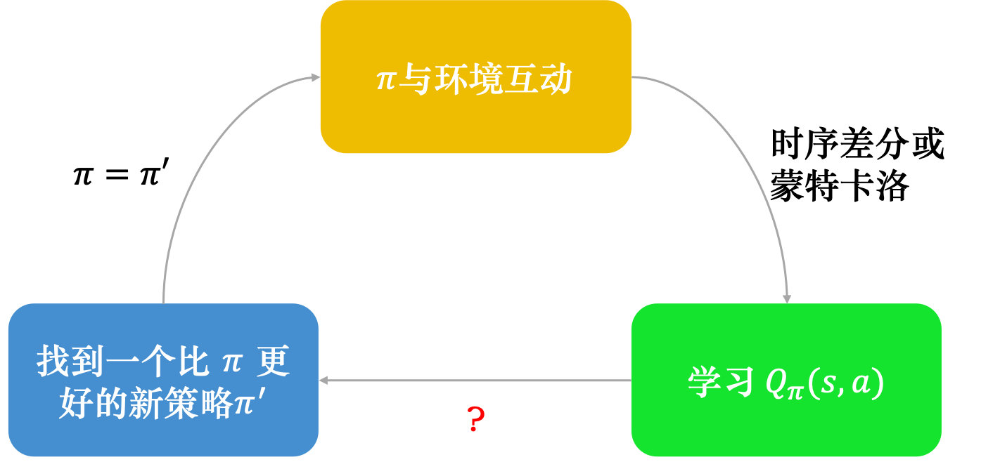

## 6.1 状态价值函数

评论员critic，评价一个状态的好坏不是凭空判断，是根据在这个状态不同的演员actor策略进行评估，不同的演员策略得到不同的状态价值函数V(S)

衡量状态价值函数V(S)的方法：

1. 蒙特卡洛方法
2. 时序差分方法

#### 蒙特卡洛方法

让演员与环境交互，让评论员评价，看到$S_a$接下来累计奖励多大，看到$S_b$接下来累计奖励多大。但理论上，我们不可能看到一个环境的所有状态。每次计算累计奖励时，要等到**游戏结束**，查看所有的奖励，计算每个状态的累计奖励，游戏不结束累计奖励无法得知。

所以$V_π(S)$是一个网络，对一个网络来说，就算输入状态是从来都没有看过的，也可以想办法估计一个值。

训练网络的原则：输入$S_a$,输出的值和$G_a$越接近越好（是一个回归问题）

#### 时序差分方法

基于时序差分的方法，不需要玩到游戏结束，在每一步都可以更新$V_π(S_a)$
$$
V_π(s_t)=V_π(s_{t+1})+r_t \tag{6.2}
$$
在训练的时候，我们并不是直接估测$V_π$，而是希望得到的结果$V_π$可以满足式（6.2），我们是这样训练的，我们把 $s_t$输入网络，网络会得到 $V_π(s_t)$，把 $s_{t+1}$ 输入网络会得到 $V_π(s_{t+1})$，$V_π(s_{t})$ 减$V_π(s_{t+1})$的值应该是 $r_t$。我们希望它们相减的损失与 $r_t$接近，训练下去，更新 $V_π$的参数，我们就可以把$V_π$函数学习出来。

## 6.2 动作价值函数

还有一种评论员称为**Q函数**，也称为动作价值函数，他的输入是一个**状态-动作对**，意为在某个状态s时，采取某个动作a，假设都使用策略π，该状态-动作对得到的累计奖励期望值有多大。

在学习到一个Q函数之后，可以通过贪心策略等，找到一个比π更好的新策略π'，如此循环学习，策略会越来越好

策略更好的概念：对于所有的可能状态S而言都有 $V_{π'}(s)$≥$V_{π}(s)$，也就是说不管在哪一个状态，我们使用π'与环境交互，得到的期望奖励一定不小于使用π的奖励期望

有了Q函数以后，我们把根据式(6.7)决定动作的策略称为 π′
$$
\pi^{\prime}(s) = \underset {a}{\arg \max}Q_{\pi}(s,a) \tag{6.7}
$$

