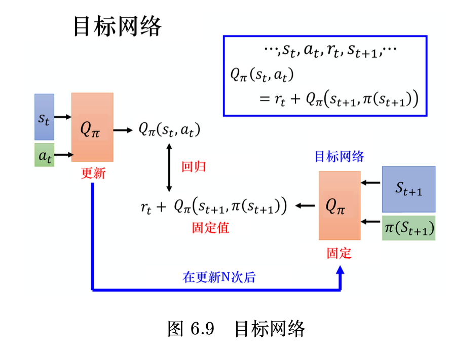

## 6.1 状态价值函数

评论员critic，评价一个状态的好坏不是凭空判断，是根据在这个状态不同的演员actor策略进行评估，不同的演员策略得到不同的状态价值函数V(S)

衡量状态价值函数V(S)的方法：

1. 蒙特卡洛方法
2. 时序差分方法

#### 蒙特卡洛方法

让演员与环境交互，让评论员评价，看到$S_a$接下来累计奖励多大，看到$S_b$接下来累计奖励多大。但理论上，我们不可能看到一个环境的所有状态。每次计算累计奖励时，要等到**游戏结束**，查看所有的奖励，计算每个状态的累计奖励，游戏不结束累计奖励无法得知。

所以$V_π(S)$是一个网络，对一个网络来说，就算输入状态是从来都没有看过的，也可以想办法估计一个值。

训练网络的原则：输入$S_a$,输出的值和$G_a$越接近越好（是一个回归问题）

#### 时序差分方法

基于时序差分的方法，不需要玩到游戏结束，在每一步都可以更新$V_π(S_a)$
$$
V_π(s_t)=V_π(s_{t+1})+r_t \tag{6.2}
$$
在训练的时候，我们并不是直接估测$V_π$，而是希望得到的结果$V_π$可以满足式（6.2），我们是这样训练的，我们把 $s_t$输入网络，网络会得到 $V_π(s_t)$，把 $s_{t+1}$ 输入网络会得到 $V_π(s_{t+1})$，$V_π(s_{t})$ 减$V_π(s_{t+1})$的值应该是 $r_t$。我们希望它们相减的损失与 $r_t$接近，训练下去，更新 $V_π$的参数，我们就可以把$V_π$函数学习出来。

## 6.2 动作价值函数

还有一种评论员称为**Q函数**，也称为动作价值函数，他的输入是一个**状态-动作对**，意为在某个状态s时，采取某个动作a，假设都使用策略π，该状态-动作对得到的累计奖励期望值有多大。

在学习到一个Q函数之后，可以通过贪心策略等，找到一个比π更好的新策略π'，如此循环学习，策略会越来越好

策略更好的概念：对于所有的可能状态S而言都有 $V_{π'}(s)$≥$V_{π}(s)$，也就是说不管在哪一个状态，我们使用π'与环境交互，得到的期望奖励一定不小于使用π的奖励期望

有了Q函数以后，我们把根据式(6.7)决定动作的策略称为 π′
$$
\pi^{\prime}(s) = \underset {a}{\arg \max}Q_{\pi}(s,a) \tag{6.7}
$$

π'一定比π好，在已经学习出π的Q函数的情况下，在状态s下，把所有可能的动作a带入Q函数，令Q函数值最大的a，就是π'将要采取的动作。

Q函数的定义：给定某一个状态s强制采取动作a，**用π继续交互**得到的期望奖励。

但在**随机性策略中**，给定状态s和策略π，并不一定会采取动作π(s)，所以$Q_π（s,π(s)）$不一定会等于$V_π(s)$。

## 6.3 目标网络

如图所示将右边的Q网络固定住，训练时只更新左边的Q网络的参数，因为右边的Q网络负责产生目标，所以被称为目标网络。最小化左边Q网络和右边的均方误差即可。

在左边的Q网络更新多次之后，再用更新过的Q网络替换目标网络，继续重新训练。

## 6.4 探索

探索—利用窘境，解决方法：**ε-贪心**和**玻尔兹曼探索**(Boltzmann exploration)

ε-贪心：有1-ε的概率按照Q函数决定动作，ε概率随机动作，一般ε设置为0.1

在玻尔兹曼探索中，我们假设对于任意的  $s$, $a$, $Q(s,a)\geqslant 0$  ，因此 $a$  被选中的概率与  $e^{Q(s,a) / T}$  呈正比，即

$$
\pi (a\mid s) = \frac{\mathrm{e}^{Q(s,a) / T}}{\sum_{a'\in A}\mathrm{e}^{Q(s,a') / T}} \tag{6.21}
$$
其中，  $T > 0$  称为温度系数。如果  $T$  很大，所有动作几乎以等概率选择（探索）；如果  $T$  很小，Q值大的动作更容易被选中（利用)；如果  $T$  趋于0，我们就只选择最优动作。

## 6.5 经验回放

