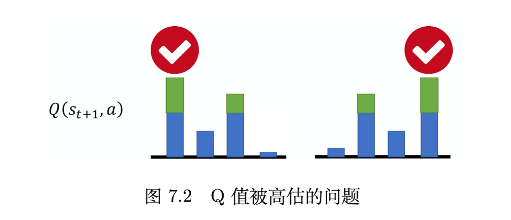

# 7.1 双深度Q网络(Double DQN)

单层深度Q网络往往会高估期望奖励值


## Q值为什么会被高估：

如图，网络是有误差的，但策略只会选择Q值最大的动作，然后使用这个被高估的Q值+$r_t$当做目标，所以Q值总是被高估了
$$
Q\left(\boldsymbol {s}_t,\boldsymbol {a}_t\right)\longleftarrow \boldsymbol {r}_t + \max_{\boldsymbol{a}}Q\left(\boldsymbol {s}_{t + 1},\boldsymbol {a}\right) \tag{7.1}
$$


## 解决Q值过高的方法：DQN

我们使用会更新参数的Q网络去选择动作，利用目标Q网络去计算动作价值

**DDQN使用两个Q网络来分离选择和评估：**

1. **主网络Q**：用于选择动作（决定哪个动作最优）
2. **目标网络Q'**：用于评估动作价值（计算选中动作的Q值）

### 计算目标值的具体流程：

$$
Q\left(s_{t},a_{t}\right)\longleftrightarrow r_{t} + Q^{\prime}\left(s_{t + 1},\arg \max_{a}Q\left(s_{t + 1},a\right)\right) \tag{7.2}
$$

1. **动作选择阶段**：
   - 使用主网络Q对下一状态$s_{t+1}$的所有可能动作进行评估
   - 找出Q值最大的动作：$a* = argmax Q(s_{t+1}, a)$
2. **价值评估阶段**：
   - 使用目标网络Q'来评估刚才选中的动作a*的价值
   - 计算：`Q'(st+1, a*)`
3. **目标值计算**：
   - 最终目标值 = 当前奖励 + 折扣因子 × 目标网络对选中动作的评估
   - `target = rt + γ × Q'(st+1, a*)`

### 为什么这样能解决过高估计？

1. **分离偏差**：主网络Q可能高估某个动作，但目标网络Q'对同一动作的估计是独立的,Q’并不会产生高估
2. **互相制约**：即使Q高估了某个动作而选择了它，Q'没有理由也高估这个动作
3. **噪声对冲**：两个网络的估计噪声相互独立，不会同时朝同一方向偏移


# 7.2 竞争深度Q网络（Dueling DQN）


## 1. 基本概念

**竞争深度Q网络（Dueling DQN）**是对传统深度Q网络的改进，主要改变了网络架构而非算法本身。

## 2. 网络架构差异

### 传统DQN：
- 直接输出每个动作的Q值：Q(s,a)

### Dueling DQN：
- 分解为两条路径：
  - **状态价值路径**：输出V(s) - 表示状态s的价值
  - **优势函数路径**：输出A(s,a) - 表示在状态s下选择动作a的优势
- **最终Q值**：Q(s,a) = V(s) + A(s,a)

## 3. 核心优势

### 更高效的学习：
- 不需要采样所有状态-动作对
- 可以通过更新V(s)间接影响所有Q(s,a)值
- 特别适用于某些动作对结果影响不大的情况

### 示例说明：
如果在某个状态下，只需要采样少数几个动作，就能通过V(s)的更新来改善未采样动作的Q值估计。

## 4. 技术细节

### 约束机制：
为避免V(s)=0, A(s,a)=Q的退化解，需要对A(s,a)添加约束：
- **零均值约束**：A(s,a)的每一列和为0
- 实现方式：A(s,a) - mean(A(s,a))

### 归一化处理：
在实际实现中，通常对A(s,a)进行归一化：
1. 计算均值
2. 每个元素减去均值
3. 确保优势函数具有更大的约束性

## 5. 实际效果

- **数据效率**：能够更有效地利用经验数据
- **稳定性**：网络训练更加稳定
- **泛化能力**：对于动作空间较大的问题表现更好

## 6. 适用场景

特别适合以下情况：
- 动作空间较大
- 某些动作的价值差异不明显
- 需要提高样本效率的强化学习任务

这种架构通过显式分离状态价值和动作优势，使得网络能够更好地理解"在这个状态下有多好"和"选择这个动作比其他动作好多少"这两个不同的概念。


# 7.3 优先级经验回放(PRE)

一句话概括：优先采样时序差分误差大的数据，因为这些数据是预测不准确，还没学习好的数据。


### 核心问题：时序差分误差反映数据重要性

在训练Q网络时，如果某些数据的**时序差分误差（TD error）特别大**，这表明：

1. **网络预测不准确**：网络的输出与目标值之间差距很大
2. **学习价值高**：这些数据包含了网络还没有很好掌握的重要信息
3. **训练效果差**：如果继续均匀采样，这些重要数据可能被忽视

### PER的解决思路

因此，PER（优先级经验回放）给予这些**难以训练的数据更高的采样概率**：

- **优先权（priority）**：基于TD误差大小分配采样权重
- **重点关注**：让网络更多地从"困难样本"中学习
- **提升效率**：避免在已经学会的简单样本上浪费训练时间

### 类比理解

这就像学习时应该把更多时间花在不会的题目上，而不是反复练习已经掌握的简单题目。TD误差大的数据相当于"错题"，需要重点复习。


## 为什么要优先学习时序差分误差大的数据

时序差分误差大**不是因为数据本身有问题**，而是因为：

1. **网络预测错误**：网络对这个状态-动作对的价值估计不准确
2. **信息丰富**：这些数据包含了网络还没有学会的重要模式
3. **学习机会**：正是通过这些"错误"，网络才能不断改进


### 1. 学习就是纠错的过程

- 如果网络对某个样本预测很准确（TD误差小），说明已经学会了
- 如果预测不准确（TD误差大），说明还需要学习
- **放弃这些数据 = 放弃学习机会**

### 2. 类比日常学习

假设你在学数学：

- 已经会做的简单题（TD误差小）→ 重复练习收益很小
- 经常做错的难题（TD误差大）→ 这些才是提升的关键

### 3. 避免学习停滞

如果只训练TD误差小的"简单"样本：

- 网络会在已知模式上过拟合
- 对新的、复杂的情况无法处理
- 整体性能提升缓慢

## PER的智慧

PER的核心思想是：**越是网络表现不好的地方，越需要重点训练**。这样才能：

- 快速识别和修正网络的薄弱环节
- 提高整体学习效率
- 获得更好的最终性能


# 7.4在蒙特卡洛方法和时序差分方法之间的平衡


## N步方法的核心思想

### 基本原理
- **传统TD(0)**：只使用1步的实际奖励，然后用估计值bootstrap
- **蒙特卡洛**：使用完整episode的所有实际奖励
- **N步方法**：使用N步的实际奖励，然后用估计值bootstrap

### 更新公式
N步方法的目标是让 Q(st, at) 接近：
$$\sum_{t'=t}^{t+N} r_{t'} + \hat{Q}(s_{t+N+1}, a_{t+N+1})$$

其中：
- 前N+1个奖励是实际观测到的
- 最后用估计的Q值来近似剩余的未来奖励

## 方法优点

### 1. **数据效率更高**
- 相比蒙特卡洛，不需要等待完整episode结束
- 可以从不完整的经验中学习

### 2. **估计误差更小**
- 使用更多步的真实奖励，减少了bootstrap带来的误差
- 相比TD(0)，有更准确的目标值

### 3. **灵活性强**
- N是超参数，可以根据问题特点调整
- 在偏差(bias)和方差(variance)之间取得平衡

### 4. **统一框架**
- N=1时退化为TD(0)
- N=∞时退化为蒙特卡洛方法

## 方法缺点

### 1. **延迟更新**
- 需要等待N步后才能进行更新
- 学习速度可能比TD(0)慢

### 2. **内存开销增加**
- 需要存储N步的状态、动作、奖励序列
- 内存需求随N线性增长

### 3. **参数调优复杂**
- 需要额外调整超参数N
- 最优的N值依赖于具体问题

### 4. **方差可能增大**
- 当环境噪声较大时，使用更多步可能引入更多噪声
- 需要在偏差和方差之间找到平衡点

## 实际应用考虑

### 何时使用N步方法：
- **环境相对稳定**：奖励信号比较可靠
- **需要快速学习**：比蒙特卡洛更高效
- **有足够内存**：可以存储多步经验

### 参数N的选择：
- **小N值**：更快更新，但可能偏差较大
- **大N值**：更准确估计，但更新较慢
- **自适应N**：根据学习进度动态调整


# 7.5 噪声网络(Noisy Net)


在传统ε-贪心策略下，探索的行为完全是纯随机概率的，属于**盲目探索**，即使此时在状态s下采取a就是最优的，还是可能盲目探索。

在噪声网络中，我们的**探索更加智能**（**与状态相关的探索**）。在噪声网络中，我们知道了$S_1$下采取A是最优的，那么此时我们可能：状态S₁ → 基于网络参数的噪声，可能倾向于探索A的变种或相近的动作。

噪声网络既保持了探索能力，又避免了明显不合理的随机动作。

举个例子

假设你在玩游戏：

- 状态：敌人在右边
- 最优动作：向右攻击
- ε-贪心：90%向右攻击，10%可能向左攻击（明显不合理）
- 噪声网络：可能探索"向右攻击+稍微调整角度"或"向右攻击+不同力度"

## 主要内容总结

### 1. 噪声网络的基本思想
- 传统方法：在动作空间加噪声（如ε-贪心策略）
- 噪声网络：在**参数空间**加噪声，让网络参数本身带有随机性

### 2. 实现机制
- 给Q网络的每个参数添加高斯噪声
- 原始Q函数变成带噪声的Q̃函数
- 动作选择：$a = \arg\max_{\boldsymbol { a }}\tilde{Q}(s,a)$

## 噪声概念的深度理解

### 1. 噪声的作用机制
**传统噪声 vs 参数噪声：**

- **ε-贪心**：在已确定的Q值基础上，概率性地选择随机动作
- **噪声网络**：Q函数经过噪声处理，算出来的Q值自带随机特性，是被噪声参数影响过的有偏差的Q值

### 2. 噪声的"智能性"
这里的关键洞察是：**噪声不是盲目的随机，而是"状态相关的探索"**

- **状态依赖的探索**：网络在不确定的状态下会产生更大的Q值变化，在熟悉的状态下相对稳定
- **自适应探索**：随着训练进行，网络学会在需要探索的地方增加不确定性，在确定的地方减少噪声

### 3. 噪声的一致性
**同一回合内的参数固定**：
- 每个episode开始时重新采样噪声
- 同一episode内参数保持不变
- **这确保了策略的一致性，避免了同一状态下的行为混乱**

### 4. 噪声 vs 探索的本质区别

```
传统ε-贪心：
状态S → Q(s,a) → 以ε概率随机选择 → 动作

噪声网络：
状态S → Q̃(s,a) [带噪声参数] → 直接选最大值 → 动作
```

**核心优势**：
- 噪声网络的探索是**结构化的**，基于网络对不确定性的理解
- 传统方法的探索是**无差别的**，不考虑状态的特殊性

### 5. 实际意义
噪声网络实现了一种更加"智能"的探索方式：
- 在网络不确定的状态/动作组合上自然产生更多探索
- 在网络确信的区域减少无意义的随机探索
- 探索强度随着学习进程自动调节

这种方法本质上是让网络的**不确定性**直接驱动**探索行为**，是一种更加原理化的探索策略。


# 7.6 分布式Q函数(Distributional Q-function)

这部分内容讲解的是**分布式Q函数（Distributional Q-function）**，我来为您详细整理：

## 核心概念

### 传统Q函数 vs 分布式Q函数
- **传统Q函数**：输出单一的期望奖励值（仅仅输出总和）
- **分布式Q函数**：输出完整的**奖励分布**，保留更多信息（每个状态-动作对的奖励都量化）

## 为什么需要分布式Q函数？

### 1. 信息丢失问题
传统方法：分布 → 期望值（Q值）
问题：**不同分布可能有相同期望值**，但风险特性完全不同

### 2. 环境随机性
- 环境本身具有随机性
- 同一状态-动作对可能产生不同奖励
- 形成奖励分布而非单一值

## 技术实现

**离散化方法：**

- 将连续的回报分布离散化为有限个区间
- 例如：将[-10, 10]的范围分成若干个长条
- 每个动作对应一个概率分布，而不是单一数值

**网络结构：**

- **输入状态s，输出每个动作a的分布参数**
- 用概率表示在各个回报区间的可能性


## 优势分析

### 1. 风险建模
```python
# 示例：两个动作的分布
动作A：高期望，高方差（高风险）
动作B：中等期望，低方差（低风险）

# 可以根据策略选择：
- 保守策略：选择低风险动作
- 激进策略：选择高期望动作
```


### 2. 更丰富的策略

- **期望最大化**：选择期望奖励最高的动作
- **风险规避**：选择方差较小的动作
- **风险寻求**：在期望相近时选择高方差动作


## 训练目标
- 不再是回归问题（预测单一值）
- 变成分类问题（预测概率分布）
- 使用交叉熵损失等分布距离度量


## 实际应用价值

1. **风险感知：** 能够区分高风险高回报和低风险稳定回报的动作
2. **探索策略：** 可以基于不确定性来指导探索
3. **决策优化：** 在回报分布相似时，可以选择风险更小的动作


# 7.7 彩虹(Rainbow)

这部分内容讲解的是强化学习中的**彩虹方法（Rainbow）**，我来为您详细整理和讲解：


## 彩虹方法的核心思想

彩虹方法是一种**集成技术**，它将多种已有的深度Q网络改进方法组合在一起，形成一个统一的算法框架。就像彩虹由七种颜色组成一样，Rainbow DQN整合了7种不同的技术改进。

## 组成彩虹的7种技术

彩虹方法主要整合了以下技术：

1. **深度Q网络（DQN）** - 基础框架
2. **双深度Q网络（DDQN）** - 解决过估计问题
3. **优先级经验回放（Prioritized DDQN）** - 改进经验回放策略
4. **竞争双深度Q网络（Dueling DDQN）** - 分离状态值和优势函数
5. **分布式深度Q网络（Distributional DQN）** - 学习价值分布而非期望
6. **噪声深度Q网络（Noisy DQN）** - 改进探索策略
7. **异步优势演员-评论员（A3C）相关的多步方法** - 多步学习


## 关键技术细节

### 中位数 vs 平均值

- 使用分布式DQN时，取**中位数**而非平均值
- 原因：不同游戏的分数差距很大，中位数更稳定
- 避免某些游戏因分数过高而主导整体结果

### 分布式DQN的特殊处理

- 输出的是奖励分布的范围（如-10到10）
- 当奖励超出范围时需要截断
- 这种设计是为了避免高估奖励，实际上会倾向于低估

## 彩虹方法的优点

1. **性能显著提升**：如图7.10所示，彩虹方法的性能明显优于单一技术
2. **技术互补**：不同技术解决不同问题，组合后效果更好
3. **稳定性增强**：多种技术的结合提高了算法的鲁棒性
4. **适用性广**：在多种游戏环境中都表现出色


## 彩虹方法的缺点

1. **复杂度高**：

   - 需要同时实现和调优多种技术
   - 增加了算法的实现难度和计算开销

2. **技术冗余**：

   - 如图7.11所示，去掉某些组件后性能下降有限
   - 表明某些技术的贡献可能有重叠

3. **调参困难**：

   - 多种技术的超参数需要协调优化
   - 增加了调参的复杂性

4. **理论理解不足**：

   - 各技术间的相互作用机制不够清晰
   - 缺乏理论指导来选择最优的技术组合

5. **计算资源消耗**：

   - 相比单一技术，需要更多的计算资源
   - 训练时间显著增加

   

## 总结

彩虹方法体现了深度强化学习中"集成学习"的思想，通过组合多种技术的优势来提升整体性能。虽然它在实验效果上表现出色，但也带来了实现复杂度和计算成本的增加。这种方法为后续研究提供了重要参考，展示了技术集成在强化学习中的潜力。
