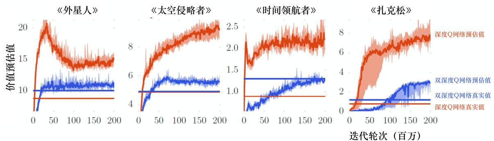

# 第7章 深度Q网络进阶技巧

# 7.1 双深度Q网络

本章我们介绍训练深度Q网络的一些技巧。第一个技巧是双深度Q网络(doubleDQN，DDQN)。为什么要有DDQN呢？因为在实现上，Q值往往是被高估的。如图7.1所示，这里有4个不同的小游戏，横轴代表迭代轮次，红色锯齿状的一直在变的线表示Q函数对不同的状态估计的平均Q值，有很多不同的状态，每个状态我们都进行采样，算出它们的Q值，然后进行平均。这条红色锯齿状的线在训练的过程中会改变，但它是不断上升的，因为Q函数是取决于策略的，在学习的过程中策略越来越强，我们得到的Q值会越来越大。在同一个状态，我们得到奖励的期望会越来越大，所以一般而言，Q值都是上升的，但这是深度Q网络预估出来的值。接下来我们就用策略去玩游戏，玩很多次，比如100万次，然后计算在某一个状态下，我们得到的Q值是多少。我们会得到在某一个状态采取某一个动作的累积奖励是多少。预估出来的值远比真实值大，且大很多，在每一个游戏中都是这样。所以DDQN的方法可以让预估值与真实值比较接近。

  
图7.1 被高估的Q值[1]

图7.1中蓝色的锯齿状的线是DDQN的Q网络所估测出来的Q值，蓝色的无锯齿状的线是真正的Q值，它们是比较接近的。我们不用管用网络估测的值，它比较没有参考价值。我们用DDQN得出的真正的Q值在图7.1的3种情况下都是比原来的深度Q网络高的，代表DDQN学习出来的策略比较强，所以实际上得到的奖励是比较大的。虽然一般的深度Q网络的Q网络高估了自己会得到的奖励，但实际上它得到的奖励是比较低的。

Q：为什么Q值总是被高估了？

A：因为实际在训练的时候，如式(7.1)所示，我们要让左式与右式（目标）越接近越好。但目标的值很容易被设得太高，因为在计算目标的时候，我们实际上在做的，是看哪一个α可以得到最大的Q值，就把它加上去变成目标。

$$
Q\left(\boldsymbol {o}_t,\boldsymbol {a}_t\right)\longleftarrow \boldsymbol {r}_t + \max_{\boldsymbol{a}}Q\left(\boldsymbol {o}_{t + 1},\boldsymbol {a}\right) \tag{7.1}
$$

例如，假设我们现在有4个动作，本来它们得到的Q值都是差不多的，它们得到的奖励也是差不多的。但是在估计的时候，网络是有误差的。如图7.2（a）所示，假设是第一个动作被高估了，绿色代表是被高估的量，智能体就会选这个动作，就会选这个高估的Q值来加上  $r_t$  来当作目标。如图7.2（b）所示，如果第四个动作被高估了，智能体就会选第四个动作来加上  $r_t$  当作目标。所以智能体总是会选那个Q值被高估的动作，总是会选奖励被高估的动作的Q值当作最大的结果去加上  $r_t$  当作目标，所以目标值总是太大。

Q：怎么解决目标值总是太大的问题呢？

A:在DDQN里面，选动作的Q函数与计算值的Q函数不是同一个。在原来的深度Q网络里面，我们穷举所有的  $a$  ，把每一个  $a$  都代入Q函数，看哪一个  $a$  可以得到的Q值最高，就把那个Q值加上  $r_t$  。

  
图7.2 Q值被高估的问题

但是在DDQN里面有两个Q网络，第一个Q网络Q决定哪一个动作的Q值最大（我们把所有的  $a$  代入Q函数中，看看哪一个  $a$  的Q值最大)。我们决定动作以后，Q值是用  $Q^{\prime}$  算出来的。

如式(7.2)所示，假设我们有两个Q函数—  $Q$  和  $Q^{\prime}$  ，如果  $Q$  高估了它选出来的动作  $a$  ，只要  $Q^{\prime}$  没有高估动作  $a$  的值，算出来的就还是正常的值。假设  $Q^{\prime}$  高估了某一个动作的值，也是没问题的，因为只要  $Q$  不选这个动作就可以，这就是DDQN神奇的地方。

$$
Q\left(s_{t},a_{t}\right)\longleftrightarrow r_{t} + Q^{\prime}\left(s_{t + 1},\arg \max_{a}Q\left(s_{t + 1},a\right)\right) \tag{7.2}
$$

我们动手实现的时候，有两个Q网络：会更新的Q网络和目标Q网络。所以在DDQN里面，我们会用会更新参数的Q网络去选动作，用目标Q网络（固定住的网络）计算值。

DDQN相较于原来的深度Q网络的更改是最少的，它几乎没有增加任何的运算量，也不需要新的网络，因为原来就有两个网络。我们只需要做一件事：本来是用目标网络  $Q^{\prime}$  来找使Q值最大的  $a$  ，现在改成用另外一个会更新的Q网络来找使Q值最大的  $a$  。如果只选一个技巧，我们一般都会选DDQN，因为其很容易实现。

# 7.2 竞争深度Q网络

第二个技巧是竞争深度Q网络（duelingDQN），相较于原来的深度Q网络，它唯一的差别是改变了网络的架构。Q网络输入状态，输出的是每一个动作的Q值。如图7.3所示，原来的深度Q网络直接输出Q值，竞争深度Q网络不直接输出Q值，而是分成两条路径运算。第一条路径会输出一个标量 $V(s)$  ，因为它与输入  $s$  是有关系的，所以称为  $V(s)$  。第二条路径会输出一个向量  $A(s,a)$  ，它的每一个动作都有一个值。我们再把  $V(s)$  和  $A(s,a)$  加起来就可以得到Q值  $Q(s,a)$  。

  
图7.3 竞争深度Q网络的网络结构[2]

我们假设状态是离散的（实际上状态不是离散的)，为了说明方便，我们假设就只有4个不同的状态，只有3个不同的动作，所以  $Q(s,a)$  可以看成一个表格，如图7.4所示。

我们知道

$$
Q(s,a) = V(s) + A(s,a)
$$

其中， $V(s)$  对不同的状态，都有一个值。 $A(s,a)$  对不同的状态、不同的动作都有一个值。我们把  $V(s)$  的每一列的值加到  $A(s,a)$  的每一列就可以得到Q值，以第一列为例，有  $2 + 1$  、  $2 + (- 1)$  、  $2 + 0$  ，可以得到3、1、2，以此类推。

如图7.4所示，假设我们在训练网络的时候，目标是希望Q表格中第一行第二列的值变成4，第二行第二列的值变成0。但是我们实际上能修改的并不是Q值，能修改的是  $V(s)$  与  $A(s,a)$  的值。根据网络的参数，  $V(s)$  与  $A(s,a)$  的值输出以后，就直接把它们加起来，所以其实不是修改Q值。在学习网络的时候，假设我们希望Q表格中的3增加1变成4、  $- 1$  增加1变成0。最后我们在训练网络的时候，我们可能就不用修改  $A(s,a)$  的值，就修改  $V(s)$  的值，把  $V(s)$  的值从0变成1。从0变成1有什么好处呢？本来只想修改两个值，但Q表格中的第三个值也被修改了：  $- 2$  变成了  $- 1$  。所以有可能我们在某一个状态下，只采样到这两个动作，没采样到第三个动作，但也可以更改第三个动作的Q值。这样的好处就是我们不需要把所有的状态- 动作对都采样，可以用比较高效的方式去估计Q值。因为有时候我们更新的时候，不一定是更新Q表格，而是只更新了  $V(s)$  ，但更新  $V(s)$  的时候，只要修改  $V(s)$  的值，Q表格的值也会被修改。竞争深度Q网络是一个使用数据比较有效率的方法。

  
图7.4 竞争深度Q网络训练

可能会有人认为使用竞争深度Q网络会有一个问题，竞争深度Q网络最后学习的结果可能是这样的：智能体就学到  $V(s)$  等于0，  $A(s,a)$  等于Q，使用任何竞争深度Q网络就没有任何好处，就和原来的深度Q网络一样。为了避免这个问题出现，实际上我们要给  $A(s,a)$  一些约束，让  $A(s,a)$  的更新比较麻烦，让网络倾向于使用  $V(s)$  来解决问题。

例如，我们有不同的约束，一个最直觉的约束是必须要让  $A(s,a)$  的每一列的和都是0，所以看我这边举的例子，列的和都是0。如果这边列的和都是0，我们就可以把  $V(s)$  的值想成是上面Q的每一列的平均值。这个平均值，加上  $A(s,a)$  的值才会变成是Q的值。所以假设在更新参数的时候，要让整个列一起被更新，更新  $A(s,a)$  的某一列比较麻烦，所以我们就不会想要更新  $A(s,a)$  的某一列。因为  $A(s,a)$  的每一列的和都要是0，所以我们无法让  $A(s,a)$  的某列的值都加1，这是做不到的，因为它的约束就是和永远都是0，所以不可以都加1，这时候就会强迫网络去更新  $V(s)$  的值，让我们可以用比较有效率的方法去使用数据。

实现时，我们要给这个  $A(s,a)$  一个约束。例如，如图7.5所示，假设有3个动作，输出的向量是 $[7,3,2]^{\mathrm{T}}$  ，我们在把  $A(s,a)$  与  $V(s)$  加起来之前，先进行归一化（normalization)。归一化的过程如下：

（1）计算均值  $(7 + 3 + 2)$ $/3 = 4$

（2）向量  $[7,3,2]^{\mathrm{T}}$  的每个元素的值都减去均值4，于是归一化的向量为  $[3, - 1, - 2]^{\mathrm{T}}$

接着我们将向量  $[3, - 1, - 2]^{\mathrm{T}}$  中的每个元素的值加上1，就可以得到最后的Q值。这个归一化的步骤就是网络的其中一部分，在训练的时候，我们也使用反向传播，只是归一化是没有参数的，它只是一个操作，可以把它放到网络里面，与网络的其他部分共同训练，这样  $A(s,a)$  就会有比较大的约束，网络就会给它一些好处，让它倾向于去更新  $V(s)$  的值，这就是竞争深度Q网络。

  
图7.5 竞争深度Q网络约束[2]

# 7.3 优先级经验回放

第三个技巧称为优先级经验回放（prioritized experience replay，PER）。如图7.6所示，我们原来在采样数据训练Q网络的时候，会均匀地从回放缓冲区里面采样数据。这样不一定是最好的，因为也许有一些数据比较重要。假设有一些数据，我们之前采样过，发现这些数据的时序差分误差特别大（时序差分误差就是网络的输出与目标之间的差距），这代表我们在训练网络的时候，这些数据是比较不好训练的。既然比较不好训练，就应该给它们比较大的概率被采样到，即给它优先权(priority)。这样在训练的时候才会多考虑那些不好训练的数据。实际上在做PER的时候，我们不仅会更改采样的过程，还会因为更改了采样的过程，而更改更新参数的方法。所以PER不仅改变了采样数据的分布，还改变了训练过程。

  
图7.6 优先级经验回放

# 7.4 在蒙特卡洛方法和时序差分方法中取得平衡

蒙特卡洛方法与时序差分方法各有优劣，因此我们可以在蒙特卡洛方法和时序差分方法中取得平衡，这个方法也被称为多步方法。我们的做法如图7.7所示，在时序差分方法里面，在某一个状态  $s_t$  采取某一个动作  $a_t$  得到奖励  $r_t$  ，接下来进入状态  $s_{t + 1}$  。但是我们可以不只保存一个步骤的数据，可保存  $N$  个步骤的数据。

我们记录在  $s_t$  采取  $a_t$  ，得到  $r_t$  时，会进入的  $s_{t + 1}$  。一直记录到第  $N$  个步骤以后，在  $s_{t + N}$  采取  $a_{t + N}$  得到  $r_{t + N}$  ，进入  $s_{t + N + 1}$  的这些经验，把它们保存下来。实际上在做更新的时候，在做Q网络学习的时候，我们要让  $Q(s_{t},a_{t})$  与目标值越接近越好。  $\hat{Q}$  所计算的不是  $s_{t + 1}$  的，而是  $s_{t + N + 1}$  的奖励。我们会把 $N$  个步骤以后的状态  $s_{t + N + 1}$  输入到  $\hat{Q}$  中去计算  $N$  个步骤以后会得到的奖励。如果要算目标值，要再加上多步（multi- step）的奖励  $\sum_{t' = t}^{t + N}r_{t'}$  ，多步的奖励是从时间  $t$  一直到  $t + N$  的  $N + 1$  个奖励的和。我们希望  $Q(s_{t},a_{t})$  和目标值越接近越好。

多步方法就是蒙特卡洛方法与时序差分方法的结合，因此它不仅有蒙特卡洛方法的好处与坏处，还有时序差分方法的好处与坏处。我们先看看多步方法的好处，之前只采样了某一个步骤，所以得到的数据是真实的，接下来都是Q值估测出来的。现在采样比较多的步骤，采样  $N$  个步骤才估测值，所以估测的部分所造成的影响就会比较小。当然多步方法的坏处就与蒙特卡洛方法的坏处一样，因为  $r$  有比较多项，所以我们把  $N$  项的  $r$  加起来，方差就会比较大。但是我们可以调整  $N$  的值，在方差与不精确的Q值之间取得一个平衡。  $N$  就是一个超参数，我们可以对其进行调整。

  
图7.7 在蒙特卡洛方法和时序差分方法中取得平衡

# 7.5 噪声网络

我们还可以改进探索。  $\epsilon$  - 贪心这样的探索就是在动作的空间上加噪声，但是有一个更好的方法称为噪声网络（noisy net)，它是在参数的空间上加噪声。噪声网络是指，每一次在一个回合开始的时候，在智能体要与环境交互的时候，智能体使用Q函数来采取动作，Q函数里面就是一个网络，我们在网络的每一个参数上加上一个高斯噪声（Gaussian noise），就把原来的Q函数变成  $\hat{Q}$  。因为我们已经用  $\hat{Q}$  来表示目标网络，所以我们用  $\hat{Q}$  来表示噪声Q函数（noisy Q- function）。我们把每一个参数都加上一个高斯噪声，就得到一个新的网络  $\hat{Q}$  。使用噪声网络执行的动作为

$$
a = \underset {a}{\arg \max}\tilde{Q} (s,a) \tag{7.3}
$$

这里要注意，在每个回合开始的时候，与环境交互之前，我们就采样噪声。接下来我们用固定的噪声网络玩游戏，直到游戏结束，才重新采样新的噪声，噪声在一个回合中是不能被改变的。OpenAI与DeepMind在同时间提出了几乎一模一样的噪声网络方法，并且对应的两篇论文都发表在ICLR2018会议中。不一样的地方是，他们用不同的方法加噪声。OpenAI的方法比较简单，直接加一个高斯噪声，也就是把每一个参数、每一个权重（weight）都加一个高斯噪声。DeepMind的方法比较复杂，该方法中的噪声是由一组参数控制的，网络可以自己决定噪声要加多大。但是两种方法的概念都是一样的，总之，我们就是对Q函数里面的网络加上一些噪声，把它变得有点儿不一样，即与原来的Q函数不一样，然后与环境交互。两篇论文里面都强调，参数虽然会被加上噪声，但在同一个回合里面参数是固定的。我们在换回合、玩另一场新的游戏的时候，才会重新采样噪声。在同一场游戏里面就是同一个噪声Q网络在玩该场游戏，这非常重要。因为这导致了噪声网络与原来的  $\epsilon$  - 贪心或其他在动作上做采样的方法的本质上的差异。

有什么本质上的差异呢？在原来采样的方法中，比如  $\epsilon$  - 贪心中，就算给定同样的状态，智能体采取的动作也不一定是一样的。因为智能体通过采样来决定动作，给定同一个状态，智能体根据Q函数的网络来输出一个动作，或者采样到随机来输出一个动作。所以给定相同的状态，如果是用  $\epsilon$  - 贪心的方法，智能体可能会执行不同的动作。但实际上策略并不是这样的，一个真实世界的策略，给定同样的状态，它应该有同样的回应。而不是给定同样的状态，它有时候执行Q函数，有时候又是随机的，这是一个不正常的动作，是在真实的情况下不会出现的动作。但是如果我们是在Q函数的网络的参数上加噪声，就不会出现这种情况。因为如果在 Q 函数的网络的参数上加噪声，在整个交互的过程中，在同一个回合里面，它的网络的参数总是固定的，所以看到相同或类似的状态，就会采取相同的动作，这是比较正常的。这被称为依赖状态的探索（state- dependent exploration），我们虽然会做探索这件事，但是探索是与状态有关系的，看到同样的状态，就会采取同样的探索的方式，而噪声（noisy）的动作只是随机乱试。但如果我们是在参数下加噪声，在同一个回合里面，参数是固定的，我们就是系统地尝试。比如，我们每次在某一个状态，都向左试试看。在下一次在玩同样游戏的时候，看到同样的状态，我再向右试试看，是系统地在探索环境。

# 7.6 分布式 Q 函数

还有一个技巧称为分布式 Q 函数（distributional Q- function）。分布式 Q 函数是比较合理的，但是它难以实现。Q 函数是累积奖励的期望值，所以我们算出来的 Q 值其实是一个期望值。如图 7.8 所示，因为环境是有随机性的，所以在某一个状态采取某一个动作的时候，我们把所有的奖励在游戏结束的时候进行统计，得到的是一个分布。也许在奖励得到 0 的概率很高，得到 - 10 的概率比较低，得到 +10 的概率也比较低，但是它是一个分布。（我们对这个分布计算它的平均值才是这个 Q 值，算出来是累积奖励的期望。所以累积奖励是一个分布，对它取期望，对它取平均值，得到 Q 值）。但不同的分布可以有同样的平均值。也许真正的分布是图 7.8 所示右边的分布，它的平均值与左边的分布的平均值其实是一样的，但它们背后所代表的分布其实是不一样的。假设我们只用 Q 值的期望来代表整个奖励，可能会丢失一些信息，无法对奖励的分布进行建模。

  
图 7.8 奖励分布

分布式 Q 函数是对分布（distribution）建模，怎么做呢？如图 7.9a 所示，在原来的 Q 函数里面，假设我们只能采取  $a_1$ 、 $a_2$ 、 $a_3$  这 3 个动作，我们输入一个状态，输出 3 个值。这 3 个值分别代表 3 个动作的 Q 值，但是这些 Q 值是一个分布的期望值。所以分布式 Q 函数就是直接输出分布。实际上的做法如图 7.9b 所示，假设分布的值就分布在某一个范围里面，比如 - 10 ~ 10，把 - 10 ~ 10 拆成一个一个的长条。例如，每一个动作的奖励空间拆成 5 个长条。假设奖励空间可以拆成 5 个长条，Q 函数的输出就是要预测我们在某一个状态采取某一个动作得到的奖励，其落在某一个长条里面的概率。所以绿色长条概率的和应该是 1，其高度代表在某一个状态采取某一个动作的时候，它落在某一个长条内的概率。绿色的代表动作  $a_1$ ，红色的代表动作  $a_2$ ，蓝色的代表动作  $a_3$ 。所以我们就可以用 Q 函数去估计  $a_1$  的分布、 $a_2$  的分布、 $a_3$  的分布。实际上在做测试的时候，我们选平均值最大的动作执行。

除了选平均值最大的动作以外，我们还可以对分布建模。例如，我们可以考虑动作的分布，如果分布方差很大，这代表采取这个动作虽然平均而言很不错，但也许风险很高，我们可以训练一个网络来规避风险。在两个动作平均值都差不多的情况下，也许可以选一个风险比较小的动作来执行，这就是分布式 Q 函数的好处。

# 7.7 彩虹

最后一个技巧称为彩虹（rainbow），如图 7.10 所示，假设每个方法有一种自己的颜色（如果每一个单一颜色的线代表只用某一个方法），把所有的颜色组合起来，就变成“彩虹”，我们把原来的深度 Q 网络也算作一种方法，故有 7 种颜色。横轴代表训练过程的帧数，纵轴代表玩十几个雅达利小游戏的平均分数

  
图7.9 分布式Q函数

的和，但它取的是分数的中位数。为什么是取中位数而不是直接取平均呢？因为不同小游戏的分数差距很大，如果取平均，某几个游戏可能会控制结果，因此我们取中位数。如果我们使用的一般的深度Q网络（灰色的线），深度Q网络的性能不是很好。噪声深度Q网络（noisy DQN）比DQN的性能好很多。紫色的线代表DDQN，DDQN还挺有效的。优先级经验回放的双深度Q网络（prioritized DDQN）、竞争双深度Q网络（dueling DDQN）和分布式深度Q网络（distributional DQN）性能也挺高的。异步优势演员- 评论员（asynchronous advantage actor- critic，A3C）是演员- 评论员的方法，A3C算法又被译作异步优势动作评价算法，我们会在第九章详细介绍异步优势演员- 评论员算法。单纯的异步优势演员- 评论员算法看起来是比深度Q网络强的。图7.10中没有多步方法，这是因为异步优势演员- 评论员算法本身内部就有多步方法，所以实现异步优势演员- 评论员算法就等同于实现多步方法，我们可以把异步优势演员- 评论员算法的结果看成多步方法的结果。这些方法本身之间是没有冲突的，我们把全部方法都用上就变成了七彩的方法，即彩虹方法，彩虹方法的性能很好。

  
图7.10 彩虹方法[3]

我们把所有的方法加在一起，模型的表现会提高很多，但会不会有些方法其实是没有用的呢？我们可以去掉其中一种方法来判断这个方法是否有用。如图7.11所示，虚线就是彩虹方法去掉某一种方法以后的结果，黄色的虚线去掉多步方法后“掉”很多。彩虹是彩色的实线，去掉多步方法会“掉下来”，去掉优先级经验回放后会“掉下来”，去掉分布也会“掉下来”。这边有一个有趣的地方，在开始的时候，分布训练的

方法与其他方法速度差不多。但是我们去掉分布训练方法的时候，训练不会变慢，但是性能（performance）最后会收敛在比较差的地方。我们去掉噪声网络后性能也差一点儿，去掉竞争深度Q网络后性能也差一点儿，去掉双深度Q网络却没什么差别。所以我们把全部方法组合在一起的时候，去掉双深度Q网络是影响比较小的。当我们使用分布式深度Q网络的时候，本质上就不会高估奖励。我们是为了避免高估奖励才加了DDQN。如果我们使用了分布式深度Q网络，就可能不会有高估的结果，多数的情况是低估奖励的，所以变成DDQN没有用。

为什么分布式深度Q网络不会高估奖励奖励，反而会低估奖励呢？因为分布式深度Q网络输出的是一个分布的范围，输出的范围不可能是无限的，我们一定会设一个限制，比如最大输出范围就是从  $- 10\sim$  10。假设得到的奖励超过10，比如100怎么办？我们就当作没看到这件事，所以奖励很极端的值、很大的值是会被丢弃的，用分布式深度Q网络的时候，我们不会高估奖励，反而会低估奖励。

  
图7.11 彩虹：去掉其中一种方法[5]

# 7.8 使用深度Q网络解决推车杆问题

在学习本节之前，可以先回顾一下之前的项目实战，即使用Q学习解决悬崖寻路问题。本节将具体实现深度Q网络算法来解决推车杆问题，对应的模拟环境为OpenAI Gym中的CartPole- v0，我们同样先对该环境做一个简要说明。

# 7.8.1 CartPole-v0简介

CartPole- v0是一个经典的入门环境，如图7.12所示，它通过向左（动作  $= 0$  ）或向右（动作  $= 1$  ）推动推车来实现推车杆的平衡。每次实施一个动作后，如果杆能够继续保持平衡，就会得到一个  $+1$  的奖励，否则杆将无法保持平衡而导致游戏结束。理论上最优算法情况下，推车杆是能够一直保证平衡的，但是如果每回合无限制地进行下去，会影响到算法的训练，所以环境一般设置每回合的最大步数为200。另外Gym官方也推出了另外一版的推车杆环境，名为CartPole- v1，相比v0版本，v1每回合最大步数为500，其他基本不变，可以说是v0的难度升级版。

我们来看看这个环境的一些参数，执行以下代码：

import gymenv  $=$  gym.make（'CartPole- v0'）#建立环境env.seed（1）#随机种子n_states  $=$  env.observation_space.shape[0]#状态数n_actions  $=$  env.action_space.n#动作数print（f"状态数：{n_states}，动作数：{n_actions}")

  
图7.12 CartPole-v0环境

可以得到结果：

状态数：4，动作数：2

该环境的状态数是4个，分别为车的位置、车的速度、杆的角度以及杆顶部的速度；动作数为2个，并且是离散的向左或者向右。

我们也可以直接重置或者初始化环境看看初始状态，代码如下：

state = env.reset() #初始化环境print(f"初始状态：{state}")

结果为：

初始状态：[0.03073904 0.00145001 - 0.03088818 - 0.03131252]

# 7.8.2 深度Q网络基本接口

介绍完环境之后，我们沿用接口的概念，通过分析伪代码来实现深度Q网络的基本训练模式。其实所有的强化学习算法都遵循同一个训练思路，执行动作，环境反馈，然后智能体更新，只是不同算法需要的一些要素不同，我们需要分析出这些要素，比如建立什么网络需要什么模块，以进一步完善算法。

我们现在常用的深度Q网络伪代码如图7.13所示

初始化经验缓冲区  $D$  ，容量为N初始化状态- 动作函数，即带有初始权重  $\theta$  的Q网络初始化状态- 动作函数，即带有初始权重  $\hat{\theta}$  的Q网络执行M个回合循环，对于每个回合

初始化环境，得到初始状态  $s_1$  循环T个时间步长，对于每个时步t

使用  $\epsilon$  一贪心策略选择动作  $a_{t}$  环境根据  $a_{t}$  反馈奖励  $r_t$  和下一个状态  $s_{t + 1}$  更新状态  $s_{t + 1} = s_t$  存储转移即  $(s_t,a_t,r_t,s_{t + 1})$  到经验回放  $D$  中更新策略如下：

1. 从  $D$  中随机采样一个小批量的转移

如果回合在时步  $j + 1$  终止2. 计算实际的Q值  $y_{j} = \left\{ \begin{array}{ll}r_{j}.\\ r_{j} + \gamma \max_{a^{\prime}}\hat{Q} (\phi_{j + 1},a^{\prime};\hat{\theta}). \end{array} \right.$  否则

3. 对损失函数  $\left(y_{j} - Q\big(\phi_{j},a_{j};\theta \big)\right)^{2}$  关于参数  $\theta$  做随机梯度下降4.每C步重置  $\hat{Q} = Q$

用代码实现如下：

rewards  $\equiv$  []#记录奖励 ma_rewards  $\equiv$  []#记录滑动平均奖励 for i_ep in range(cfg.train_eps): state  $=$  env.reset（）#初始化环境 done  $=$  False ep_reward  $= 0$  while True: action  $=$  agent.choose_action(state) next_state, reward, done,  $\begin{array}{rl}{\mathrm{\underline{\Pi}}}&{=}\end{array}$  env.step(action) ep_reward  $+ =$  reward agent.memory.push(state, action, reward, next_state, done) state  $=$  next_state agent.update() if done: break if (i_ep+1)% cfg.target_update  $= = 0$  . agent.target_net.load_state_dict(agent.policy_net.state_dict())) if  $(\mathtt{i\_ep + 1})\% 10 = =0$  print（回合：{}/，奖励：{。format（i_ep+1，cfg.train_eps,ep_reward）） rewards.append(ep_reward) if ma_rewards: ma_rewards.append(0.9\*ep_rewards[- 1]+0.1\*ep_reward) else: ma_rewards.append(ep_reward)

可以看到，深度Q网络的训练模式其实和大多强化学习算法是一样的思路，但与传统的Q学习算法相比，深度Q网络使用神经网络来代替之前的Q表格从而存储更多的信息，且由于使用了神经网络，因此我们一般需要利用随机梯度下降来优化Q值的预测。此外深度Q网络多了回放缓冲区，并且使用两个网络，即目标网络和当前网络。

# 7.8.3 回放缓冲区

从伪代码中可以看出，回放缓冲区的功能有两个：一个是将每一步采集的经验（包括状态、动作、奖励、下一时刻的状态）存储到缓冲区中，并且缓冲区具有一定的容量（capacity）；另一个是在更新策略的时候需要随机采样小批量的经验进行优化。因此我们可以定义一个 ReplayBuffer 类，包括 push() 和 sample() 两个函数，用于存储和采样。

import random

class ReplayBuffer:

def _init_（self,capacity): self.capacity  $=$  capacity#回放缓冲区的容量 self.buffer  $\equiv$  []#缓冲区 self.position  $= 0$

def push(self, state, action, reward, next_state, done): '缓冲区是一个队列，容量超出时删除开始存入的经验 if len(self.buffer)  $\epsilon$  self.capacity: self.buffer.append(None) self.buffer[self.position]  $=$  (state, action, reward, next_state, done) self.position  $=$  (self.position  $+1$  ）% self.capacity

def sample(self, batch_size): batch  $=$  random.sample(self.bufer,batch_size)#随机采小批量经验 state,action,reward,next_state,done  $=$  zip(\*batch)#解压成状态、动作等 return state, action, reward, next_state, done def__len__（self): 返回当前存储的量 return len(self.bufer)

# 7.8.4 Q网络

在深度Q网络中我们使用神经网络替代原有的Q表格，从而能够存储更多的Q值，实现更为高级的策略以便用于复杂的环境。这里我们用的是一个三层的感知机或者称之为连接网络：

class MLP(nn.Module): def__init__（self,input_dim,output_dim,hidden_dim=128): 初始化Q网络，为全连接神经网络 input_dim：输入的特征数即环境的状态数 output_dim：输出的动作维度 super（MLP,self）__init__（） self.fc1  $=$  nn.Linear（input_dim,hidden_dim)#输入层 self.fc2  $=$  nn.Linear(hidden_dim,hidden_dim)#隐藏层 self.fc3  $=$  nn.Linear(hidden_dim,output_dim)#输出层 def forward(self,x): #各层对应的激活函数  $\texttt{x} = \texttt{F}$  .relu（self.fc1（x))  $\texttt{x} = \texttt{F}$  .relu（self.fc2（x)) return self.fc3(x)

学过深度学习的读者应该对全连接神经网络十分熟悉。在强化学习中，网络的输入一般是状态，输出则是一个动作，假如总共有两个动作，那么这里的动作维度就是2，可能的输出就是0或1，一般我们用ReLU作为激活函数。根据实际需要也可以改变神经网络的模型结构等等，比如若我们使用图像作为输入，则可以使用卷积神经网络（convolutional neural network，CNN）。

# 7.8.5 深度Q网络算法

与前面的项目实战一样，深度Q算法一般也包括选择动作和更新策略两个函数，首先我们看选择动作：

def choose_action(self, state): '选择动作 self.frame_idx  $+ = 1$  if random.random()  $>$  self.epsilon(self.frame_idx): with torch.no_grad(): state  $=$  torch.tensor([state],device=self.device, dtype=torch.float32) q_values  $=$  self.policy_net(state) action  $=$  q_values.max（1)[1].item（）#选择Q值最大的动作 else:

action = random.randrange(self.action_dim)

可以看到跟深度 Q 网络算法与 Q 学习算法其实是一样的，都是用的  $\epsilon$ - 贪心策略，只是深度 Q 网络算法我们需要通过 PyTorch 或者 TensorFlow 工具来处理相应的数据。

而深度 Q 网络算法更新策略的步骤稍微复杂一点儿，主要包括三个部分：随机采样、计算期望 Q 值和梯度下降，如下：

def update(self):

if len(self.memory)  $\epsilon$  self.batch_size:#当memory中不满足一个批量时，不更新策略 return

从回放缓冲区中随机采样一个批量的经验

state_batch, action_batch, reward_batch, next_state_batch, done_batch = self.memory.sample(self.batch_size)

转为张量

state_batch = torch.tensor(state_batch, device=self.device, dtype=torch. float) action_batch = torch.tensor(action_batch, device=self.device).unsqueeze(1) reward_batch = torch.tensor(reward_batch, device=self.device, dtype=torch. float) next_state_batch = torch.tensor(next_state_batch, device=self.device, dtype=torch. float) done_batch = torch.tensor(np.float32(done_batch), device=self.device)

q_values = self.policy_net(state_batch).gather(dim=1, index=action_batch) # 计算当前状态(s_t,a)对应的Q(s_t,a)

next_q_values = self.target_net(next_state_batch).

max(1)[0].detach() # 计算下一时刻的状态(s_t,a)对应的Q值

计算期望的Q值，对于终止状态，此时done_batch[0]=1，对应的expected_q_values等于reward

expected_q_values = reward_batch + self.gamma * next_q_values * (1- done_batch)

loss = nn.MSELoss()(q_values, expected_q_values.unsqueeze(1)) # 计算均方根损失

优化更新模型

self.optimizer.zero_grad()

loss.backward()

for param in self.policy_net.parameters(): # clip防止梯度爆炸

param.grad.data.clamp_{- 1, 1} self.optimizer.step()

# 7.8.6 结果分析

实现代码之后，我们先来看看深度 Q 网络算法的训练效果，如图 7.14 所示。

从图 7.14 中可以看出，算法其实已经在 60 回合左右达到收敛，最后一直维持在最佳奖励 200 左右，可能会有轻微的波动，这是因为我们在收敛的情况下依然保持了一定的探索率，即 epsilon_end=0.01。现在我们可以载入模型看看测试的效果，如图 7.15 所示。

我们测试了 30 个回合，每个回合奖励都保持在 200 左右，说明我们的模型学习得不错！

# 7.9 关键词

双深度 Q 网络（double DQN）：在双深度 Q 网络中存在两个 Q 网络，第一个 Q 网络决定哪一个动作的 Q 值最大，从而决定对应的动作。另一方面，Q 值是用  $Q'$  计算得到的，这样就可以避免过度估计的问题。具体地，假设我们有两个 Q 函数并且第一个 Q 函数高估了它现在执行的动作  $a$  的值，这没关系，只要第二个 Q 函数  $Q'$  没有高估动作  $a$  的值，那么计算得到的就还是正常的值。

竞争深度 Q 网络（dueling DQN）：将原来的深度 Q 网络的计算过程分为两步。第一步计算一个与输入有关的标量 V(s)；第二步计算一个向量 A(s,a) 对应每一个动作。最后的网络将两步的结果相加，得到

  
图7.14 CartPole-v0环境下深度Q网络算法的训练曲线

  
图7.15 CartPole-v0环境下深度Q网络算法的测试曲线

我们最终需要的Q值。用一个公式表示就是  $\mathrm{Q(s,a) = V(s) + A(s,a)}$  。另外，竞争深度Q网络，使用状态价值函数与动作价值函数来评估Q值。

优先级经验回放（prioritized experience replay，PER)：这个方法是为了解决我们在第6章中提出的经验回放方法的不足而提出的。我们在使用经验回放时，均匀地取出回放缓冲区（reply buffer）中的采样数据，这里并没有考虑数据间的权重大小。但是我们应该将那些训练效果不好的数据对应的权重加大，即其应该有更大的概率被采样到。综上，优先级经验回放不仅改变了被采样数据的分布，还改变了训练过程。

噪声网络（noisy net）：其在每一个回合开始的时候，即智能体要和环境交互的时候，在原来的Q函数的每一个参数上加上一个高斯噪声（Gaussian noise），把原来的Q函数变成  $\tilde{Q}$  ，即噪声Q函数。同样，我们把每一个网络的权重等参数都加上一个高斯噪声，就得到一个新的网络  $\tilde{Q}$  。我们会使用这个新的网络与环境交互直到结束。

分布式Q函数（distributional Q- function）：对深度Q网络进行模型分布，将最终网络的输出的每一类别的动作再进行分布操作。

彩虹（rainbow）：将第6、7章7个技巧综合起来的方法，7个技巧分别是——深度Q网络、双深度

Q 网络、优先级经验回放的双深度 Q 网络、竞争深度 Q 网络、异步优势演员- 评论员算法（A3C）、分布式 Q 函数、噪声网络，进而考察每一个技巧的贡献度或者与环境的交互是否是正反馈的。

# 7.10 习题

7- 1 为什么传统的深度 Q 网络的效果并不好？可以参考其公式  $Q(s_{t}, a_{t}) = r_{t} + \max_{a} Q(s_{t + 1}, a)$  来描述。

7- 2 在传统的深度 Q 网络中，我们应该怎么解决目标值太大的问题呢？

7- 3 请问双深度 Q 网络中所谓的  $Q$  与  $Q'$  两个网络的功能是什么？

7- 4 如何理解竞争深度 Q 网络的模型变化带来的好处？

7- 5 使用蒙特卡洛和时序差分平衡方法的优劣分别有哪些？

# 7.11 面试题

7- 1 友善的面试官：深度 Q 网络都有哪些变种？引入状态奖励的是哪种？

7- 2 友善的面试官：请简述双深度 Q 网络原理。

7- 3 友善的面试官：请问竞争深度 Q 网络模型有什么优势呢？

# 参考文献

[1] VAN HASSELT H, GUEZ A, SILVER D. Deep reinforcement learning with double q- learning[C]// Proceedings of the AAAI conference on artificial intelligence: volume 30. 2016: 2094- 2100.

[2] WANG Z, SCHAUL T, HESSEL M, et al. Dueling network architectures for deep reinforcement learning[C]// International conference on machine learning. PMLR, 2016: 1995- 2003.

[3] HESSEL M, MODAYIL J, VAN HASSELT H, et al. Rainbow: Combining improvements in deep reinforcement learning[C]// Thirty- second AAAI conference on artificial intelligence. 2018: 3215- 3222.