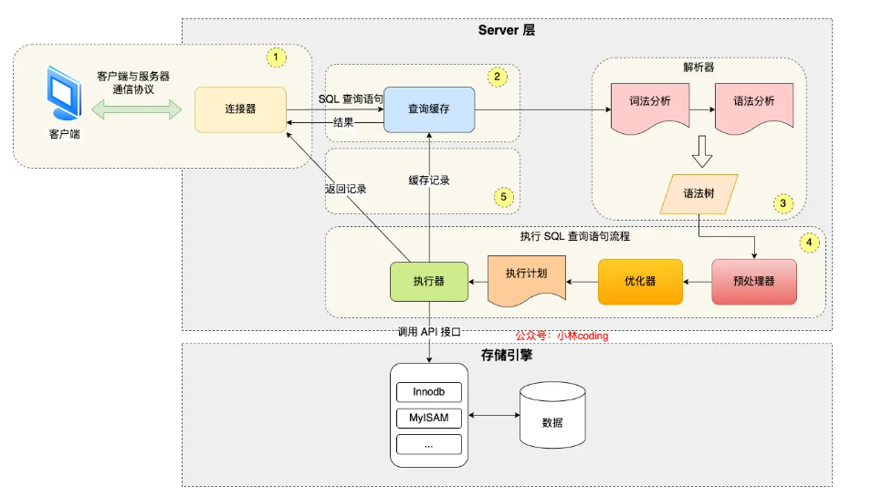

# 1. 执行一条select语句，期间发生了什么

## 1.1 MySQL 执行流程是怎样的？

先来一个上帝视角图，下面就是 MySQL 执行一条 SQL 查询语句的流程，也从图中可以看到 MySQL 内部架构里的各个功能模块。

可以看到，MySQL 的架构共分为两层：**Server 层和存储引擎层**，

- **Server 层负责建立连接、分析和执行 SQL**。MySQL 大多数的核心功能模块都在这实现，主要包括连接器，查询缓存、解析器、预处理器、优化器、执行器等。另外，所有的内置函数（如日期、时间、数学和加密函数等）和所有跨存储引擎的功能（如存储过程、触发器、视图等。）都在 Server 层实现。
- **存储引擎层负责数据的存储和提取**。支持 InnoDB、MyISAM、Memory 等多个存储引擎，不同的存储引擎共用一个 Server 层。现在最常用的存储引擎是 InnoDB，从 MySQL 5.5 版本开始，InnoDB 成为了 MySQL 的默认存储引擎。我们常说的索引数据结构，就是由存储引擎层实现的，不同的存储引擎支持的索引类型也不相同，比如 InnoDB 支持索引类型是 B+树，且是默认使用，也就是说在数据表中创建的主键索引和二级索引默认使用的是 B+ 树索引。

好了，现在我们对 Server 层和存储引擎层有了一个简单认识，接下来，就详细说一条 SQL 查询语句的执行流程，依次看看每一个功能模块的作用。