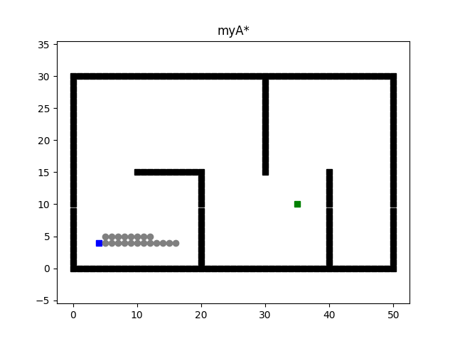
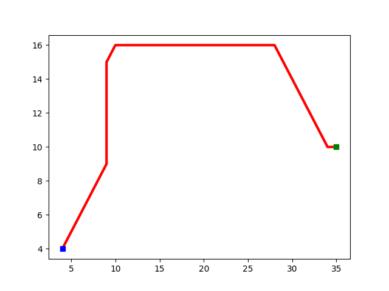

# 路径规划算法

本文用于记录自己入门路径规划A*和RRT算法的学习心得。

## **1.引言**

在现代技术领域，无人机群（Drone Swarm）以其高灵活性、协作能力和广泛的应用场景，正逐渐成为智能系统研究和工程实践的重要方向。无论是在灾害救援、环境监测还是物流配送中，无人机群都展现出了强大的潜力。然而，在这些应用中，**路径规划**作为无人机群协同和高效执行任务的核心技术，面临着诸多挑战。

### **路径规划的重要性与挑战**

对于无人机群而言，路径规划需要解决以下问题：

- **高效性：** 在复杂、动态的环境中快速规划出可行路径，确保任务及时完成。
- **安全性：** 规避环境中的障碍物和无人机之间的碰撞，减少意外。
- **多目标协同：** 多架无人机需要协调行动，以避免冲突并最大化任务效率。
- **环境适应性：** 面对不确定的环境变化，规划算法需要具备实时调整能力。

为了解决这些问题，本文选择了两种经典的路径规划算法——**A*** 和 **RRT**，分别应用于无人机群的路径规划任务。A* 算法以其**全局最优性**和**确定性**著称，适用于**离散环境**；而 RRT 算法因其**随机性**和**高维空间探索能力**，在**连续环境**中表现突出。

### **本文目标**

本文旨在：

1. 实现 A* 和 RRT 两种路径规划算法。

2. 比较两种算法在不同环境中的性能表现，包括路径长度、计算效率和适用性。

3. 探讨在无人机群任务中如何结合 A* 和 RRT 的优点，提高路径规划的效率和可靠

   性。

------

## 2.环境配置

env主要负责地图初始化，包括地图大小和障碍物生成

plotting主要负责路径规划过程的可视化工作

```python
# env.py
class Env:
    def __init__(self):
        self.x_range = 51  # size of background
        self.y_range = 31
        self.motions = [(-1, 0), (-1, 1), (0, 1), (1, 1),
                        (1, 0), (1, -1), (0, -1), (-1, -1)]
        self.obs = self.obs_map()

    def update_obs(self, obs):
        self.obs = obs

    def obs_map(self):
        """
        Initialize obstacles' positions
        :return: map of obstacles
        """

        x = self.x_range
        y = self.y_range
        obs = set()

        for i in range(x):
            obs.add((i, 0)) #下边界：（0,0）到（50,0）

        for i in range(x):
            obs.add((i, y - 1)) #上边界：（0,30）到（50,30）

        for i in range(y):
            obs.add((0, i)) #左边界：（0,0）到（0,30）
        for i in range(y):
            obs.add((x - 1, i)) #右边界：（50,0）（50,30）

        for i in range(10, 21):
            obs.add((i, 15))     #水平障碍物1：从（10，15）到（20，15）的水平线

        for i in range(15):
            obs.add((20, i))     #垂直障碍物1：（20,0）到（20，14）的垂线

        for i in range(15, 30):
            obs.add((30, i))     #垂直障碍物2：（30,15）到（30,29）的垂线

        for i in range(16):
            obs.add((40, i))    #从(40,0)到(40,15)的垂直线

        return obs


#plotting.py
import os
import sys
import matplotlib.pyplot as plt

sys.path.append(os.path.dirname(os.path.abspath(__file__)))

from Search_2D import env


class Plotting:
    def __init__(self, xI, xG):
        self.xI, self.xG = xI, xG
        self.env = env.Env()
        self.obs = self.env.obs_map()

    def update_obs(self, obs):
        self.obs = obs

    def animation(self, path, visited, name):
        self.plot_grid(name)
        self.plot_visited(visited)
        self.plot_path(path)
        plt.show()

    def animation_lrta(self, path, visited, name):
        self.plot_grid(name)
        cl = self.color_list_2()
        path_combine = []

        for k in range(len(path)):
            self.plot_visited(visited[k], cl[k])
            plt.pause(0.2)
            self.plot_path(path[k])
            path_combine += path[k]
            plt.pause(0.2)
        if self.xI in path_combine:
            path_combine.remove(self.xI)
        self.plot_path(path_combine)
        plt.show()

    def animation_ara_star(self, path, visited, name):
        self.plot_grid(name)
        cl_v, cl_p = self.color_list()

        for k in range(len(path)):
            self.plot_visited(visited[k], cl_v[k])
            self.plot_path(path[k], cl_p[k], True)
            plt.pause(0.5)

        plt.show()

    def animation_bi_astar(self, path, v_fore, v_back, name):
        self.plot_grid(name)
        self.plot_visited_bi(v_fore, v_back)
        self.plot_path(path)
        plt.show()

    def plot_grid(self, name):
        obs_x = [x[0] for x in self.obs]
        obs_y = [x[1] for x in self.obs]

        plt.plot(self.xI[0], self.xI[1], "bs")
        plt.plot(self.xG[0], self.xG[1], "gs")
        plt.plot(obs_x, obs_y, "sk")
        plt.title(name)
        plt.axis("equal")

    def plot_visited(self, visited, cl='gray'):
        if self.xI in visited:
            visited.remove(self.xI)

        if self.xG in visited:
            visited.remove(self.xG)

        count = 0

        for x in visited:
            count += 1
            plt.plot(x[0], x[1], color=cl, marker='o')
            plt.gcf().canvas.mpl_connect('key_release_event',
                                         lambda event: [exit(0) if event.key == 'escape' else None])

            if count < len(visited) / 3:
                length = 20
            elif count < len(visited) * 2 / 3:
                length = 30
            else:
                length = 40
            #
            # length = 15

            if count % length == 0:
                plt.pause(0.001)
        plt.pause(0.01)

    def plot_path(self, path, cl='r', flag=False):
        path_x = [path[i][0] for i in range(len(path))]
        path_y = [path[i][1] for i in range(len(path))]

        if not flag:
            plt.plot(path_x, path_y, linewidth='3', color='r')
        else:
            plt.plot(path_x, path_y, linewidth='3', color=cl)

        plt.plot(self.xI[0], self.xI[1], "bs")
        plt.plot(self.xG[0], self.xG[1], "gs")

        plt.pause(0.01)

    def plot_visited_bi(self, v_fore, v_back):
        if self.xI in v_fore:
            v_fore.remove(self.xI)

        if self.xG in v_back:
            v_back.remove(self.xG)

        len_fore, len_back = len(v_fore), len(v_back)

        for k in range(max(len_fore, len_back)):
            if k < len_fore:
                plt.plot(v_fore[k][0], v_fore[k][1], linewidth='3', color='gray', marker='o')
            if k < len_back:
                plt.plot(v_back[k][0], v_back[k][1], linewidth='3', color='cornflowerblue', marker='o')

            plt.gcf().canvas.mpl_connect('key_release_event',
                                         lambda event: [exit(0) if event.key == 'escape' else None])

            if k % 10 == 0:
                plt.pause(0.001)
        plt.pause(0.01)

    @staticmethod
    def color_list():
        cl_v = ['silver',
                'wheat',
                'lightskyblue',
                'royalblue',
                'slategray']
        cl_p = ['gray',
                'orange',
                'deepskyblue',
                'red',
                'm']
        return cl_v, cl_p

    @staticmethod
    def color_list_2():
        cl = ['silver',
              'steelblue',
              'dimgray',
              'cornflowerblue',
              'dodgerblue',
              'royalblue',
              'plum',
              'mediumslateblue',
              'mediumpurple',
              'blueviolet',
              ]
        return cl

```


## **3. A\* 算法部分**

### **3.1 算法原理**

A*（A-Star）算法是一种经典的启发式搜索算法，广泛应用于路径规划领域。它通过结合实际代价和启发式估计代价，在保证路径最优性的同时提高了搜索效率。

#### **核心思想**

A* 算法的核心是通过评估每个节点的代价函数 `f(n)` 来选择优先扩展的节点，其中：

- **`g(n)`**：从起始点到当前节点 n 的实际代价。
- **`h(n)`**：从当前节点 n 到目标点的启发式估计代价。
- **`f(n)` = `g(n) + h(n)`**：总代价。

A* 算法会优先扩展 `f(n)` 最小的节点，从而尽可能快速地找到代价最小的路径。

#### **适用场景**

- **离散化地图：** 将环境划分为网格（如二维/三维栅格地图），每个栅格作为一个节点。
- **静态障碍物：** 环境中障碍物的位置固定且已知。
- **无人机群协作：** 在网格图中为多架无人机规划不冲突的路径。

#### **优点**

- 能够找到全局最优路径（在启发函数满足条件时）。
- 算法简单且易于实现。

#### **局限性**

- 在高维空间或动态环境中效率较低。
- 对于无人机群任务，需要额外处理多目标和避免碰撞的问题。

------

### **3.2 算法实现**

```python
import math
import heapq
import env
import plotting
import time


class myAstar:

    #初始化部分
    def __init__(self, c_start, c_goal):
        self.n_start = c_start #起始节点坐标
        self.n_goal = c_goal #目标节点坐标
        self.OPEN = [] #待搜索节点的F值最小堆
        self.CLOSED = []  #已搜索过的节点列表
        self.PARENT = dict() #存储每个节点的父节点，用于路径回溯
        self.G = dict() #存储起点到各节点的实际代价
        self.Env = env.Env()
        self.obs = self.Env.obs
        

    def find_way(self):
        #1.初始化
        self.G[self.n_start] = 0
        self.PARENT[self.n_start] = None
        #把起点存放入open最小堆列表，元素以元组的形式存储（F值，节点坐标）
        #节点按F值从小到大排序，F值最小的在最上端（因为是最小堆）（比较元组时，按位置顺序比较）
        heapq.heappush(self.OPEN,  (self.f(self.n_start), self.n_start)
        #2.主循环
        while self.OPEN:
            _, node = heapq.heappop(self.OPEN) #取出节点坐标
            self.CLOSED.append(node) #将取出的节点坐标放入closed集合中
            if node == self.n_goal:
                break
            for n in self.find_child(node):#获取当前节点的所有邻节点
                #计算从起点到当前节点再到邻居节点的新代价
                g_new = self.G[node] + math.hypot(node[0] - n[0], node[1] - n[1])
                
                if n not in self.G:  #如果n是第一次访问
                    self.PARENT[n] = node  #设置父节点
                    self.G[n] = g_new  #记录代价
                    heapq.heappush(self.OPEN, (self.f(n), n)) #把该邻节点放入堆中
                else:
                    if g_new < self.G[n]:  #如果新路径更短
                        self.G[n] = g_new  #更新代价
                        self.PARENT[n] = node  #更新父节点
                        heapq.heappush(self.OPEN, (self.f(n), n)) #放回堆中
                       
         return self.extrcat_path(self.CLOSED), self.CLOSED #循环结束后返回路径和访问过的节点

    def f(self, node):  # 返回当前节点的f值（总估计代价）
        f = self.G[node] + math.hypot(    #欧几里得距离作为启发式函数
            self.n_goal[0] - node[0], self.n_goal[1] - node[1])
        return f

    def find_child(self, node):
        child_list = []  # 子节点列表
        near = [-1, 0, 1]  # 八个周边方向
        for i in near:
            for j in near: 
                child_node = (node[0] + i, node[1] + j) #两层for循环遍历周边9个位置
                if self.is_legal(node, child_node):
                    child_list.append(child_node) #合法的节点将加入到子节点中
        return child_list

    def is_legal(self, n_start, n_end):
        if n_start in self.obs or n_end in self.obs: #当前节点和子节点有一个在障碍物集合中就不合法
            return False
        else:
            return True

    def extrcat_path(self, P):

        path = [self.n_goal] #存储最终路径的列表
        n_last = self.n_goal #当前节点
        while self.PARENT[n_last] != None:
            n_last = self.PARENT[n_last] #循环查找父节点
            path.append(n_last) #把父节点加入路径

        return path


def main():
    time_start = time.time() #记录开始时间
    c_start = (4 , 4)
    c_goal = (35 , 10)
    astar = myAstar(c_start, c_goal) #创建算法实例
    plot = plotting.Plotting(c_start, c_goal) #创建绘图实例
    path, visited = astar.find_way() #执行搜索
    time_end = time.time() #记录结束时间
    print('totally cost', time_end - time_start)
    plot.animation(path, visited, "myA*")


if __name__ == '__main__':
    main()
```

**实现思路：**

1. 初始化两个列表—OPEN（待搜索节点列表）和CLOSED（已搜索过的节点列表）

2. OPEN列表是以F值（总代价）为标准的最小堆，两个列表的元素为二元元组，元组中存放着节点的F值和坐标

3. 另外初始化两个字典PARENT和G。

   ​	3.1 PARENT用于存放节点的父节点信息，用于找到目标节点后的路径回溯。

   ​	3.2 G用于存放各个节点到初始点的实际代价

4. 障碍物生成在env.py中，图像生成在plotting.py中

5. 首先把起点存入OPEN列表，拿出OPEN列表的首元素，放入CLOSED列表中，遍历该节点所有合法的（没有在障碍物集合中且没有超过地图范围）子节点，记录这些子节点的代价，并设置各子节点的父节点，计算f值后放入OPEN列表中。

6. 拿出OPEN列表的首元素，遍历其所有不在CLOSED列表中且合法的子节点，期间如果某子节点存在更近的新路径，更新其父节点和新路径的代价，计算f值后重新放入堆中

7. 重复步骤6，直至找到目标节点或OPEN列表为空（未找到路径）

8. 找到目标节点后利用PARENT字典回溯，从目标节点一直追溯到起始节点，构建完整路径。





## 4.RRT算法部分

```python
import os
import sys
import math
import numpy as np

sys.path.append(os.path.dirname(os.path.abspath(__file__)) +
                "/../../")

from Sampling_based_Planning.rrt_2D import env, plotting, utils


class Node:
    def __init__(self, n):#定义Node节点类，n是节点的坐标
        self.x = n[0] 
        self.y = n[1]
        self.parent = None


class Rrt:
    def __init__(self, s_start, s_goal, step_len, goal_sample_rate, iter_max):
        #初始化起点终点为Node对象
        self.s_start = Node(s_start)
        self.s_goal = Node(s_goal)
        #算法参数
        self.step_len = step_len #单次扩展步长
        self.goal_sample_rate = goal_sample_rate #直接目标点采样概率
        self.iter_max = iter_max #最大迭代次数
        
        #树结构顶点
        self.vertex = [self.s_start]
        
		#环境配置
        self.env = env.Env()
        self.plotting = plotting.Plotting(s_start, s_goal)
        self.utils = utils.Utils()
        
		#从环境中获取地图信息
        self.x_range = self.env.x_range
        self.y_range = self.env.y_range
        self.obs_circle = self.env.obs_circle
        self.obs_rectangle = self.env.obs_rectangle
        self.obs_boundary = self.env.obs_boundary

    def planning(self):
        for i in range(self.iter_max):
            #1.随机取样
            node_rand = self.generate_random_node(self.goal_sample_rate)
            #2.找最近的邻节点
            node_near = self.nearest_neighbor(self.vertex, node_rand)
            
            #3.从已知点向随机点方向扩展
            node_new = self.new_state(node_near, node_rand)
            
			#4.碰撞检测
            if node_new and not self.utils.is_collision(node_near, node_new):
                self.vertex.append(node_new) # 添加新节点到树
                
                #5.检查是否到达目标
                dist, _ = self.get_distance_and_angle(node_new, self.s_goal)
				#如果新节点到目标节点距离小于步长，且无碰撞，则找到路径
                if dist <= self.step_len and not self.utils.is_collision(node_new, self.s_goal):
                    self.new_state(node_new, self.s_goal)
                    return self.extract_path(node_new) #提取路径
		#for循环走完都没找到返回空
        return None

    def generate_random_node(self, goal_sample_rate):
        delta = self.utils.delta #安全边界
		
        #按概率采样目标点或随机点
        if np.random.random() > goal_sample_rate:
            #未命中目标点概率，返回随机点
            #生成点的x坐标，值保留地图范围安全边界
            xMin=self.x_range[0] + delta 
            xMax=self.x_range[1] - delta
            #生成点的y坐标，值保留地图范围安全边界
            yMin=self.y_range[0] + delta
            yMax=self.y_range[1] - delta                     
            return Node((np.random.uniform(xMin, xMax),
                         np.random.uniform(yMin, yMax)))

        return self.s_goal #命中目标点概率，直接返回目标点

     @staticmethod
    def nearest_neighbor(node_list, n):
        # 计算所有节点到随机点的距离，distance是一个列表，存放了所有的距离值
        distances = [math.hypot(nd.x - n.x, nd.y - n.y) for nd in node_list]
        return node_list[int(np.argmin(distances))]  # 返回最近节点

    def new_state(self, node_start, node_end):
        #计算距离和角度，start是附近点，end是刚生成的随机点
        dist, theta = self.get_distance_and_angle(node_start, node_end)
		#限制步长
        dist = min(self.step_len, dist)
        #在该方向上创建新节点，并设置父节点
        node_new = Node((node_start.x + dist * math.cos(theta),
                         node_start.y + dist * math.sin(theta)))
        node_new.parent = node_start

        return node_new

    def extract_path(self, node_end):
        #路径从终点开始写起，此处的node_end即是终点
        path = [(self.s_goal.x, self.s_goal.y)]
        node_now = node_end

        while node_now.parent is not None:
            node_now = node_now.parent
            path.append((node_now.x, node_now.y))

        return path

    @staticmethod
    def get_distance_and_angle(node_start, node_end):
        dx = node_end.x - node_start.x
        dy = node_end.y - node_start.y
        return math.hypot(dx, dy), math.atan2(dy, dx)


def main():
    x_start = (5, 5)  # Starting node
    x_goal = (45, 15)  # Goal node

    rrt = Rrt(x_start, x_goal, 0.5, 0.05, 10000)
    path = rrt.planning()

    if path:
        rrt.plotting.animation(rrt.vertex, path, "RRT", True)
    else:
        print("No Path Found!")


if __name__ == '__main__':
    main()

```

