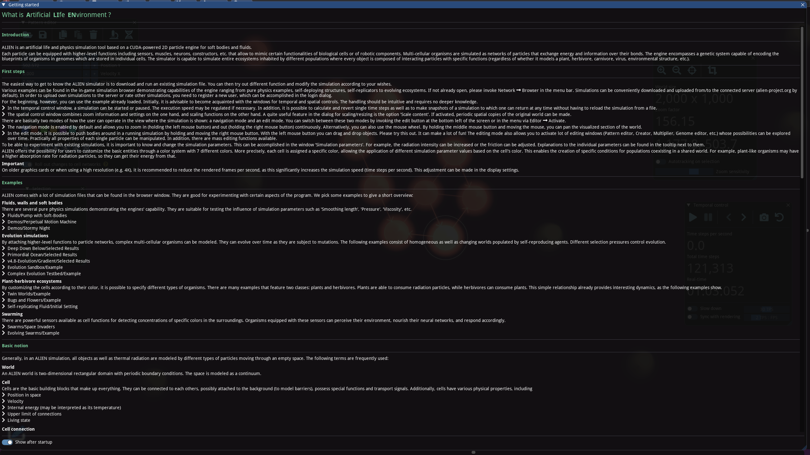
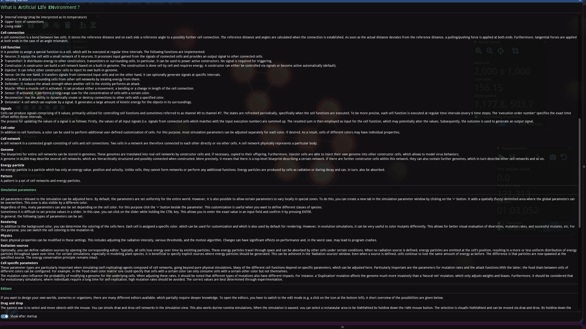
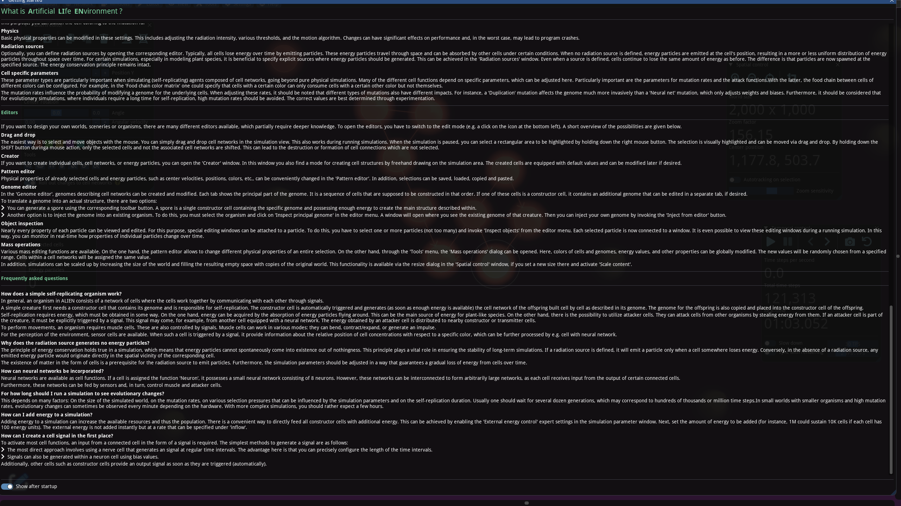

## 什么是人工生命环境？

**简介**
 ALIEN 是一个基于 CUDA 驱动的 2D 粒子引擎的人工生命和物理模拟工具，适用于软体和流体。每个粒子可以配备更高级别的结构，包括能够模拟某些生物细胞或机器人组件功能的宏观结构。多细胞生物体被模拟为通过键连接并在其键上交换能量和信息的粒子网络。引擎包含一个遗传系统，能够编码繁殖行为、神经网络结构和身体形态。

**第一步**
 了解 ALIEN 模拟器最简单的方法是下载并运行现有的模拟文件。您可以尝试不同的功能并根据自己的需求修改模拟。

**基本概念**

**世界**
 ALIEN 世界是一个具有周期性边界条件的二维矩形域。空间被建模为连续体。

**细胞**
 细胞是构成一切的基本构建块。它们可以相互连接，可能附着到背景上（以模拟屏障），具有特殊功能并运输信号。此外，细胞具有各种物理属性，包括：

- 位置在空间中
- 速度
- 内部能量（可解释为温度）
- 连接的上限
- 生存状态

**细胞连接**
 细胞连接是两个细胞之间的键，它存储参考距离和每一端的参考角度到可能的进一步细胞连接。

**细胞功能**
 可以为细胞分配特殊功能，在定期时间间隔执行。实现了以下功能：

- 神经元：使细胞拥有类似神经元的小网络
- 传输器：向其他连接器、传输器或环境传输信号
- 构造器：在细胞周围构建其他细胞和连接
- 注射器：可以感染其他构造器细胞以注入自己的内置基因组
- 神经：一方面传输来自连接输入细胞的信号，另一方面可选择性地在特定间隔生成信号
- 攻击器：通过从其他细胞网络中窃取能量来攻击周围细胞
- 防御器：当另一个细胞在附近执行攻击时降低攻击强度
- 肌肉：对连接执行力，减少或增加连接长度
- 传感器：执行长程扫描以检测具有特定颜色的细胞浓度
- 重连器：能够动态创建或销毁与具有指定颜色的其他细胞的连接
- 爆炸器：可以通过信号爆炸的细胞

**信号**
 细胞可以产生由8个值组成的信号，主要用于控制细胞功能。

**细胞颜色**
 除了细胞功能，颜色还可以用于执行细胞的额外用户定义定制。

**细胞网络**
 细胞网络是由细胞和细胞连接组成的连通图。

**基因组**
 整个细胞网络的蓝图可以存储在基因组中。这些基因组被翻译成真实的细胞网络。

**能量粒子**
 能量粒子是仅具有能量值、位置和速度的粒子。与细胞不同，它们无法形成网络或执行任何其他功能。

**模式**
 模式是一组细胞网络和能量粒子。

**模拟参数**
 所有与模拟相关的参数都可以在这里调整。

**编辑器**
 如果您想设计自己的世界、场景或生物体，有许多不同的编辑器可用。

**常见问题**
 文档还包含了关于自复制生物体、能量守恒、神经网络、进化等方面的常见问题解答。

## 英语原文

