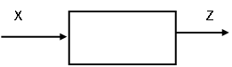
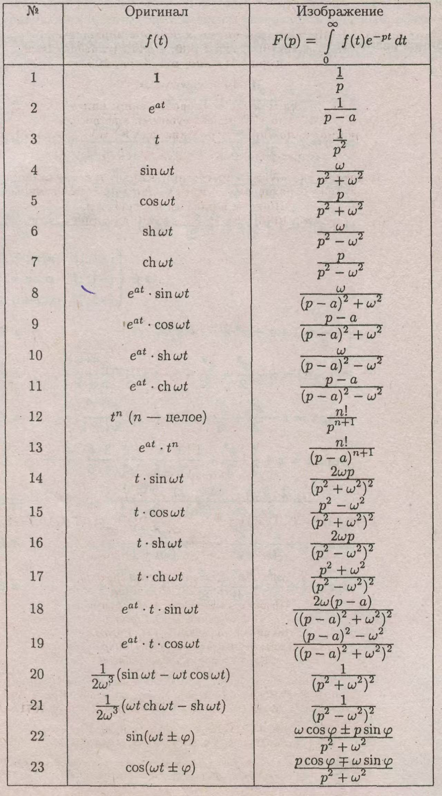
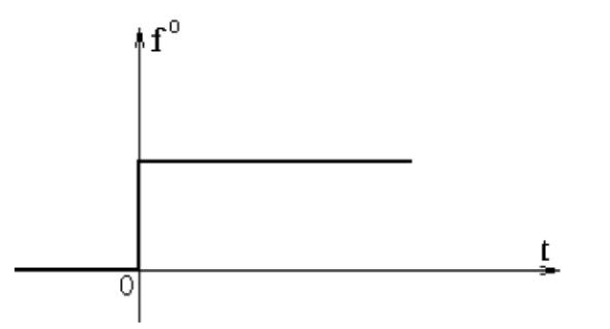
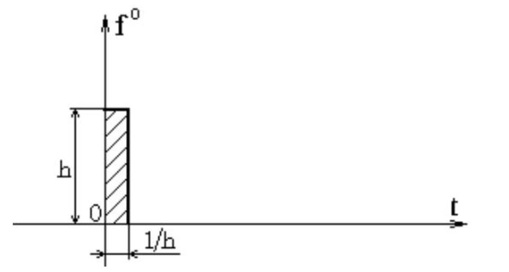

### 2. Основные методы построения математических моделей для решения обыкновенных линейных дифференциальных уравнений с постоянными коэффициентами.

Зависимость между двумя функциями времени  ***X=X(t)* и *Z=Z(t)***, являющимися, например входным и выходным сигналами линейной системы, может быть задана в трёх видах.

两个时间函数 ***X=X(t)* 与 *Z=Z(t)*** 之间的依赖关系，例如，它们分别为线性系统的输入和输出信号，这种关系可以用三种形式来表示。



**1-й вид:** Зависимость задаётся дифференциальным уравнением **n**-ного порядка[[1\]](#_ftn1). При ***n=3\***, например , это уравнение имеет вид

第一种类型：依赖关系由 n 阶微分方程给出。例如，当 n = 3 时，此方程具有以下形式
$$
A_{3}Z^{\prime \prime} + A_{2}Z^{\prime \prime} + A_{1}Z^{\prime} + A_{0}Z = X \tag{2,a}\\

Z^{(i)} = \frac{d^{i}Z}{dt^{i}}
$$
При **i=0**  получаем **$Z^{(0)} = Z$**. Эту величину, таким образом, можно рассматривать как производную нулевого порядка.

当i = 0时，我们得到$Z^{(0)} = Z$ 。因此，这个量可以被视为零阶导数。

```
производная->阴性名词导数，后接n-ного порядка
производная первого порядка 一阶导数
或者ф-первая производная 表示 f’(x)
```

**2-й вид.** Зависимость задаётся системой m дифференциальных уравнений (причём m<n), сумма порядков которых равна n. Например, вместо уравнения (2,а) может быть задана система двух уравнений второго и первого порядков

第二种类型。依赖关系由 m 个微分方程（其中 m<n）的系统定义，这些方程的阶数总和为 n。例如，可以用一个二阶方程和一个一阶方程组成的系统来取代方程 (2,a)。
$$
\begin{array}{rl} & B_{11}Z_{1}^{\prime \prime} + B_{12}Z_{2}^{\prime \prime} + B_{13}Z_{1}^{\prime} + B_{14}Z_{2}^{\prime} + B_{15}Z_{1} + B_{16}Z_{2} = X_{1};\\ & B_{21}Z_{1}^{\prime} + B_{22}Z_{22}^{\prime} + B_{23}Z_{1} + B_{24}Z_{2} = X_{2}, \end{array} \tag{2,б} \\
$$
где  $Z_{1} = Z_{1}(t) = Z(t)$ ; $Z_{2} = Z_{2}(t)$ — некоторая вспомогательная функция; 

$X_{1} = X_{1}(t)$ ; $X_{2} = X_{2}(t)$ — заданные функции, связанные линейной зависимостью с $X = a_{1}X_{1} + a_{2}X_{2}$ . 

**3-й вид.** Зависимость задаётся системой ***m\*** дифференциальных уравнений первого порядка ***(m=n)\***, каждое из которых содержит только одну производную. В таком случае, вместо (2,а), (2,б), имеем 

第三种类型。依赖关系由一个由 *m* 个一阶微分方程组成的系统来确定（*m=n*），其中每个方程只包含一个导数。在这种情况下，代替（2,a）、（2,b），我们有 
$$
\begin{array}{rl} & Z_{1}^{\prime} = C_{11}Z_{1} + C_{12}Z_{2} + C_{13}Z_{3} + x_{1} \\ & Z_{2}^{\prime} = C_{21}Z_{1} + C_{22}Z_{2} + C_{23}Z_{3} + x_{2} \\ & Z_{3}^{\prime} = C_{31}Z_{1} + C_{32}Z_{2} + C_{33}Z_{3} + x_{3} \end{array}
$$
где $Z_{1} = Z_{1}(t) = Z(t)$ ; $Z_{2} = Z_{2}(t)$ ; $Z_{3} = Z_{3}(t)$ — вспомогательные функции; 

$x_{1} = x_{1}(t)$ , $x_{2} = x_{2}(t)$ , $x_{3} = x_{3}(t)$ — заданные функции, связанные линейно с $x = b_{1}x_{1} + b_{2}x_{2} + b_{1}x_{3}$ . 


Подобные дифференциальные уравнения носят название нормальных, Каждый из этих трёх видов зависимости между ***X=X(t)\*** и ***Z=Z(t)\*** может быть представлен в трёх формах: временной, символической и операторной.

这样的微分方程被称为正规的。*X = X(t)* 与 *Z = Z(t)* 之间这三种依赖关系中的每一种都可以用三种形式表示：时间形式、符号形式和算子形式。

Пусть зависимость между функциями ***X\*** и ***Z\*** задана дифференциальным уравнением (2,а). Такую дифференциальную форму связи ***Z\*** и ***X\*** можно назвать ***формой времени\*** или ***временной формой\***.

设函数*X*与*Z*之间的关系由微分方程(2,a)给定。这种*Z*与*X*之间联系的微分形式可称为*时间形式*或*时间的形式*。

Если ввести оператор (т.е. символ) дифференцирования $D=\frac{d()}{dt}\frac{1}{cek}$, то от формы времени можно перейти к символической форме записи дифференциального уравнения (2,а):

如果输入微分运算符(符号形式)$D=\frac{d()}{dt}\frac{1}{cek}$ ，那么从时间形式可以转换到微分方程（2,а）的符号形式记录：
$$
\begin{array}{c}{{A_{3}D^{3}Z+A_{2}D^{2}Z+A_{1}D Z+A_{0}Z=}}\\ {{=(A_{3}D^{3}+A_{2}D^{2}+A_{1}D+A_{0})Z=X}}\end{array} \tag{2,B}
$$
Здесь по-прежнему ***Z\*** и ***X\*** являются функциями времени.

在这里，*Z* 和 *X* 仍然是时间函数。

Если подвергнуть обе части уравнения (2,в) преобразованию Лапласа

如果对等式(2,в)的两边进行拉普拉斯变换
$$
\begin{array}{r}{\int_{0}^{\infty}(A_{3}Z^{\prime \prime \prime} + A_{2}Z^{\prime \prime} + A_{1}Z^{\prime} + A_{0}Z)e^{-\mathrm{\Delta}p t}d t = \int_{0}^{\infty}X e^{-\mathrm{\Delta}p t}d t,} \end{array}
$$
rдe $p$ - комплексная переменная, то получим операторную форму представления этого уравнения 

其中p是复变量，那么我们将得到该方程的*算子形式*表示。
$$
\begin{array}{c}{{A_{3}\left(p^{3}Z-p^{2}Z_{0}-p Z_{0}^{\prime}-Z_{0}^{\prime\prime}\right)+A_{2}\left(p^{2}Z-p Z_{0}-Z_{0}^{\prime}\right)+}}\\ {{+A_{1}\left(p Z-Z_{0}\right)+A_{0}Z=X}}\end{array} \tag{2,г}
$$
При этом $Z_{0}, Z_{0}$ , $Z_{0}$ — начальные значения переменной $Z$ и её производных (при $t = 0$ ), а $Z$ и $X$ — изображения $Z(p)$ и $X(p)$ функций $Z(t)$ и $X(t)$ . Во избежание путаницы в некоторых случаях целесообразно обозначать оригиналы через $Z = Z(t), X = X(t)$ , а их изображения как $Z = Z(p), \overline{X} = \overline{X} (p)$ . В случае нулевых начальных условий $(Z_{0} = Z_{0}^{\prime} = Z_{0}^{\prime \prime} = 0)$ операторная форма (2,г) 

此时，$Z_0$、$Z_0'$、$Z_0''$ 是变量 $Z$ 及其导数的初始值（在 $t = 0$ 时），而 $Z$ 和 $X$ 是函数 $Z(t)$ 和 $X(t)$ 的 $Z(p)$ 和 $X(p)$ 的像。为避免混淆，在某些情况下，通过 $Z = Z(t)$、$X = X(t)$ 来表示原函数，而将它们的像表示为 $Z = Z(p)$、$\overline{X}=\overline{X}(p)$ 是合适的。在零初始条件的情况下（$Z_0 = Z_0' = Z_0'' = 0$），算子形式 (2,г) 
$$
\begin{array}{c}{{A_{3}p^{3}Z+A_{2}p^{2}Z+A_{1}p Z+A_{0}Z=}}\\ {{=(A_{3}p^{3}+A_{2}p^{2}+A_{1}p+A_{0})Z=X}}\end{array} \tag{2,д}
$$
совпадает с символической (2,в) и можно считать, что $p = D = \frac{d}{dt}$ . 

При построении схем математических моделей для решения линейных дифференциальных уравнений всегда можно принимать начальные условия за нулевые, а затем фиксировать их начальными значениями напряжений моделирующих $Z, Z^{\prime}, Z^{\prime \prime}, \ldots$ . Это обстоятельство позволяет рассматривать символическую форму (2,в) представления зависимости между $Z$ и $X$ одновременно и как операторную, считая $D = p$ . 

在构建用于求解线性微分方程的数学模型方案时，始终可以将初始条件设为零，然后将它们固定为模拟 \(Z\)、\(Z'\)、\(Z''\) 等的应力初始值。这一情况使得可以同时将 \(Z\) 与 \(X\) 之间依赖关系的符号形式（2，в）视为算子形式，将 \(D = p\)。 

------


#### **2.1. Оператор системы (系统算子)**

Всякая динамическая система осуществляет некоторое преобразо­вание функций. Получая на входе определенную функцию, си­стема вырабатывает на выходе другую функцию. Например, следящая система получает определенную функцию на входе. Эту функцию она должна, в силу своего назначения, воспроизвести с возможно боль­шей точностью. Но в действительности точное воспроизведение этой функции невозможно. Следовательно, при подаче на вход следящей системы одной функции на выходе, вообще говоря, полу­чится другая функция. При этом каждой данной входной функции система ставит в соответствие одну единственную выходную функ­цию. С математической точки зрения соответствие между функциями на входе и выходе системы является оператором.

任何动态系统都会对函数进行某种变换。系统在输入端接收一个特定函数，然后在输出端产生另一个函数。例如，跟踪系统在输入端接收一个特定函数。由于其自身的用途，该系统必须尽可能精确地重现这个函数。但实际上，精确重现这个函数是不可能的。因此，当向跟踪系统输入一个函数时，一般来说，输出端会得到另一个函数。此时，对于每个给定的输入函数，系统都会对应一个唯一的输出函数。从数学角度来看，系统输入和输出函数之间的对应关系就是一个算子。 

Оператором называется закон, в соответствии с которым по заданной функции определяется другая функция. Иными словами, оператор представляет собой совокупность математических и логических действий, в результате которых заданной функции приводится в соответствие некоторая другая функция.

算子是指这样一种规则，根据该规则，依据给定的函数来确定另一个函数。换句话说，算子是数学和逻辑运算的集合，通过这些运算，使给定的函数与某个其他函数相对应。 

 Понятие оператора является обобщением понятия функции. ***Функ­цией\****,* как известно, называется переменная величина, числовое значе­ние которой определяется заданием числового значения другой пере­менной — аргумента. Более общим понятием является понятие функ­ционала, ***функционалом\*** называется переменная величина, числовое значение которой определяется заданием функции (например, пло­щадь, ограниченная замкнутой кривой). Понятие оператора является еще более широким, так как оператор приводит в соответствие каждой данной функции не число, а функцию.

算子的概念是函数概念的推广。众所周知，函数是指一个变量，其数值由另一个变量——自变量的数值确定。更为一般的概念是泛函的概念，泛函是指一个变量，其数值由一个函数的给定确定（例如，由一条封闭曲线所围成的面积）。算子的概念更为宽泛，因为算子使每一个给定的函数不是对应一个数，而是对应一个函数。 

Так как любая динамическая система осуществляет преобразо­вание функций — каждой данной функции на входе ставит в соот­ветствие определенную функцию на выходе,—то каждой динамичес­кой системе соответствует вполне определенный оператор. Этот опе­ратор мы будем называть ***оператором системы\****.* Оператор системы обычно коротко обозначают одной буквой. Тогда соответствие между входной функцией системы ***x(t)\*** и ее выходной функцией ***у (t)\*** можно коротко записать в виде

由于任何动态系统都实现函数的变换——将每个给定的输入函数对应到一个确定的输出函数，因此每个动态系统都对应一个完全确定的算子。我们将这个算子称为系统算子。系统算子通常用一个字母来简记。那么，系统的输入函数*x(t)*与其输出函数*y(t)*之间的对应关系可以简记为
$$
y(t) = A \cdot x(t), \tag{2.1}
$$
где $A$ —оператор системы. Буквой $A$ в равенстве (2.1) обозначена вся совокупность математических действий, которые нужно произвести, чтобы по данной входной функции $x(t)$ найти соответствующую выходную функцию системы $y(t)$ . 

其中 𝐴 是系统算子。在等式(2.1)中，字母 𝐴 表示为了根据给定的输入函数 𝑥(𝑡) 找到系统相应的输出函数 𝑦(𝑡) 而需要进行的所有数学运算的总和。 

Оператор системы является полной, исчерпывающей ее характе­ристикой. При этом понятием оператора объединяются любые мате­матические действия: все алгебраические действия, дифференцирование, интегрирование, сдвиг во времени, решение дифференциальных, интег­ральных, алгебраических и любых других функциональных уравнений, а также любые логические действия. Задать оператор системы — это означает задать совокупность (программу) действий, которые надо осуществить над входной функцией, чтобы получить выходную функцию.

系统算子是对系统的完整、详尽的描述。在此，算子这一概念涵盖了任何数学运算：所有代数运算、微分、积分、时间平移、求解微分方程、积分方程、代数方程以及任何其他泛函方程，还有任何逻辑运算。定义系统算子意味着定义一系列（程序）操作，这些操作需作用于输入函数，以得到输出函数。 

Оператор системы может быть задан в различных формах. В част­ности, оператор системы полностью определяется системой уравнений, описывающих работу всех элементов, из которых состоит данная система. Так, например, оператор системы управления полетом лета­тельного аппарата (самолета или ракеты) можно задать в форме дифференциальных уравнений движения летательного аппарата и уравнений, описывающих все механические, электрические, электро­магнитные и другие процессы в элементах системы управления. Дей­ствительно, совокупность всех этих уравнений полностью определяет Закон, по которому для любого данного входного возмущения можно найти соответствующую выходную переменную системы. Например, по скорости действующего на летательный аппарат ветра, заданной как функция времени, можно найти координаты центра массы лета­тельного аппарата как функции времени. А это и означает, что со­вокупность дифференциальных уравнений движения летательного аппарата и уравнений, описывающих процессы, протекающие в элемен­тах системы управления, определяет оператор системы управления полетом.

系统算子可以用不同的形式来设定。具体而言，系统算子完全由描述系统各组成元件工作的方程组所确定。例如，飞行器（飞机或火箭）飞行控制系统的算子，可以用飞行器运动的微分方程以及描述飞行控制系统各元件中所有机械、电气、电磁和其他过程的方程来设定。实际上，所有这些方程共同完全确定了一个规律，根据这个规律，对于任何给定的输入扰动，都可以找到系统相应的输出变量。例如，根据作为时间函数给出的作用于飞行器的风速，就可以找到飞行器质心坐标作为时间的函数。这就意味着，飞行器运动的微分方程以及描述飞行控制系统元件中所发生过程的方程，共同确定了飞行控制系统的算子。 

В задачах практики поведение автоматической системы часто можно описать конечным числом обыкновенных дифференциальных уравнений. В таких случаях оператор системы сводится к операции решения дифференциальных уравнений. Это дает возможность приме­нить для исследования системы методы теории дифференциальных уравнений. Однако на практике встречаются и такие системы, пове­дение которых описывается уравнениями в частных производных или даже более сложными видами уравнений. Поэтому аппарат теории дифференциальных уравнений недостаточен для построения общей теории автоматических систем. Именно поэтому приходится в общем случае характеризовать автоматическую систему ее оператором и поль­зоваться различными способами задания этого оператора. Задание опе­ратора системы в форме дифференциальных уравнений, обыкновенных или в частных производных, возможно только в частных случаях.

在实际问题中，自动系统的行为通常可以用有限个常微分方程来描述。在这种情况下，系统的算子就归结为求解微分方程的运算。这使得我们有可能运用微分方程理论的方法来研究系统。然而，在实际中也会遇到这样一些系统，其行为是由偏微分方程甚至更复杂形式的方程来描述的。因此，微分方程理论的工具不足以构建自动系统的一般理论。正是因为这个原因，在一般情况下，不得不通过其算子来描述自动系统，并使用各种方法来定义这个算子。只有在特殊情况下，才有可能以常微分方程或偏微分方程的形式来定义系统的算子。 

------


#### 2.2 Линейные и нелинейные системы (线性和非线性系统). Принцип суперпозиции (叠加原理).

Оператор называется линейным, если при любых числах $n$ , $c_{1}\ldots c_{n}$ при любых функциях $x_{1}(t)\ldots x_{n}(t)$ 

如果对于任意数字 n,任意系数 $c_{1}\ldots c_{n}$ 以及任意函数$x_{1}(t)\ldots x_{n}(t)$ (存在以下的关系)该算子被称为线性算子。
$$
A\left\{\sum_{m = 1}^{n}c_{m}\cdot x_{m}(t)\right\} = \sum_{m = 1}^{n}A\cdot c_{m}\cdot x_{m}(t) \tag{2.2}
$$
Т. е. результат действия этого оператора на любую линейную комбинацию данных функций является линейной комбинацией от результатов его действия на каждую функцию в отдельности с теми же коэффициентами. 

也就是说，该算子对这些函数的任何线性组合的作用结果，是它对每个函数单独作用的结果的线性组合，且系数相同。

Динамическая система называется **линейной**, если ее оператор линеен. Иными словами, динамическая система линейна тогда и только тогда, когда линейной комбинации любых входных возмущений соответствует та же линейная комбинация соответствующих выходных функций. Это свойство линейных систем, выраженное формулой (2.2), обычно называется **принципом суперпозиции**. Поэтому линейные системы можно определить как такие системы, для которых справедлив принцип суперпозиции. 

如果一个动态系统的**算子是线性的**，那么这个动态系统就被称为线性系统。换句话说，当且仅当任何输入扰动的线性组合对应于相应输出函数的相同线性组合时，动态系统才是线性的。线性系统的这一特性，用公式(2.2)表示，通常被称为**叠加原理**。因此，线性系统可以定义为符合叠加原理的系统。 

Для того чтобы система была линейной, необходимо и достаточно выполнение следующих двух условий:

***1)\*** ***сумме любых двух входных возмущений соответствует сумма соответствующих двух выходных переменных;\***

***2)\*** ***при любом усилении входного возмущения без изменения его формы выходная переменная претерпевает точно такое же усиление, также не изменяя своей формы.\***

为使系统是线性的，必须且只需满足以下两个条件：

*1)* 任何两个输入扰动之和对应于相应的两个输出变量之和；

*2)* 无论对输入扰动进行何种放大而不改变其形式，输出变量都会经历完全相同的放大，且同样不改变其形式。 

Необходимость этих условий очевидна. Так как формула (2.2) справедлива для любого $n$ и любых чисел $c_{1},\ldots ,c_{n}$ , то, полагая $n = 2$ , $c_{1} = c_{2} = 1$ , получаем: 

这些条件的必要性是显而易见的。由于公式(2.2)对于任意的 n以及任意的数$c_{1},\ldots ,c_{n}$都成立，那么，令 n = 2，$c_{1} = c_{2} = 1$，我们得到：
$$
A\left\{x_{1}(t) + x_{2}(t)\right\} = A x_{1}(t) + A x_{2}(t) \tag{2.3}
$$
Полагая $n = 1$ , получим при производных $c$ и $x(t)$ : 
$$
A\{c_{1}(t)\} = c A x(t) \tag{2.4}
$$
Для доказательства достаточности условий (2.3) и (2.4) заметим, что из этих условий вытекают формулы 

为了证明条件(2.3)和(2.4)的充分性，我们注意到从这些条件可以推出公式
$$
A\left\{c_{1}x_{1}(t) + c_{2}x_{2}(t)\right\} = A\left\{c_{1}x_{1}(t)\right\} +A\left\{c_{2}x_{2}(t)\right\} = c_{1}A x_{1}(t) + c_{2}A x_{2}(t), \tag{2.5}\\
$$

$$
\begin{array}{l}{{A\left\{\sum_{m = 1}^{n}c_{m}\cdot x_{m}(t)\right\} = A\cdot \left\{\sum_{m = 1}^{n - 1}c_{m}\cdot x_{m}(t) + c_{n}\cdot x_{n}(t)\right\} =}}\\ {{= A\cdot \left\{\sum_{m = 1}^{n - 1}c_{m}\cdot x_{m}(t)\right\} +A\cdot \left\{c_{n}\cdot x_{n}(t)\right\} = A\cdot \left\{\sum_{m = 1}^{n - 1}c_{m}\cdot x_{m}(t)\right\} +A\cdot c_{n}\cdot x_{n}(t)}} \end{array} \tag{2.6}
$$
справедливые для любых чисел $n$ , $c_{1},\ldots ,c_{n}$ и для любых функций $x_{1}(t),\ldots ,x_{n}(t)$ . Формула (2.5) показывает, что из условий (2.3) и (2.4) следует справедливость принципа суперпозиции для случая двух слагаемых. Формула (2.6) показывает, что принцип суперпозиции выполняется для $n$ слагаемых, если он выполняется для $n - 1$ слагаемых. Из этой формулы по индукции следует справедливость принципа суперпозиции при любом числе $n$ слагаемых, поскольку он справедлив для случая двух слагаемых. Таким образом, принцип суперпозиции является следствием условий (2.3) и (2.4), что и доказывает достаточность этих условий. 

对于任意数$n$ , $c_{1},\ldots ,c_{n}$以及任意函数$x_{1}(t),\ldots ,x_{n}(t)$都成立。公式(2.5)表明，从条件(2.3)和(2.4)可推出对于两项相加的情况叠加原理成立。公式(2.6)表明，如果叠加原理对于 \(n - 1\) 项相加的情况成立，那么对于 \(n\) 项相加的情况也成立。由这个公式通过归纳法可知，对于任意数量 \(n\) 项相加的情况，叠加原理都成立，因为它对于两项相加的情况是成立的。这样，叠加原理是条件(2.3)和(2.4)的推论，这就证明了这些条件的充分性。 

Подчеркнем, что для линейности системы необходимо, чтобы принцип суперпозиции соблюдался при любом числе слагаемых, при любом выборе постоянных $c_{m}$ , и функций $x_{m}(t)$ . 

需要强调的是，对于系统的线性特性，无论相加项的数量、常数$c_{m}$以及函数 $x_{m}(t)$如何选择，都必须满足叠加原理。

Принцип суперпозиции значительно облегчает исследование линей­ных систем по сравнению с нелинейными. Благодаря принципу супер­позиции теория линейных дифференциальных уравнений разработана в самом общем виде для уравнений любого порядка, в то время как теория нелинейных дифференциальных уравнений по существу отсут­ствует, и мы можем решать в аналитической форме только нелиней­ные дифференциальные уравнения частных видов невысокого порядка. Вот почему для решения всех математических вопросов, возникаю­щих в приложениях, обращаются в первую очередь к линейным методам. При этом даже нелинейные системы стараются приближенно рассматривать как линейные. В результате появились различные ме­тоды ***линеаризации\*** нелинейных систем, т. е. приближенной замены нелинейных систем практически равноценными линейными.

叠加原理与非线性系统相比，极大地简化了线性系统的研究。由于叠加原理，线性微分方程理论已针对任意阶方程以最一般的形式得到发展，而本质上并不存在非线性微分方程理论，我们只能以解析形式求解某些特定类型的低阶非线性微分方程。这就是为什么在解决应用中出现的所有数学问题时，首先会采用线性方法。即便对于非线性系统，人们也尽量近似地将其视为线性系统。结果便出现了各种非线性系统的*线性化*方法，即对非线性系统用几乎等价的线性系统进行近似替换。

Примерами линейных операторов могут служить оператор диф­ференцирования

微分算子可作为线性算子的示例。 
$$
y(t) = Dx(t) = \frac{d}{dt} [x(t)] \tag{2.6a}
$$
линейный интегральный оператор
$$
y(t) = \int_{t_0}^{t} g(t, \tau) \cdot x(\tau) d\tau \tag{2.6 6}
$$
и более общий линейный интегро-дифференциальный оператор
$$
y(t) = \sum_{p = 0}^{N} \int_{p}^{t} g_p(t, \tau) \cdot x^{(p)}(\tau) d\tau \tag{2.6 b}
$$
К линейному интегральному оператору или к линейному интегро-дифференциальному оператору приводится оператор решения произ­вольного обыкновенного линейного дифференциального уравнения

任意一个常线性微分方程的解算子，可归结为线性积分算子或线性积分—微分算子。
$$
a_{n}(t) \cdot y^{(n)}(t) + a_{n - 1}(t) \cdot y^{(n - 1)}(t) + \ldots + a_{1}(t) \cdot y'(t) + a_{0}(t) \cdot y(t) = \\

b_{m}(t) \cdot x^{(m)}(t) + b_{m - 1}(t) \cdot x^{(m - 1)}(t) + \ldots + b_{1}(t) \cdot x'(t) + b_{0}(t) \cdot x(t) \tag{2.7}
$$
***Нелинейным\*** называется любой оператор, для которого принцип суперпозиции не имеет места или справедлив только при некоторых вполне определенных функциях ***x1(t),..., xn(t)\*** и числах ***c1, ..., cn\***.

任何不满足叠加原理，或仅在某些特定函数 *x1(t),..., xn(t)* 与数 *c1, ..., cn* 下满足叠加原理的算子，都被称为**非线性算子**。

В качестве примеров нелинейных операторов можно привести нелинейный интегральный оператор

作为非线性算子的例子，可以列举非线性积分算子
$$
y(t) = \int_{t_0}^{t} \phi (x(\tau), t, \tau) \cdot d\tau \tag{2.8}
$$
где ***φ (x, τ, t)\*** — данная функция, нелинейная относительно переменной ***x\***, и оператор решения нелинейного дифференциального уравнения

其中 *φ (x, τ, t)* 是给定的函数，相对于变量 *x* 是非线性的，并且是求解非线性微分方程的算子。
$$
y''(t) + k \cdot \sin \left| y'(t) \right| = x(t) \tag{2.9}
$$
Из справедливости принципа суперпозиции для линейных систем при любом числе слагаемых и любом выборе функций $x_{m}(t)$ и чи­сел $c_{m}$ следует, что он применим не только к суммам, но и к интег­ралам. Другими словами, если входное возмущение системы пред­ставляет собой сумму бесконечно большого числа бесконечно малых элементарных возмущений, то выходная переменная линейной системы представляет собой сумму соответствующих бесконечно малых реак­ций на эти элементарные возмущения. Математически это выра­жается формулой

根据线性系统叠加原理的公正性，对于任意数量的相加项以及任意选择的函数$x_{m}(t)$和数字*$c_{m}$*，该原理不仅适用于求和，也适用于积分。换句话说，如果系统的输入扰动是无穷多个无穷小的基本扰动之和，那么线性系统的输出变量就是对这些基本扰动相应的无穷小响应之和。从数学角度，这可以用公式表示为
$$
A_{1}\left\{\int_{\lambda_{1}}^{\lambda_{2}}c(\lambda)\cdot x(t,\lambda)d\lambda \right\} = \int_{\lambda_{1}}^{\lambda_{2}}c(\lambda)\cdot A_{1}\cdot x(t,\lambda)d\lambda \tag{2.10}
$$
rдe индекс $t$ y оператора $A$ показывает, что этот оператор действует над функцией аргумента $t$ , а $\lambda$ при этом рассматривается как фиксированный параметр. Эта формула выражает принцип суперпозиции в интегральной форме. Для доказательства достаточно представить интеграл в виде предела последовательности сумм. Для каждой суммы принцип суперпозиции справедлив. Таким образом, для любого члена этой последовательности справедлива формула (2.2). Следовательно, при переходе к пределу получится формула (2.10), если интеграл в правой части существует. 

这里索引 t 在算子 A处表明，该算子作用于自变量 t 的函数，而此时$\lambda$被视为固定参数。这个公式以积分形式表达了叠加原理。为了证明，只需将积分表示为和序列的极限形式。对于每个和式，叠加原理都成立。因此，对于这个序列的任何一项，公式(2.2) 都成立。所以，如果右边的积分存在，取极限时就会得到公式(2.10)。 

 Принцип суперпозиции дает возможность выразить реакцию ли­нейной системы па любое возмущение через ее реакцию на опреде­ленный вид элементарных возмущений. Для этого достаточно разло­жить произвольное возмущение$x(t)$ на элементарные возмущения выбранного типа. Тогда, зная реакцию линейной системы на элемен­тарные возмущения этого типа, мы можем при помощи принципа суперпозиции определить ее реакцию на произвольное возмущение$x(t)$. Таким образом, для определения реакции линейной системы на произ­вольное возмущение достаточно знать ее реакцию на выбранный стандартный тип элементарных возмущений. Иными словами, любая линейная система полностью характеризуется ее реакцией на какой-нибудь стандартный тип возмущений. В зависимости от выбора стандартного типа возмущений мы получим разные характеристики линейной системы. Каждая такая характеристика будет исчерпываю­щей, так как знания ее достаточно для нахождения реакции линейной системы на любое возмущение.

叠加原理使得我们能够通过线性系统对特定类型的基本扰动的响应来表示该系统对任意扰动的响应。为此，只需将任意扰动$x(t)$分解为选定类型的基本扰动。这样，知道了线性系统对这种类型基本扰动的响应，我们就可以利用叠加原理确定它对任意扰动$x(t)$的响应。因此，为了确定线性系统对任意扰动的响应，只需知道它对选定的标准类型基本扰动的响应。换句话说，任何线性系统都完全由其对某种标准类型扰动的响应来表征。根据标准扰动类型的选择，我们将得到线性系统的不同特性。每一种这样的特性都是完备的，因为知道它就足以确定线性系统对任何扰动的响应。 

Уравнения, описывающие поведение линейной системы, всегда линейны. И наоборот, если все уравнения, описывающие поведение системы, линейны, то данная система линейна. Если среди уравнений, описывающих поведение объекта управления и процессы в элементах системы управления, имеется хотя бы одно нелинейное, то система нелинейна. 

描述线性系统行为的方程始终是线性的。反之，如果描述系统行为的所有方程都是线性的，那么该系统就是线性的。如果在描述控制对象行为以及控制系统各元件中过程的方程中，至少有一个是非线性的，那么该系统就是非线性的。 

------


#### 2.3 Обыкновенные линейные системы (常线性系统) 

Уравнение называется линейным, если регулируемая (искомая) величина и её производные входят в это уравнение в первой степени. Порядок уравнения определяется старшей производной и может быть любым. 

如果可控（待求）量及其导数以一次方的形式出现在方程中，则该方程称为线性方程。方程的阶数由最高阶导数决定，并且可以是任意阶。 

Запишем обыкновенное дифференциальное уравнение в следующем виде: 
$$
a_{0}\frac{d^{n}x}{dt^{n}} +a_{1}\frac{d^{n - 1}x}{dt^{n - 1}} +\ldots +a_{n - 1}\frac{dx}{dt^{n}} +a_{n}x = b_{0}\frac{d^{m}f}{dt^{m}} +b_{1}\frac{d^{m - 1}f}{dt^{m - 1}} +\ldots +\\ +b_{m - 1}\frac{df}{dt} +b_{m}f + c_{0}\frac{d^{v}y}{dt^{v}} +c_{1}\frac{d^{v - 1}y}{dt^{v - 1}} +\ldots +c_{v - 1}\frac{dy}{dt} +c_{v}y\qquad (2.11) \tag{2.11}
$$
Используя элементы операционного исчисления: 
$$
\frac{d(\ldots)}{dt} = P(\ldots); \quad \frac{d^{2}(\ldots)}{dt^{2}} = P^{2}(\ldots); \quad \int (\ldots)dt = \frac{(\ldots)}{P} \tag{2.12}
$$
Одним из основных методов операционного исчисления является преобразование по Лапласу. 

拉普拉斯变换是算子运算的主要方法之一。

Пусть $t -$ действительная переменная, $p -$ комплексная переменная, $x(t) -$ оригинал, $X(p) -$ изображение. Если заменить $t$ на $p$ , то некоторые операции над функциями упрощаются. Прямое преобразование Лапласа записывается в виде: 

设 t为实变量，p为复变量$x(t)$ 为原函数，$X(p) -$ 为像函数。如果用 p代替 t，那么对函数的某些运算就会简化。拉普拉斯正变换的形式为：
$$
L[x(t)] = X(p) \\ or\\ X(p) = x(t),
$$

$$
\\where\\\\
X(p) = \int_{0}^{\infty} x(t) e^{-pt} dt,
\\
x(t) = \frac{1}{2\pi} \int_{a - j\infty}^{a + j\infty} X(p) e^{pt} dp
$$

Преобразования по Лапласу нельзя проводить, если функция имеет разрывы второго рода, а также для функций $x(t) > ce^{mt}$ . 

如果函数具有第二类间断点，以及对于函数 $x(t) > ce^{mt}$ ，则不能进行拉普拉斯变换。

```
间断点：
第一类间断点：函数在该点处的左、右极限都存在（但可以不相等或不等于函数值）。例如：跳跃间断点。
第二类间断点：函数在该点处的左、右极限至少有一个不存在（例如趋于无穷大）。例如：无穷间断点、振荡间断点。

第二类间断点不能进行拉普拉斯变换的原因：
因为第二类间断点意味着函数在该点附近无界（趋于无穷大）。当你在一个无界的点附近进行积分时，积分值很容易发散（发散的积分对拉普拉斯变换无意义）。

后面的情况也不能进行拉普拉斯变换的原因：
首先翻译一下公式，这个公式的意思是，该函数增长的速率超过了指数型函数，显然，这种情况下积分也是发散的（发散的积分对拉普拉斯变换无意义）
```

Пример: 

Пусть нам известна $x(t)$ . Найдем изображение для $\dot{x} (t)$ . 

Имеем: 
$$
L[\dot{x} (t)] = \int_{0}^{\infty} x(t) e^{-pt} dt
$$
Произведем интегрирование по частям. 

Пусть $u = e^{- pt}$ , $dv = x(t) dt$ , тогда 
$$
du = -p \cdot e^{-pt}, \qquad v = x(t).
$$
Следовательно, можно записать: 
$$
\int_{0}^{\infty}x(t)e^{-pt}dt = x(t)e^{-pt}\Big|_{0}^{\infty} + p\int_{0}^{\infty}x(t)e^{-pt}dt = -x(0) + pX(p)
$$
При нулевых начальных условиях операции дифференцирования заменяются умножением на ***р\***, а интегрирование – делением на ***р\***. Для наиболее распространенных случаев составлены таблицы операционного исчисления, пользуясь которыми, легко находить изображение и оригинал функции.

在零初始条件下，微分运算可替换为乘以 p，而积分运算可替换为除以 p。针对最常见的情况，人们编制了算子运算表，利用这些表可以轻松地找到函数的像函数和原函数。

------


```
一些说明：

首先，上述利用原函数计算像函数，利用了分部积分公式：∫u dv = uv - ∫v du
在这里，u和v都是关于t的函数
通过灵活选择u和v，令积分变得容易求解，正如上面使用的u和dv
注：X（t）是x（t）的像函数

“在零初始条件下”的解读：
此处指函数值及其n阶导数在t=0时都为0，即x(0)=0,x'(0)=0,x''(0)=0.......

“微分运算可替换为乘以 p，而积分运算可替换为除以 p”的理解：
这是拉普拉斯变换的核心意义所在
在时域(t)中，描述系统动态行为通常需要微分方程。求解微分方程通常比较繁琐。
在复频域(p)中：微分运算变成了乘以 p，积分运算变成了除以p，
这意味着：
一个复杂的时域微分方程，通过拉普拉斯变换，可以转化为一个简单的复频域代数方程。
求解这个代数方程得到像函数X(p)后，再通过拉普拉斯逆变换，就能轻松得到原微分方程的解 x(t)
这个过程极大地简化了系统分析和求解的难度，是工程师解决线性系统问题的核心方法。

```

另外，在这里给出原函数/像函数对应表用于参考：



------

Запишем (2.1) в операторном виде:
$$
\begin{array}{r l} & {\big(a_{0}p^{n} + a_{1}p^{n - 1} + \ldots +a_{n - 1}p + a_{n}\big)_{X}(t) =}\\ & {\quad = \big(b_{0}p^{m} + b_{1}p^{m - 1} + \ldots +b_{m - 1}p + b_{m}\big)f(t) + }\\ & {\quad +\big(c_{0}p^{\nu} + c_{1}p^{\nu -1} + \ldots +c_{\nu -1}p + c_{\nu}\big)y(t),} \end{array} \tag{2.13}
$$
where 2.1：
$$
y(t) = A \cdot x(t), \tag{2.1}
$$


или в самом общем виде:
$$
L(p)x(t) = S(p)\cdot f(t) + N(p)\cdot y(t) \tag{2.14}
$$
где *L(p)*, *S(p)*, *N(p)* – полиномы (多项式).

 С точки зрения математики нужно найти ***x(t)\***, т.е. изменение регулируемой величины во времени при заданном внешнем и задающем воздействии. Это и есть ***основная задача автоматического регулирования\*****.** 

从数学角度来看，需要找到 *x(t)*，即要找到在给定外部和给定作用下，受控值随时间的变化是怎么样的。这就是 *自动调节的主要任务*。 

Решение линейных дифференциальных уравнений складывается из двух частей:

线性微分方程的解由两部分组成：

a) из решения этого уравнения без правой части;    齐次的通解

b) из решения этого уравнения с правой частью;    非齐次特解
$$
x(t) = x_{\text{nep}}(t) + x^0 (t) \tag{2.15}
$$
也就是微分方程的通解=(该方程)齐次的通解+(该方程)非齐次的任意一个特解

求通解的意义：能根据具体的初值条件确定唯一解。

Здесь $x_{\text{nep}}(t)$– переходная составляющая, т. е. решение однородного уравнения: 

这里$x_{\text{nep}}(t)$是齐次的通解

```
过渡分量，描述了系统在输入扰动下从初始状态动态变化（过渡过程）的部分。
X_пер是指переходная 过渡的
```


$$
L(p)x(t) = 0 \tag{2.16}
$$
$ x^0 (t)$ – частное решение неоднородного уравнения (2.14). В нашем случае установившееся значение регулируемой величины. Такое решение получается в том случае, когда внешняя нагрузка  $f(t)$и регулирующее воздействие $y(t)$ являются номинальными, т. е. 

$x^0 (t)$ 是 非齐次方程（2.14）的特解。在我们的情况下，它是被调节量的稳态值。当外部负载 $f(t)$ 和调节作用 $y(t)$ 为额定值时，即会得到这样的解。 

```
 частное решение 通常指在控制系统中通常代表系统达到平衡后的稳态值 (Установившееся значение)。它是在外部负荷 f(t)和调节作用 y(t)都处于其额定（设计）值时得到的解。
 номинальными：强调是在标准设计条件下，f(t)和y(t)都是额定值
```


$$
f(t) = f^{0}(t) \\and\\y(t) = y^{0}(t).
$$
Если нагрузка и задающее воздействие отличаются от номинальных:

如果负载和给定的调节作用并不是额定值：
$$
\begin{array}{c}{{f(t)=f^{0}(t)+\Delta f^{0}(t)}}\\ {{}}\\ {{y(t)=y^{0}(t)+\Delta y^{0}(t)}}\end{array}
$$
то уравнение (2.14) принимает вид:
$$
L(p)x(t) = S(p)f^{0}(t) + N(p)y^{0}(t) + S(p)\Delta f^{0}(t) + N(p)\Delta y^{0}(t) \tag{2.17}
$$
在非标准设计条件下，右边多了**额外的扰动项** `S(p)Δf(t) + N(p)Δy(t)`。

В этом случае решение будет состоять из трех частей:

在这种情况下，微分方程的通解将由三个部分组成：
$$
x(t) = x_{n e p}(t) + x^{0}(t) + \Delta x^{0}(t) \tag{2.18}
$$
где $x_{n e p}(t)$ – решение однородного уравнения  $$ L(p)x(t) = 0 $$

$x^{0}(t)$– частное решение уравнения   $$ L(p)x(t) = S(p)f^{0}(t) + N(p)y^{0}(t)$$         (2.19)

$\Delta x^{0}(t)$– частное решение уравнения  $$ L(p)x(t) = S(p)\Delta f^{0}(t) + N(p)\Delta y^{0}(t). \tag{2.20} $$     (2.20)

```
也就是此时的新微分方程（非标准设计条件下）的特解，变成了两个特解的和
此时新微分方程的通解依旧为   齐次的通解+非齐次的特解
```

К линейным уравнениям применим принцип суперпозиции, т.е. мы можем рассматривать воздействие каждого фактора на систему в отдельности, а результаты складывать.

对于线性方程，可以应用叠加原理，也就是说，我们可以分别考虑每个因素对系统的影响，然后将结果相加。

Решение $x_{n e p}(t)$характеризует собственное движение системы и называется переходным процессом. 

齐次方程通解 $x_{n e p}$ 描述了系统的固有运动，称为过渡过程。

При решении уравнения (2.16) получается , $n$ " произвольных постоянных, причем решение находится из характеристического уравнение, которое получается из заданного путем замены , $P$ " на символ , $Z$ " и приравнивания полинома $L(z)$ нулю 

在求解方程(2.16)时，会得到 n个任意常数，而且解是从特征方程中得到的，该特征方程是通过将 P替换为符号Z并令多项式L(z)等于零，从给定方程得到的。 
$$
L(z) = 0 \tag{2.21}
$$
Если корни характеристического уравнения (2.21) действительные и разные, то 

如果特征方程（2.21）的根是实根且各不相同，那么
$$
\
x_{\text{nep}}(t) = c_{1}e^{z_{1}t} + c_{2}e^{z_{2}t} + \ldots + c_{n}e^{z_{n}t} \tag{2.22}
$$
Если корни действительно, но есть среди них кратные, например $z_{1} = z_{2}$ , то 

如果根确实存在，但其中有重根，那么 
$$
x_{\text{nep}}(t) = e^{z_{1},2t}(c_{1} + c_{2}t) + c_{3}e^{z_{3}t} + \ldots + c_{n}e^{z_{n}t} \tag{2.23}
$$
Если есть комплексные корни (их число четное), например: $z_{1,2} = \alpha_{1} \pm \omega_{1}$ то решение принимает вид

如果存在复数根（其数量为偶数），那么解的形式为
$$
x_{\text{nep}}(t) = c_{1}e^{\alpha_{1}t}\sin (\omega_{1}t + \beta) + c_{3}e^{z_{3}t} + \ldots + c_{n}e^{z_{n}t} \tag{2.24}
$$
Произвольные постоянные $c_{i}$ находят из начальных условий. При этом если начальные условия отличны от нулевых, то для нахождения постоянных необходимо использовать полные решения (2.18). 

任意常数 $c_{i}$ 由初始条件确定。此时，如果初始条件不为零，那么为了确定常数，必须使用完整解(2.18)。

------

#### 2.4 Типовые нагрузки на систему 系统的典型负载

Для исследования свойств автоматической системы на ее вход накладывают стандартные нагрузки.

为了研究自动化系统的特性，在其输入端施加标准负载。

##### 2.4.1 Единичный скачок 单位阶跃

Имеет следующие характеристики:
$$
\begin{array}{rlr}t< 0 & \mathrm{~f(t) = 0~} & \\ t > 0 & \mathrm{~f(t) = 1~} & \end{array}
$$
Реакцию на эту нагрузку называют переходной функцией $h(t)$ . 

对这种负载的响应称为阶跃响应函数 ℎ(𝑡) 。



##### 2.4.2 Единичный импульс(или дельта функция)    单位脉冲（或狄拉克δ函数）

В общей теории линейных систем удобно пользоваться в качестве стандартных возмущений, на которые можно раскладывать любые возмущения, единичными мгновенными импульсами. Чтобы сформировать понятие единичного импульса и дать его математическое описа­ние, обратимся к известным понятиям теоретической механики. Как известно, импульсом постоянной силы называется произведение величины этой силы на время ее действия. С другой стороны, согласно второму закону Ньютона изменение количества движения тела равно импульсу действующей на него силы. Следовательно, данной величине действующего на точку постоянной массы импульса соответствует вполне определенное конечное изменение скорости точки. Если мы будем неограниченно уменьшать время действия силы и пропорцио­нально увеличивать величину силы так, чтобы импульс оставался неизменным, то изменение скорости точки под действием этой силы будет оставаться постоянным, а время, в течение которого происхо­дит это изменение скорости, будет неограниченно уменьшаться. В пределе, при нулевой длительности импульса, скорость точки будет мгновенно изменяться на величину импульса, деленную на массу точ­ки. Этот случай в механике рассматривается как случай удара абсо­лютно твердых тел. При соударении двух абсолютно твердых тел их скорости мгновенно, скачком изменяются. Таким образом, при ударе каждое из соударяющихся тел испытывает бесконечно большое уско­рение в течение бесконечно малого промежутка времени, а скорость его в течение этого бесконечно малого промежутка времени (т. е. практически мгновенно) изменяется на определенную конечную величину.

在线性系统的一般理论中，将单位瞬时冲量作为标准扰动是很方便的，任何扰动都可以分解为单位瞬时冲量。为了形成单位冲量的概念并给出其数学描述，让我们回顾一下理论力学中的已知概念。众所周知，恒力的冲量是该力的大小与其作用时间的乘积。另一方面，根据牛顿第二定律，物体动量的变化等于作用在它上面的力的冲量。因此，作用在具有恒定质量的点上的给定冲量值，对应着该点速度的完全确定的有限变化。如果我们无限地减小力的作用时间，并成比例地增加力的大小，以使冲量保持不变，那么在这个力的作用下，点的速度变化将保持不变，而速度发生这种变化的时间将无限减小。在极限情况下，当冲量持续时间为零时，点的速度将瞬间改变一个量，该量等于冲量除以点的质量。在力学中，这种情况被视为绝对刚体碰撞的情况。当两个绝对刚体碰撞时，它们的速度会瞬间、跳跃式地变化。因此，在碰撞时，每个碰撞的物体在无限短的时间间隔内会经历无限大的加速度，而在这个无限短的时间间隔内（即几乎瞬间），其速度会改变一个确定的有限量。 

Изложенное показывает, что во время удара абсолютно твердых тел ускорение каждого тела представляет собой такую функцию времени, которая имеет бесконечно большое значение в течение опре­деленного бесконечно малого промежутка времени, равна нулю вне этого промежутка времени, а интеграл от которой конечен (равен мгновенному изменению скорости тела). Такими свойствами обладает импульсная $δ$- функция, впервые введенная в науку английским физиком Дираком.

上述内容表明，在完全刚体碰撞时，每个物体的加速度是关于时间的这样一个函数，该函数在某一确定的无穷小时间段内具有无穷大的值，在此时间段之外等于零，而其积分是有限的（等于物体速度的瞬时变化）。具有这种性质的是脉冲δ-函数，它最早由英国物理学家狄拉克引入科学领域。



Данная нагрузка характеризуется следующими параметрами:
$$
\delta (t) = \left\{ \begin{array}{ll}0 & t< 0\\ \infty & t = 0\\ 0 & t > 0 \end{array} \right.
$$
Реакция системы на единичный импульс называется функцией веса $w(t)$ . Единичный импульс и скачок связаны между собой соотношениями:

系统对单位脉冲的响应称为权重函数  𝑤(𝑡)  。单位脉冲和阶跃之间通过以下关系相互关联：
$$
\frac{d\left|1(t)\right|}{dt} = \delta (t), \qquad \int_{-\infty}^{\infty} \delta (t) dt = 1(t)
$$
Для переходной функции и функции веса также справедливы соотношения:

对于阶跃响应函数和权重函数，以下关系同样成立：
$$
\frac{dh(t)}{dt} = w(t), \qquad \int w(t) dt = h(t)
$$
Следует заметить, что переходная функция и функция веса получаются при нулевых начальных условиях.

需要注意的是，阶跃响应函数和权重函数是在零初始条件下得到的。

##### 2.4.3 Гармоническое возбуждение （谐波激励）

Записывается в виде:
$$
f^0 (t) = A \sin (\omega t)
$$
Такой формой воздействия исследуют поведение следящих систем (например, радиолокационных). 

通过这种作用形式来研究跟踪系统（例如雷达系统）的行为。