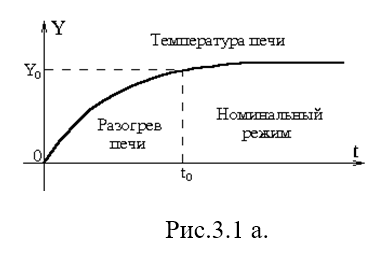
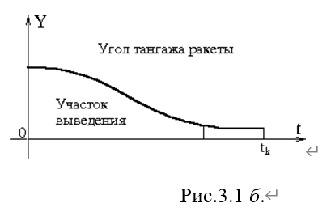
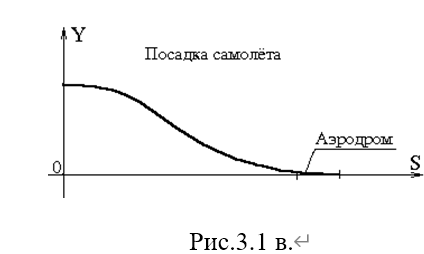
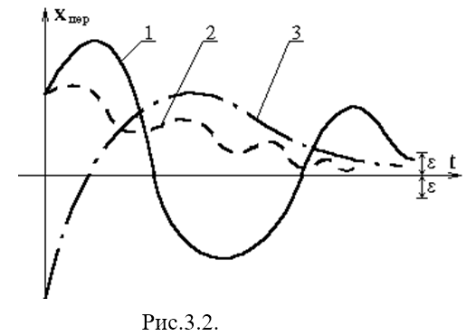
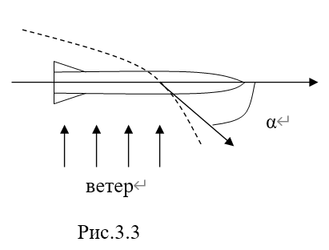
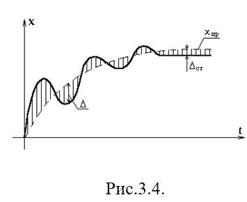
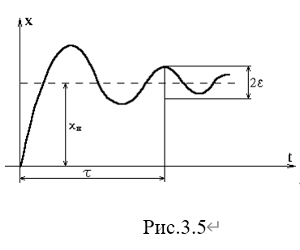

# 3. Программы регулирования  (调控程序)

Ошибки автоматических систем регулирования.  

自动调节系统的错误。

Задачей системы автоматического регулирования или управления является поддержание (**维持**) требуемого значения регулируемой величиныx(t) или изменение ее по определенной программе, которая или заранее задается, либо поступает извне(**从外部**)  во время эксплуатации(运行) системы в зависимости от некоторых условий.

自动调节系统或控制系统的任务是维持被调节量x(t)的所需值，或者按照特定程序对其进行改变，该程序要么预先设定，要么在系统运行期间根据某些条件从外部输入。

Программы могут быть временными(задаваться по времени)

程序可以是定时的（**按时间设定**      时间触发/时间调度）
$$
 x_{n\mathrm{p}} = x_{n\mathrm{p}}(t), 
$$


```
一个控制动作或一系列指令（即“程序”）不是在任意时刻执行，而是在一个预先设定好的、特定的时间点或时间段内执行。
```

или параметрическими (задаются в текущих параметрах).

也可以是参数化的（在当前参数中设定）。
$$
x_{n\mathrm{p}} = x_{n\mathrm{p}}(s_1,s_2,\ldots ,s_n)
$$
где $s_1,s_2,\ldots ,s_n$– какие-либо физические величины, характеризующие текущее состояние объекта в процессе регулирования. Примеры временных и параметрических программ приведены на рис.3.1.

其中 𝑠1, 𝑠2, …, 𝑠𝑛 是某些物理量，用于描述调节过程中对象的当前状态。时间和参数程序的示例见图3.1。

Программа регулирования $$x_{np}(t)$$ осуществляется(**执行**) регулятором или системой управления неизбежно с некоторой ошибкой  $\epsilon = x_{n\mathrm{p}}(t) - x (t)$ 

调控程序$x_{np}(t)$ 由调节器或控制系统执行，不可避免地会存在一定误差 $\epsilon=x_{np}(t)-x(t)$ 。

Эта ошибка обусловлена как погрешностями реальной аппаратуры (случайная ошибка), так и самим принципом построения регулятора (методическая ошибка).

这种误差是由实际设备的不精确性（随机误差）以及调节器的构建原理本身（方法误差）所导致的。







В системах автоматического регулирования различают три компоненты ошибки

在自动调节系统中，误差分为三个部分。
$$
\epsilon = \Delta_{n\partial} + \Delta_{c\partial} + \Delta_{\partial \partial},
$$
где

$\Delta_{n\partial}$– переходная динамическая ошибка            过渡动态误差

$\Delta_{c\partial}$– стационарная динамическая ошибка   	 稳态动态误差

$\Delta_{\partial\partial}$– дополнительная динамическая ошибка    附加动态误差


# 3.1 Переходная динамическая ошибка(过渡动态误差)

Данная ошибка связана с качеством переходного процесса и численно равна:$\Delta_{n\partial} = x_{n e p}\big(t\big)$ , т.е. определяется из решения однородного уравнения (2.16). Для устойчивости динамического процесса в системе автоматического регулирования необходимо, чтобы переходная динамическая ошибка с течением времени стремилась к нулю, или была меньше какого-то заданного числа (рис.3.2).

该误差与过渡过程的质量相关，其数值等于：$Δ_{𝑛𝜕}=𝑥_{𝑛𝑒𝑝}(𝑡)$  ，即由齐次方程（2.16）的解确定。为使自动调节系统中的动态过程稳定，过渡动态误差必须随时间趋于零，或小于某个给定值（图3.2）。
$$
L(p)x(t) = 0 \tag{2.16}
$$


Характер переходного процесса (или, что то же самое, изменение переходной динамической ошибки) очень важно при проектировании и построении систем автоматического регулирования. Следует запомнить, что $𝑥_{𝑛𝑒𝑝}(𝑡)$ – собственное свойство системы и не зависит от внешних воздействий. 

Невыполнение условия $\begin{array}{r}{\lim_{t\rightarrow \infty}x_{n e p}(t) = 0} \end{array}$ приведет к неустойчивости системы.

过渡过程的特性（或者说，过渡动态误差的变化也是同样的情况）在自动调节系统的设计和构建过程中非常重要。应该记住，$𝑥_{𝑛𝑒𝑝}(𝑡)$是系统的特有属性，不依赖于外部作用。

不满足 $\begin{array}{r}{\lim_{t\rightarrow \infty}x_{n e p}(t) = 0} \end{array}$ 这一条件会导致系统不稳定。 


# 3.2 Стационарная динамическая ошибка(稳态动态误差)

Данный тип ошибки определяется как разность между реальным и номинальным установившимся значением регулируемой величины. 

这种类型的误差被定义为调节量的实际稳定值与额定稳定值之间的差值。
$$
\Delta_{c\partial} = x^{0}\big(t\big) - x_{n p}^{0}\big(t\big)
$$
где  $x^{0}\big(t\big)$– частное решение уравнения (2.9)

其中$x^{0}\big(t\big)$是方程（2.9）的一个特解 
$$
y''(t) + k \cdot \sin \left| y'(t) \right| = x(t) \tag{2.9}
$$
$x_{n p}^{0}\big(t\big)$ – номинальное значение регулируемой величины, которое мы хотели бы получить.

$x_{np0}(t)$ - 我们希望得到的被调控值的额定值

На рис.(3.3) показан пример возникновения стационарной ошибки. Ракета движется по заданной траектории, но с некоторым углом атаки, обусловленным боковым ветром.

图（3.3）展示了稳态误差出现的一个示例。火箭沿着给定轨迹飞行，但由于侧风的影响存在一定的攻角。

Если внешняя нагрузка и задающее воздействие есть величины постоянные, то мы имеем дело со статической ошибкой системы. Говорить о стационарной динамической ошибке можно в том случае, когда внешняя нагрузка и (или) задающее воздействие есть величины переменные.

如果外部载荷和给定作用是常量，那么我们面对的就是系统的静态误差。当外部载荷和（或）给定作用是变量时，就可以谈及稳态动态误差。 




# 3.3 Дополнительная динамическая ошибка(额外动态误差)

Появляется в том случае, когда в уравнении, описывающем поведение системы, появляются члены:

当描述系统行为的方程中出现以下项时，就会出现这种情况：
$$

S(p)\Delta f + N(p)\Delta y
$$
которые отличают внешнюю нагрузку и задающее воздействие от номинальных. 

这些因素将外部载荷和给定作用与标称值区分开来。

Эта ошибка равна: $\Delta_{\partial\partial} = \Delta x^{0}(t)$ и находится как частное решение уравнения (2.20). Для того чтобы система автоматического регулирования работала хорошо необходимо, чтобы суммарная ошибка динамического процесса $\Delta$ была минимальной (рис.3.4). Наряду с рассматриваемой выше динамической ошибкой при проектировании системы автоматического управления важное место отводится и такой характеристике, как время регулирования. Это время, в течение которого регулируемая величина достигает поминального значения, или значения, отличающегося от заданного на малую величину (рис.3.5). Время регулирования показывает, за какой промежуток времени система автоматического регулирования отрабатывает сигнал, полученный на входе. 

该误差等于：$\Delta_{\partial\partial} = \Delta x^{0}(t)$，并且是方程（2.20）的特解。为使自动调节系统良好运行，动态过程的总误差Δ 必须最小（图3.4）。在设计自动控制系统时，除了上述动态误差外，调节时间这一特性也占据重要地位。调节时间是指被调节量达到最小值，或达到与给定值相差很小的值所需的时间（图3.5）。调节时间表明自动调节系统在多长时间内对输入信号做出响应。 
$$
 L(p)x(t) = S(p)\Delta f^{0}(t) + N(p)\Delta y^{0}(t). \tag{2.20}
$$



