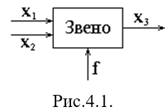
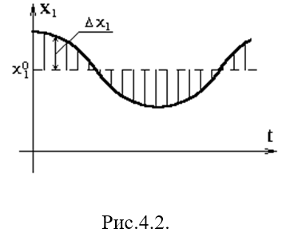
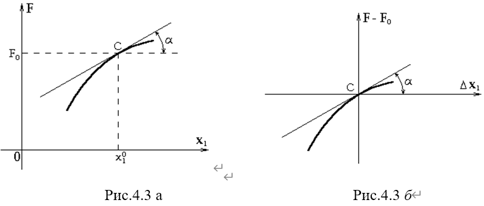
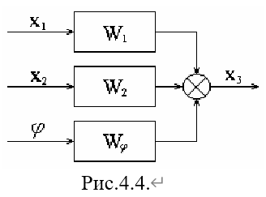
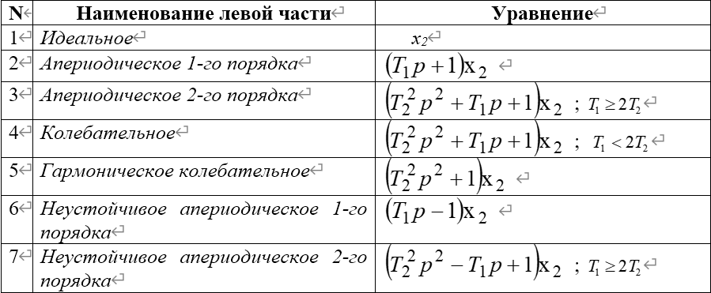
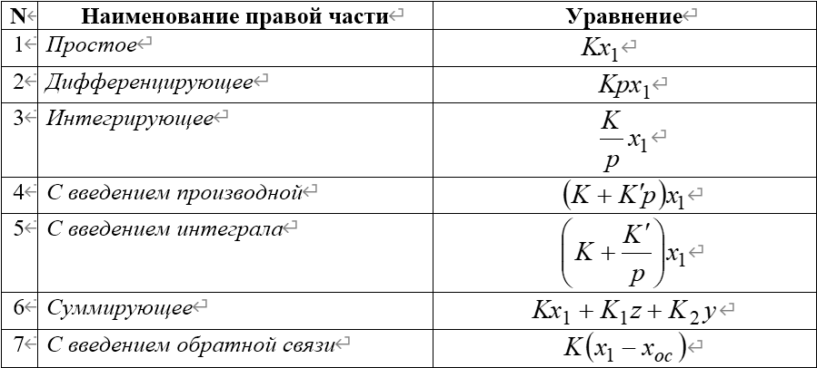

# 4.1 Линеаризация дифференциальных уравнений систем автоматического регулирования. 

Положим, что динамическое уравнение звена имеет произвольный нелинейный вид:

假设连杆的动力学方程具有任意非线性形式：
$$
F(x_{1},x_{2},\dot{x}_{2},\dot{x}_{3},\dot{x}_{3},\dot{x}_{3},\dot{x}_{3}) = \phi (f,\dot{f}) \tag{4.1}
$$
B общем случае нелинейное уравнение приводится к линейному путем линеаризации. 

在一般情况下，非线性方程通过线性化转化为线性方程。

Допустим, что установившийся процесс имеет место при некоторых постоянных значениях 

$x_{1} = x_{1}^{0},x_{2} = x_{2}^{0}, x_{3} = x_{3}^{0}, f = f^{0}$ . 

Тогда уравнение установившегося состояния для данного звена можно записать в виде ：

假设在某些常数值 $x_{1} = x_{1}^{0},x_{2} = x_{2}^{0}, x_{3} = x_{3}^{0}, f = f^{0}$下存在稳定过程。

那么，该环节稳定状态的方程可以写成如下形式 
$$
F(x_{1}^{0},x_{2}^{0},0,x_{3}^{0},0,0,0) = \phi (f^{0},0) \tag{4.2}
$$

В основе линеаризации нелинейных уравнений лежит представление о том, что в исследуемом динамическом процессе переменные $x_1,x_2,x_3$ изменяются так, что их отклонение от установившихся значений $x_{1}^{0},x_{2}^{0},x_{3}^{0}$ остается все время малым. Обозначим указанные отклонения через $\Delta x_{1},\Delta x_{2},\Delta x_{3}$ 

非线性方程线性化的基础是这样一种观点，即在研究的动态过程中，变量 $x_1,x_2,x_3$的变化方式使得它们相对于稳定值$x_{1}^{0},x_{2}^{0},x_{3}^{0}$ 的偏差始终保持很小。我们用$\Delta x_{1},\Delta x_{2},\Delta x_{3}$ 来表示这些偏差。 
$$
\begin{array}{r l} & {x_{1} = x_{1}^{0} + \Delta x_{1},}\\ & {x_{2} = x_{2}^{0} + \Delta x_{2},}\\ & {x_{3} = x_{3}^{0} + \Delta x_{3},}\\ & {\dot{x}_{2} = \dot{x}_{2}^{0} + \Delta \dot{x}_{2},}\\ & {\dot{x}_{3} = \dot{x}_{3}^{0} + \Delta \dot{x}_{3},}\\ & {\dot{x}_{3} = \ddot{x}_{3}^{0} + \Delta \ddot{x}_{3},}\\ & {\ddot{x}_{3} = \ddot{x}_{3}^{0} + \Delta \ddot{x}_{3}.} \end{array}
$$

Если установившееся значение не зависит от времени, то 

如果设定的值不依赖于时间，那么
$$

\dot{x}_{2} = \Delta \dot{x}_{2},\qquad \dot{x}_{3} = \Delta \dot{x}_{3},\qquad \ddot{x}_{3} = \Delta \ddot{x}_{3},\qquad \ddot{x}_{3} = \Delta \ddot{x}_{3}.
$$
Условие малости обычно выполняется. **Внешнее воздействие f не зависит от работы автоматической системы, изменение его может быть произвольным, и поэтому правая часть уравнения обычно линеаризации не подлежит** (хотя в отдельных случаях это возможно).

小条件通常是满足的，**外部作用f不依赖于自动系统的运行，其变化可能是任意的，因此线性化方程的右侧通常不适用**（尽管在个别情况下这是可能的）。

Разложим функцию F в ряд и оставим только слагаемые первого порядка малости

将函数F展开为级数，并只保留一阶无穷小项
$$
F^{0} + (\frac{\partial F}{\partial x_{1}})^{0}\cdot \Delta x_{1} + 
(\frac{\partial F}{\partial x_{2}})^{0}\cdot \Delta x_{2} + 
(\frac{\partial F}{\partial\dot{x}_{2}})^{0}\cdot \Delta \dot{x}_{2} + 
\\+(\frac{\partial F}{\partial x_{3}})^{0}\cdot\Delta x_{3} + 
(\frac{\partial F}{\partial \dot x_{3}})^{0}\cdot\Delta\dot x_{3}+
(\frac{\partial F}{\partial\ddot x_{3}})^{0}\cdot\Delta\ddot x_{3} 
+(\frac{\partial F}{\partial\dddot x_{3}})^{0}\cdot\Delta\dddot x_{3} 
+...
= \phi (f,\dot{f})\tag{4.3}
$$

$$
where \ \ \ \ \ \left(\frac{\partial F}{\partial q_{j}}\right)^{0} = \left(\frac{\partial F}{\partial q_{j}}\right)\ \\\\ 
when \: \: \ \ \ \  \ \ \ \ \  \
q_{j}{}=q_j^0 (q_{j} = x_{1},x_{2},\dots)  \ \  \ \ \ \ \ \  
and \ \ \ \ \ 
F^{0} = F(x_{1}^{0},x_{2}^{0},0,x_{3}^{0},0,0,0).
$$

Все частные производные в полученном выражении постоянные коэффициенты.

所得表达式中的所有偏导数均为常数系数。

Они будут переменными, если функция *F* содержит в явном виде *t*, или если  $x_{1}^{0}(t),x_{2}^{0}(t),x_{3}^{0}(t)$ 

如果函数F中明确包含t，或者 $x_{1}^{0}(t),x_{2}^{0}(t),x_{3}^{0}(t)$ , 它们将成为变量

Вычтя из уравнения (4.3) уравнение установившегося состояния и отбросив члены второго и более порядка малости получим линеаризованное уравнение 

从方程(4.3)中减去稳态方程，并忽略二阶及更高阶的小量，我们将得到线性化方程。 
$$
\begin{array}{l}{{\left(\frac{\partial F}{\partial x_{1}}\right)^{0}\cdot\Delta x_{1}+\left(\frac{\partial F}{\partial x_{2}}\right)^{0}\cdot\Delta x_{2}+\left(\frac{\partial F}{\partial\dot{x}_{2}}\right)^{0}\cdot\Delta\dot{x}_{2}+\left(\frac{\partial F}{\partial x_{3}}\right)^{0}\cdot\Delta x_{3}+}}\\ {{+\left(\frac{\partial F}{\partial\dot{x}_{3}}\right)^{0}\cdot\Delta\dot{x}_{3}+\left(\frac{\partial F}{\partial\ddot{x}_{3}}\right)^{0}\cdot\Delta\ddot{x}_{3}+\left(\frac{\partial F}{\partial\dddot{x}_{3}}\right)^{0}\cdot\Delta\dddot{x}_{3}+\ldots=\phi(f,\dot{f})-\phi(f^{0},0)}}\end{array} \tag{4.4}
$$
Полученное уравнение описывает динамический процесс в системе, но: 

1) является приближенным; 

2) неизвестными функциями времени являются не полные $x_{1}, x_{2}, x_{3}$ , a их отклонения $\Delta x_{1}, \Delta x_{2}, \Delta x_{3}$ ; 

3) полученное уравнение является линейным относительно $\Delta x_{1}, \Delta x_{2}, \Delta \dot{x}_{2}, \Delta x_{3}, \ldots , \Delta \dddot{x}_{3}$ с постоянными коэффициентами. 

得到的方程描述了系统中的动态过程，但是：

1. 该方程是近似的

2. 关于时间的未知函数不是完整的 $x_{1}, x_{2}, x_{3}$，而是它们的偏差 $\Delta x_{1}, \Delta x_{2}, \Delta x_{3}$ ；

3. 得到的方程对于$\Delta x_{1}, \Delta x_{2}, \Delta \dot{x}_{2}, \Delta x_{3}, \ldots , \Delta \dddot{x}_{3}$是线性的，且系数为常数。

Уравнение (4.4) называется **дифференциальным уравнением звена** (системы) в отклонениях, или **уравнением в вариациях**. Геометрическая интерпретация **процесса линеаризации** показана на рис.4.3. Видно, что линеаризация эквивалентна переходу начала координат в точку C. 

方程(4.4)被称为**环节（系统）的偏差微分方程**，或**变分方程**。线性化过程的几何解释如图4.3所示。可以看出，线性化相当于将坐标原点移动到点C。 

Следует отметить, что линеаризация недопустима в системах со скачкообразными(跳跃式的) зависимостями (релейные системы, сухое трение и др.). Преобразуем линеаризованное уравнение (4.4). Запишем выходную величину и ее производные в левой части, а входную и все остальные - в правой. Разделим обе части преобразованного уравнения на $\left(\frac{\partial F}{\partial x_{3}}\right)^{0}$ для того, чтобы сама выходящая величина записывалась в уравнении с коэффициентом 1. 

需要指出的是，线性化在具有跳跃式依赖关系的系统（继电器系统、干摩擦等）中是不可行的。我们对线性化方程（4.4）进行变换。将输出量及其导数写在方程左边，而输入量及其他所有量写在右边。将变换后的方程两边同时除以$\left(\frac{\partial F}{\partial x_{3}}\right)^{0}$ ，以便使输出量在方程中的系数为1。

Введем при этом следующие обозначения: 

在此我们引入以下符号：
$$
\begin{array}{r l}
{\frac{\left(\frac{\partial F}{\partial\dddot{x}_{3}}\right)^{0}}
{\left(\frac{\partial F}{\partial x_{3}}\right)^{0}} = T_{3}^{3};\quad} & {\frac{\left(\frac{\partial F}{\partial\ddot{x}_{3}}\right)^{0}}{\left(\frac{\partial F}{\partial x_{3}}\right)^{0}} = T_{2}^{2};\quad} & 
{\frac{\left(\frac{\partial F}{\partial\dot{x}_{3}}\right)^{0}}{\left(\frac{\partial F}{\partial x_{3}}\right)^{0}} = T_{1};}\\ 
-{\frac{\left(\frac{\partial F}{\partial x_{1}}\right)^{0}}{\left(\frac{\partial F}{\partial x_{3}}\right)^{0}} = K_{1};\quad} & 
-{\frac{\left(\frac{\partial F}{\partial x_{2}}\right)^{0}}{\left(\frac{\partial F}{\partial x_{3}}\right)^{0}} = K_{2};\quad} & -{\frac{\left(\frac{\partial F}{\partial\dot{x}_{2}}\right)^{0}}{\left(\frac{\partial F}{\partial x_{3}}\right)^{0}} = K_{2}';\quad} & {\frac{f(t) - f^{0}}{\left(\frac{\partial F}{\partial x_{3}}\right)^{0}} = \phi_{1}.} \end{array}
$$

Тогда уравнение (4.4.) примет вид: 
$$
T_{3}^{3} \Delta \dddot{x}_{3} + T_{2}^{2} \Delta \ddot{x}_{3} + T_{1} \Delta \dot{x}_{3} + \Delta x_{3} = k_{1} \Delta x_{1} + k_{2} \Delta x_{2} + k_{2}^{\prime} \Delta \dot{x}_{2} + \phi_{1}
$$
или в операторной форме: 
$$

\begin{array}{r l} & {\left(T_{3}^{3}p^{3} + T_{2}^{2}p^{2} + T_{1}p + 1\right)\Delta x_{3} = k_{1}\Delta x_{1} + \left(k_{2}^{\prime}p + k_{2}\right)\Delta x_{2} + \phi_{1}} \end{array} \tag{4.5}
$$
Если$\left(\frac{\partial F}{\partial x_{3}}\right)^{0}$=0,то все члены уравнения (4.4) делят на $\left(\frac{\partial F}{\partial \dot x_{3}}\right)^{0}$и т.д.

Разделим левую и правую части уравнения (4.5) на выражение, стоящее в скобках слева и введем обозначения:

将方程(4.5)的左右两边同时除以左边括号中的表达式，并引入以下符号：
$$
 W_{1}(p) = \frac{K_{1}}{T_{3}^{3}p^{3} + T_{2}^{2}p^{2} + T_{1}p + 1};\quad W_{2}(p) = \frac{K_{2}^{\prime}p + K_{2}}{T_{3}^{3}p^{3} + T_{2}^{2}p^{2} + T_{1}p + 1}; 
$$

$$
W_{\phi}(p) = \frac{\phi_{1}}{T_{3}^{3}p^{3} + T_{2}^{2}p^{2} + T_{1}p + 1}.
$$

Тогда можно записать: 
$$
\
\Delta x_{3} = W_{1}(p) \Delta x_{1} + W_{2}(p) \Delta x_{2} + W_{\phi}(p) \phi_{1} \tag{4.6}
$$
В дальнейшем значок $\Delta$ будем опускать, подразумевая под $x_1,x_2,x_3 $малые отклонения величины. В этом случае систему можно представить в соответствии с рис.4.4.

此后，我们将省略符号Δ，认为$x_1$、$x_2$、$x_3$是该量的微小偏差。在这种情况下，系统可以按照图4.4所示来表示。

Если обозначить отклонение выходной величины через $x_2 $, а входной через $x_1 $ , то вместо (4.5) можно записать:

如果用 $x_2$表示输出量的偏差，用 $x_1$ 表示输入量的偏差，那么可以写成（4.5）的形式：
$$

\begin{array}{r l} & {\Bigl (\mathrm{T}_{3}^{3}p^{3} + T_{2}^{2}p_{2} + T_{1}p + 1\Bigr)\mathbf{x}_{2} =}\\ & {= \mathbf{K}_{1}y_{1} + \bigl (K_{2}^{\prime} + K_{2}\bigr)x_{1} + \phi_{1}\qquad (4.7)} \end{array}
$$
В зависимости от вида левой и правой части уравнения (4.7) приняты следующие названия звеньев:

根据方程(4.7)左右两边的形式，采用了以下环节名称：

Правая часть показывает на что реагирует звено (т.е. что у него на входе), а левая часть показывает, как отрабатывается воздействие в звене.

右侧显示环节对什么做出反应（即其输入是什么），而左侧显示环节中作用是如何实现的。

# 4.2 Моделирование типовых звеньев САУ(典型自动化控制系统元件的建模)

​	Типовыми линейными звеньями САУ являются усилительное, суммирующее, дифференцирующее апериодическое , интегро-дифференцирующее и колебательное. Типовыми нелинейными звеньями являются: усилительное с ограничением, релейное, усилительное с зоной нечувствительности, релейное с зоной нечувствительности, усилительное с люфтом, гистерезисное.

自动化控制系统的典型线性环节有放大环节、求和环节、非周期微分环节、积分微分环节和振荡环节。典型非线性环节有：带限幅的放大环节、继电器环节、带不灵敏区的放大环节、带不灵敏区的继电器环节、带死区的放大环节、滞环环节。

​    Данные необходимые для моделирования типовых звеньев, приведены в таблице 3. Для каждого звена указаны описывающая его функция (т.е. зависимость между входной *X* и выходной *Z* величиной звена), схема модели звена, функция описывающая модель (т.е. зависимость между входным $u_0$ и выходным u напряжениями модели), и выражения, определяющие параметры модели через параметры звена и масштабы , $K_x=\frac{X}{u_0}$и$K_z=\frac{Z}{u_0}$ . 

用于模拟典型环节所需的数据见表3。对于每个环节，都给出了描述其的函数（即环节的输入量X与输出量Z之间的关系）、环节的模型示意图、描述模型的函数（即模型的输入电压$u_0$与输出电压u之间的关系），以及通过环节参数和比例系数  $K_x=\frac{X}{u_0}$和$K_z=\frac{Z}{u_0}$ 来确定模型参数的表达式。 

Работа моделей линейных типовых звеньев в пояснениях не нуждается. Работу моделей нелинейных звеньев следует пояснить. 

线性典型环节模型的工作原理无需解释。非线性环节模型的工作原理需要进行说明。

​    В схеме модели усилительного звена с ограничением оба вентиля остаются закрытыми до тех пор, пока выходное напряжение *u* не станет равным +*$u_or$* или -*$u_or$*. Когда один из диодов открывается, сопротивление шунтируется цепью, составленной из открывшегося диода и части подключенного к нему потенциометра. Если сопротивление этой цепи мало по сравнению с $r_1$, то коэффициент усиления модели изменяется от  $\frac{r_0}{r_c}$до нуля.

在具有限幅的放大级模型电路中，两个二极管一直保持关闭状态，直到输出电压u等于 +*$u_or$* 或 -*$u_or$* 。当其中一个二极管导通时，分流电阻被由导通二极管及其连接的部分电位器组成的电路所旁路。如果该电路的电阻与$r_1$  相比很小，那么模型的放大系数将从$\frac{r_0}{r_c}$变化到零。

​     Схема модели релейного звена получается из предыдущей при *$r_0=∞$.* В этом случае до открытия вентилей *$u = - ku_0$*, где *$k≈10^5$* ― коэффициент усиления усилителя без обратной связи. Абсолютное значение выходного напряжения, равное напряжению запирания вентилей, достигается при $|u_0|=\frac{u_0r}{k}≈0$ . Это означает, что практически выходное напряжение достигает предельного значения при малейшем отклонении входного напряжения от нуля.

继电器环节模型的方案是由前一个方案在 $r_0 = \infty$ 时得到的。在这种情况下，在阀门打开之前，$u = -ku_0$，其中 $k \approx 10^5$ 是无反馈放大器的放大系数。当 $|u_0| = \frac{u_{0r}}{k} \approx 0$ 时，输出电压的绝对值等于阀门闭锁电压。这意味着，实际上，当输入电压偏离零的程度最小时，输出电压就达到了极限值。 

​      Воспроизведение зоны нечувствительности в моделях усилительного и релейного звеньев с зоной нечувствительности достигается включением во входную цепь операционного усилителя вентильных ограничителей.

在具有死区的放大和继电环节模型中，死区的再现是通过将限幅器接入运算放大器的输入电路来实现的。

