# 1. MTU与MSS

### MTU（Maximum Transmission Unit）最大传输单元

- **定义**：数据链路层一次能够传输的最大数据包大小
- **层次**：工作在数据链路层（第2层）   但在网络层将数据包封装成MTU
- **包含内容**：整个IP数据包（TCP头部+IP头部 + 应用层数据部分）
- **常见值**：以太网MTU通常为1500字节

### MSS（Maximum Segment Size）最大段大小

- **定义**：TCP层一次能够传输的最大数据段大小
- **层次**：工作在传输层（第4层）
- **包含内容**：仅指应用层数据部分，不包括TCP头部和IP头部
- **计算方式**：MSS = MTU - IP头部长度 - TCP头部长度

### 关系示例

```
MTU = 1500字节（以太网标准）
IP头部 = 20字节（无选项时）
TCP头部 = 20字节（无选项时）
MSS = 1500 - 20 - 20 = 1460字节
```

**一个简单的比喻：**

- **MTU** 就像是公路上对货车整体尺寸的限制（例如，长、宽、高都不能超过某个值）。
- **MSS** 则是货车车厢内部可以装载货物的最大体积。为了让货车能顺利上路，装载的货物（MSS）加上车头和车身等（IP 和 TCP 头部）的尺寸，不能超过公路的限制（MTU）。

### 为什么要有 MTU 和 MSS？

**为什么需要 MTU？**

 **MTU 的存在主要是为了平衡传输效率和网络延迟：**

- **避免无限大的数据包**：网络中的设备（如路由器、交换机）需要缓存和转发数据包，如果数据包无限大，对设备的内存和处理能力要求会极高，成本也会随之增加。

- 平衡效率和延迟：

  - **较大的 MTU**：可以减少头部开销的比例，因为每个数据包都需要添加头部信息，数据包越大，有效数据的占比就越高，传输效率也就越高。
  - **较小的 MTU**：可以减少网络延迟。在共享网络中，一个大的数据包会长时间占用链路，导致其他数据包等待，从而增加整体延迟。 此外，数据包越大，在传输过程中出错的概率也越高，一旦出错就需要重传整个大数据包，代价更大。
  
- **历史原因**：以太网的 MTU 设置为 1500 字节是一个历史遗留问题，与早期的 CSMA/CD (载波侦听多路访问/冲突检测) 机制有关，旨在确保网络中的冲突能够被有效检测。

**为什么在有了 MTU 之后还需要 MSS？** 既然 网络层可以根据 MTU 对过大的数据包进行分片，为什么 TCP 层还需要一个 MSS 呢？

主要原因是为了**尽可能避免在网络层进行分片**，从而提高传输效率和可靠性。

**举例：**

假设没有MSS，在应用层共有1w4字节的数据需要传输，向下经过传输层传到网络层后，网络层收到该数据包（TCP头部+IP头部+应用层数据共14040字节），发现超过了MTU的大小，就将数据包进行分片（网络层分片**效率低下**），分成10片，然后传输，如果其中任意一个分片丢失了，就会将整个数据包全部重传。

在发送端：如果有MSS，在传输层就会将1W4字节的数据，分成10个TCP段，并给这十个段都加一个TCP头部，之后将这十个段向下传给网络层，此时网络层收到数据包（MSS令其最大1500字节）之后，不需要进行分片，加上IP头部后发给数据链路层，每个包**独立传输**。

在接收端：网络层收到十个数据包之后，对每个数据包独立检查错误，解封装后变为TCP段发给传输层，传输层利用TCP头部的**序列号**将这些段**按正确的顺序重新组装**成原始的应用程序数据流。如果有段丢失，TCP会请求重传那个特定的段。组装完成后将完整的数据上传给应用层。

- **IP 分片的效率问题**：IP 层分片对网络是透明的，但它存在一个严重缺陷：如果分片后的任何一个小数据包在传输过程中丢失，整个原始数据包就必须全部重传。 这会大大增加网络开销和延迟。
- **MSS 的主动控制**：通过在 TCP 层设置 MSS，发送方在发送数据之前，就会主动将数据分割成小于 MSS 的段。 这样一来，每个 TCP 段封装成 IP 包后，其大小就不会超过 MTU，从而避免了在 IP 层进行分片。
- **TCP 的高效重传机制**：如果某个 TCP 段在传输中丢失，TCP 的可靠传输机制只需要重传丢失的那个小段即可，而不需要重传整个大数据块，这比 IP 分片丢失后的重传效率高得多。

**总结来说**，MTU 是数据链路层的一个物理限制，而 MSS 是 TCP 层为了适应这个限制而进行的一种主动优化策略。 通过 MSS 协商，TCP 协议可以主动将数据分割成合适的大小，以避免低效的 IP 层分片，从而在保证数据可靠性的同时，最大化地提升网络传输的效率。


# 2. 用户之间收发信息的过程

## CS模式下的通信机制

整个过程，发送方不需要知道接受方的端口号和IP地址，只需要知道服务器的端口号和IP地址（域名）即可

全靠服务器转发给接收方

### 发送方（同学A）的视角
```
同学A发送文件时：
- 只知道：微信服务器的地址（如 wechat.qq.com:443）
- 不知道：同学B的IP地址、端口号、甚至B在哪个网络
- 只需要：告诉服务器"我要给用户B发文件"
```

### 服务器的转发机制
```
微信服务器维护的信息：
用户A：IP=203.0.113.10, 端口=12345, 在线状态=在线
用户B：IP=198.51.100.20, 端口=54321, 在线状态=在线
用户C：IP=192.168.1.100, 端口=23456, 在线状态=离线
```

### 完整的转发过程

#### 1. A发送给服务器
```
A → 服务器的数据包：
源IP: A的IP地址
目标IP: 微信服务器IP
应用层数据: {
    from: "用户A",
    to: "用户B", 
    type: "文件",
    content: 文件数据
}
```

#### 2. 服务器处理和转发
```
服务器收到后：
1. 解析：这是A发给B的文件
2. 查表：B当前的连接信息是 198.51.100.20:54321
3. 转发：将文件数据推送给B
```

#### 3. 服务器发送给B
```
服务器 → B的数据包：
源IP: 微信服务器IP
目标IP: B的IP地址
应用层数据: {
    from: "用户A",
    to: "用户B",
    type: "文件", 
    content: 文件数据
}
```

## 关键优势

### 1. 简化客户端逻辑
```
客户端只需要：
- 连接到服务器
- 发送"给谁发什么"
- 不用管对方在哪里、怎么到达
```

### 2. 解决网络复杂性
```
服务器处理：
- NAT穿透问题
- 用户离线消息存储
- 跨网络路由
- 负载均衡
```

### 3. 实际例子对比

**微信聊天（CS模式）**：
```
你发消息 → 微信服务器 → 对方收到
你不需要知道对方的IP地址
```

**直接P2P聊天**：
```
你发消息 → 直接到对方
但你必须先知道对方的IP:端口
```

## 这就解释了为什么

1. **微信可以给离线用户发消息**：服务器存储转发
2. **不需要知道对方网络信息**：服务器负责寻址
3. **可以跨不同网络通信**：服务器作为中继
4. **群聊很容易实现**：服务器向多个用户转发

**CS模式下，客户端之间不直接通信，完全依靠服务器的"邮局"功能进行消息转发**。这大大简化了客户端的复杂度，但代价是对服务器的完全依赖。


# 3. 获取目标IP地址的方法

在网络数据发送过程中，网络层本身并不主动“发现”目标IP地址，而是从更高层（通常是应用层或传输层）接收这个地址。以下是网络通信中获取目标IP地址的几种常见方法：

### 1. 域名系统 (DNS) 解析

这是最常见的方法，尤其是在访问网站或连接到远程服务器时。整个过程通常如下：

- **用户输入域名**: 用户在浏览器中输入一个网址，例如 `www.google.com`。这个域名对人类友好，但计算机网络需要IP地址来进行通信。
- **发起DNS查询**: 用户的操作系统会将这个域名发送给一个DNS解析器（通常由互联网服务提供商ISP提供）。
- **解析过程**: DNS解析器会查询一系列的DNS服务器（根服务器、顶级域服务器和权威名称服务器），以找到与该域名对应的IP地址。
- **返回IP地址**: 权威DNS服务器最终会将IP地址（例如 `172.217.160.100`）返回给用户的计算机。
- **向下层传递**: 应用程序（如浏览器）获得IP地址后，在准备发送数据时，会将此IP地址连同数据一起传递给传输层，再由传输层传递给网络层。 网络层随后将这个IP地址放入IP数据包的目标地址字段中。

### 2. 静态配置或直接输入

在某些情况下，IP地址是预先知道的，不需要通过DNS解析：

- **直接输入IP**: 用户可以直接在应用程序中输入数字IP地址来代替域名。
- **配置文件**: 应用程序或操作系统可能有一个配置文件，其中静态地指定了要连接的目标服务器的IP地址。这在企业内部网络或特定软件中很常见。

### 3. 从应用程序和服务中获取

许多应用程序在内部处理IP地址的获取过程：

- **API调用**: 程序员在编写网络应用程序时，会使用套接字（Socket）API。在建立连接（如使用 `connect()` 函数）或发送数据包（如使用 `sendto()` 函数）时，目标IP地址会作为一个参数明确地提供给操作系统内核中的网络协议栈。
- **服务发现**: 在复杂的分布式系统中，服务可能会向一个中心目录注册自己的IP地址，其他服务在需要通信时会从该目录查询IP地址。

### 需要澄清的概念：ARP协议

地址解析协议（ARP）经常被提及，但它的作用**不是**获取目标IP地址。ARP的功能恰恰相反：当网络层已经知道了一个IP地址，并且需要将数据包发送到同一局域网内的该IP地址时，它会使用ARP来查询与该IP地址对应的物理硬件地址（MAC地址）。 如果目标IP地址不在同一局域网内，网络层则会使用ARP来查找下一跳路由器（网关）的MAC地址。

总结来说，网络层在发送数据包之前，必须从上层协议（如TCP或UDP）获得明确的目标IP地址。而这个IP地址最常见的来源是通过DNS将用户友好的域名转换而来，或是由用户或应用程序直接提供。


# 4. 键入网址到网页显示，期间发生了什么？

## 4.1 浏览器解析URL


长长的URL实际上是在请求服务器中的**文件资源**(根据路径名)

当没有路径名时，就会访问根目录下事先设置的默认文件，也就是/index.html

## 4.2 根据URL提供的Web服务器和文件名，生成HTTP请求消息

## 4.3 根据域名通过DNS查询IP地址

此时浏览器解析URL已经生成了HTTP消息，需要把消息发送给Web服务器

此时通过DNS将域名转化为IP地址

如：www.server.com.

域名中越靠右的位置，代表层级越高。**.根域**是在最顶层（**根DNS服务器**），下一层就是.com**顶级域DNS服务器**，再下面是server.com**权威DNS服务器**

根域的DNS服务器信息保存在互联网所有的DNS服务器中，客户端只需要找到任意一台DNS服务器，就可以通过它找到根域DNS服务器，再一路找到目标DNS服务器

### 4.3.1 域名解析的工作流程

1. 客户端发出一个DNS请求，问www.server.com的IP是什么，并发给本地DNS服务器（TCP/IP设置中填写的）
2. 本地域名服务器收到请求后，如果缓存里的表格能找到该域名，则直接返回IP地址给客户端。如果没有，本地DNS回去问它的根域名服务器
3. 根DNS收到来自本地NDS请求后，发现www.server.com域名后置是.com，就把.com顶级域名服务器地址发送给本地DNS
4. 本地DNS收到顶级域名服务器地址后，发起请求问www.server.com的IP地址
5. 顶级域名服务器给本地DNS发送负责www.server.com区域的权威DNS服务器的地址(如:dns1.server.com)
6. 本地DNS收到权威DNS服务器地址之后，询问www.server.com对应的IP是什么
7. 权威DNS服务器查询域名后，将对应的IP地址发送给本地DNS
8. 本地DNS将IP返回客户端，客户端和目标建立连接


当然，也不是每次域名解析都需要这么多流程

1. 如果浏览器有该域名缓存
2. 操作系统有该域名缓存
3. hosts文件有该域名缓存

会直接返回，这些条件都不满足才会去问本地DNS服务器

## 4.4 协议栈

通过DNS拿到IP地址之后，就可以把HTTP的传输工作交给操作系统中的协议栈

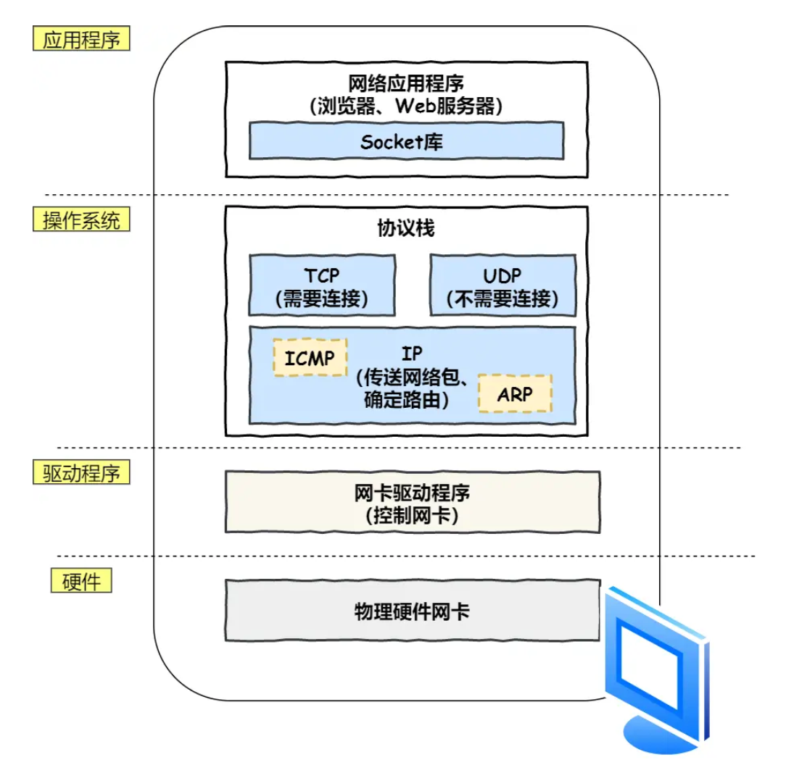

此时数据包可以交给TCP处理


## 4.5. TCP协议—可靠传输

### 4.5.1 TCP报文头部格式


1. 源端口号16bit
2. 目标端口号16bit
3. 序号32bit，解决包乱序的问题
4. 确认序列32bit，目的是确认发出去对方是否收到，如果没有收到就应该重新发送，解决丢包问题
5. 状态位6bit，SYN（sync同步）是要发起一个连接，ACK是回复，RST是重新连接，FIN是结束连接等。TCP是面向连接的，所以要用这些去维护连接的状态
6. 窗口大小16bit，TCP要做流量控制，通信双方各声明一个窗口（缓存大小），标识自己当前的处理能力，防止对方发送过快或过慢
7. 拥塞控制，只能做的就是控制自己发送的速度

### 4.5.2 TCP三次握手

TCP连接的建立，称为三次握手。

**每一个数据包（SYN， SYN-ACK， ACK）都需要独立地、完整地走完从源到目的地的整个网络路径。**

所谓连接，只是双方计算机中维护一个状态机，连接建立的过程中，状态变化时序图如下


1. 一开始，客户端和服务器都处于`CLOSED`状态。先是服务器主动监听某个端口，处于`LISTEN`状态。
2. 随后客户端主动发起连接`SYN`，之后处于`SYN-SENT`状态，假设Seq Num = x，SYN bit = 1
3. 服务端收到发起的连接，返回SYN，并且ACK = x+1 回应客户端的SYN，发送自己的Seq Num=y 之后处于`SYN_RCVD`状态
4. 客户端收到服务端发送的SYN和ACK之后，发送对SYN确认的ACK=y+1，之后处于`ESTABLISHED`状态

三次握手的目的是保证双方都有发送和接收的能力


### 4.5.3 TCP分割数据

如果HTTP请求消息比较长，超过了MSS的长度，此时TCP就需要把HTTP的数据拆解成一块块数据发送。


MTU：一个网络包的最大长度，以太网中一般为1500字节

MSS：出去IP头部(一般20字节)和TCP头部(一般20字节)之后，一个网络包能容纳的TCP数据最大长度

数据会被以MSS的长度为单位进行拆分，拆出来的每一块数据都会被放进单独的网络包中。每个被拆分的数据都会加上TCP头部。


## 4.6. IP模块—远程定位

目标IP地址是前面通过DNS获取的

### 4.6.1 IP报文头格式


1. Ver: 版本号 占4bit 如： IPv4 0100
2. Head.len 首部的长度，占4bit，以4B为单位（系数） 最大可表示的首部长度为60B（15*4B）。最常用的首部长度是20B（5*4B）该字段的值是0101，此时不使用任何可选字段
3. Type of service 服务类型 ： 占8个bit 代表数据报携带的载荷的类型
4. Length 数据报总长度：占16bit，指首部与数据之和的长度，单位是字节，因此IP数据报的最大长度是2^16^-1=65535B。以太网帧的最大传送单元（MTU）为1500B，因此当一个IP数据报封装成帧时，数据报的总长度（首部+数据）不能超过链路层MTU的值
5. 16-bit identifier 标识：16bit 是一个计数器，每产生一个数据报就+1，并赋值给标识（identifier）字段。但它不是“序号”，因为IP是无连接服务。当一个数据报的长度超过网络MTU时，必须分片，此时每一个数据报片都复制一次标识号，以便能正确重装成原来的数据报
6. Flags 标志：3bit 标志（flags）字段的最低位是MF，MF=1表示后面还有分片，MF=0表示最后一个分片。标志（flags）字段中间的一位是DF，只有当DF=0时才允许分片。
7. **Fragment offset 片偏移**：13bit，它指出较长的数据报在分片后，某片在原数据报中的相对位置，片偏移以8B为偏移单位。除最后一个分片以外，每个分片的长度一定是8B的整数倍
8. Time to live TTL 生存时间： 占8bit，数据报在网络中可通过的路由器数的最大值，标识数据报在网络中的寿命，确保不会无限循环，路由器在转发数据报前，先将TTL-1，若TTL为0，则必须丢弃
9. **Upper layer协议**：8bit，指出此IP数据报携带的数据使用何种协议，即数据报的数据部分应上交给哪个协议进行处理，如TCP,UDP等。值为**6代表TCP**，值为**17代表UDP**
10. Internet checksum 首部校验和： 16bit，他只校验数据报的首部，不包括数据部分，不校验数据部分可减少计算工作量。
11. **Source IP address 原地址字段：32bit 标识发送方IP地址**
12. **Destination IP address 目标地址字段：32bit 标识接收方的IP地址**


## 4.7. MAC地址—两点传输

生成了IP头部之后，接下来网络包还需要在IP头部的前面加上MAC头部。

### 4.7.1 MAC头部信息

MAC头部是以太网使用的头部，它包含了接收方和发送方的MAC地址信息，用于两点之间的传输

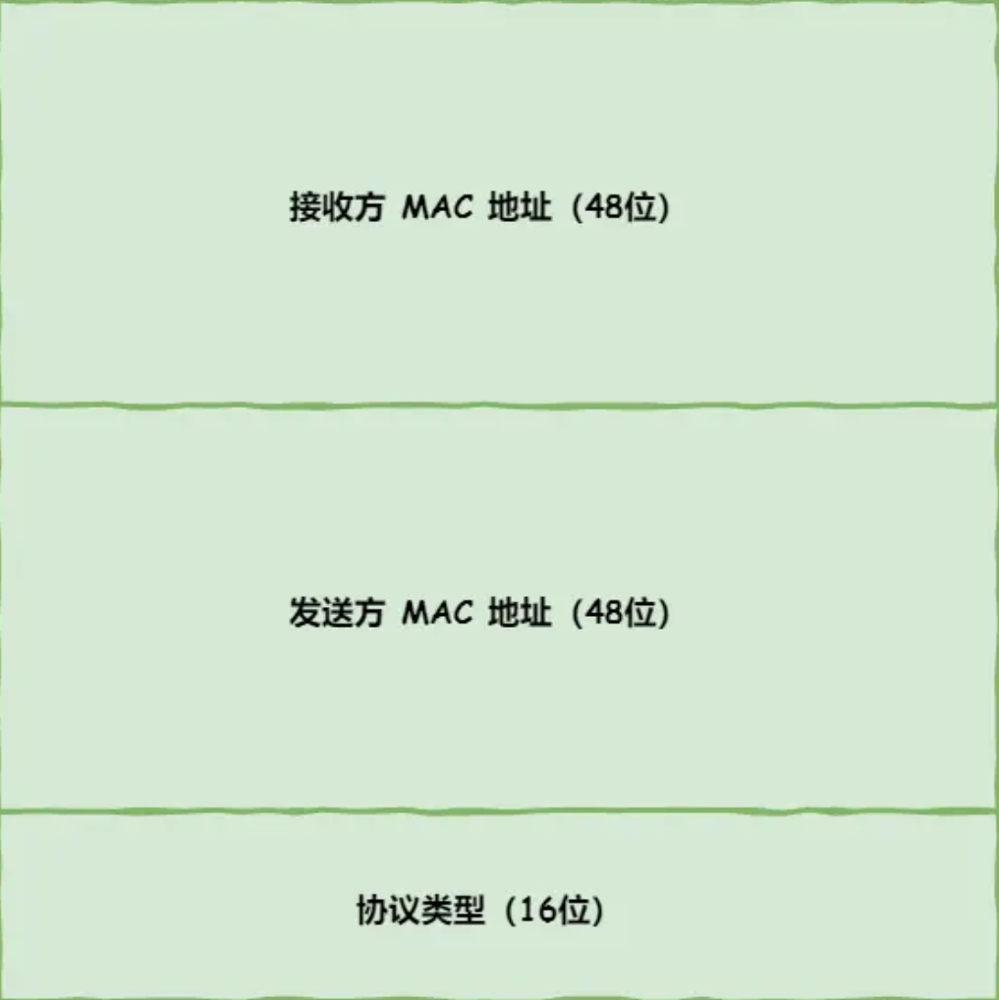

一般在TCP/IP通信中，MAC包头的协议类型只使用：

1. 0800：IP协议
2. 0806：ARP协议

### 4.7.2 MAC发送方和接收方的确认

发送方的MAC地址获取：MAC地址是在网卡生产时写入到ROM中的，只要将这个值读取出来写入到MAC头部即可

接收方的MAC地址获取：

1. 查路由表，如果在同一网关下，使用ARP协议，在以太网中使用广播的形式询问该IP对应的MAC地址
2. 不在同一网关：通过网关转发给下一跳的路由器一步步到目标

在一次查询后，操作系统会把本次查询结果放到ARP缓存的内存空间中，TTL几分钟


#### 4.7.2.1 子网和网关

同一子网：指IP地址在同一个网络段内，可以直接通信

同一网关：指使用相同的网关设备，但可能在不同的子网中

##### 场景1：同一子网=同一网关


```
设备A: 192.168.1.10/24  网关: 192.168.1.1
设备B: 192.168.1.20/24  网关: 192.168.1.1
┌─────────────┐    ┌─────────────┐
│   设备A     │    │   设备B     │
│192.168.1.10 │    │192.168.1.20 │
└──────┬──────┘    └──────┬──────┘
       │                  │
       └────────┬─────────┘
                │
        ┌───────┴────────┐
        │   交换机/路由器  │
        │  192.168.1.1   │
        └────────────────┘
```

通信方式：A和B直接通信，不需要经过网关

##### 场景2：不同子网+同一网关

```
设备A: 192.168.1.10/24  网关: 192.168.1.1
设备C: 192.168.2.10/24  网关: 192.168.2.1

┌─────────────┐              ┌─────────────┐
│   设备A     │              │   设备C     │
│192.168.1.10 │              │192.168.2.10 │
└──────┬──────┘              └──────┬──────┘
       │                            │
┌──────┴──────┐              ┌──────┴──────┐
│   交换机1    │              │   交换机2    │
└──────┬──────┘              └──────┬──────┘
       │                            │
       └────────┬───────────────────┘
                │
        ┌───────┴────────┐
        │     路由器      │
        │ 192.168.1.1    │
        │ 192.168.2.1    │
        └────────────────┘

```

通信方式：设备A和C必须通过路由器转发，即使连接到同一台路由器

同一网关不同子网的分隔方式：

1. VLAN隔离  三层交换机
2. 路由器+多个二层交换机
3. 软件定义网络SDN


## 4.8 网卡—出口

网络包是存放在内存中的一串二进制数字信息，没有办法直接发送给对方。因此我们需要将数字信息转换为电信号，才能在网线上传输，这才是**真正的**数据发送过程。负责执行这一操作的是网卡，控制网卡还需要网卡驱动程序

网卡驱动获取网络包之后，会将其复制到网卡内的缓存区中，接着会在其开头加上报头和**起始帧分界符**，在末尾加上用于检测错误的**帧校验序列（FCS）**

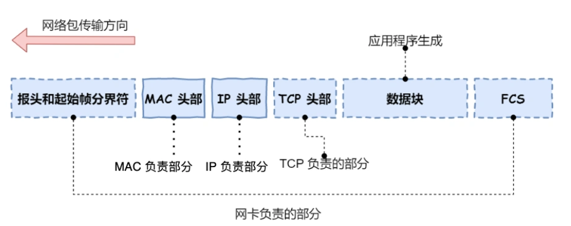

起始帧分界符是一个用来表示包起始位置的标记

末尾的FCS用来检查包传输过程中是否有损坏

最后网卡把包转化为电信号，通过网线发送出去

## 4.9 交换机—送别者

交换机的设计是将网络包原样转发到目的地，交换机工作在MAC层（数据链路层），也成为二层网络设备

通常是需要交给路由器

### 4.9.1 交换机的包接收操作

首先，电信号到达网线接口，交换机里的模块接收，将电信号转换为数字信号

然后使用FCS校验错误，没错误就放到缓冲区（这部分操作和计算机网卡相同）

```
计算机网卡和交换机工作方式不同的地方：

计算机网卡本身具有MAC地址，通过核对收到的包的接受方MAC地址判断是不是发给自己的，如果不是则丢弃
交换机的端口不核对接收方的MAC地址，直接接收所有包并存放到缓冲区中，因此交换机端口不具有MAC地址
```

将包放入缓冲区后，接下来查询这个包的接收方MAC地址是否已经在MAC地址表中有记录了。

```
交换机的MAC地址表主要包含两个信息

1.设备的MAC地址
2.该设备连接在交换机的哪个端口上
```

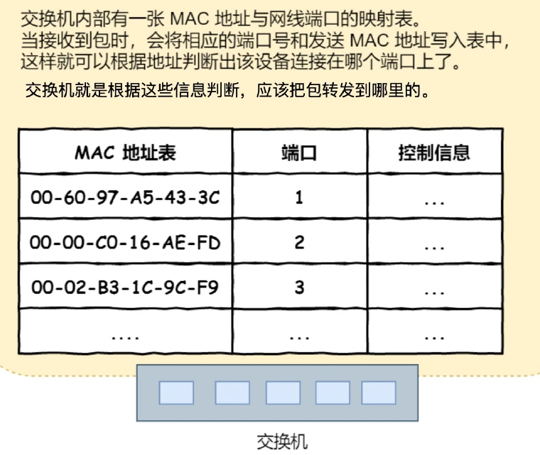

**交换机根据MAC地址表查找MAC地址，然后将信号发送到相应端口**


### 4.9.2 交换机找不到指定的MAC地址会怎么样

原因：

1. 该地址的设备还没有向交换机发送过包
2. 这个设备一段时间没有工作导致地址在表中被删除了

在这种情况下，交换机只能把包转发到除了源端口之外的所有端口上，总有一个端口连接了目标设备。

**只有目标主机才会接受包，而其他设备则会忽略这个包**

此外，如果接收方MAC地址是一个广播地址，交换机会将包发送到除了源端口之外的所有窗口


## 4.10 路由器—出境大门

网络包经过交换机到达了路由器，并在此被转发到下一个路由器或者目标设备（**通过查表判断包转发的目标**）

### 4.10.1 路由器和交换机的区别

1. 路由器基于IP设计，是三层网络设备，路由器的各个端口都有IP地址和MAC地址
2. 交换机基于以太网设计，二层网络设备，交换机的端口不具有MAC地址（**交换机只有MAC地址表**）

### 4.10.2 路由器的基本原理

路由器的端口具有MAC地址，因此他能成为以太网的发送方和接收方；同时还具有IP地址

当转发包时，首先路由器端口会接受发给自己的以太网包，然后路由表查询转发目标，再由相应的端口作为发送方将以太网包发送出去。

### 4.10.3 路由器的包接收操作

首先，电信号到达网线接口部分，路由器中的模块会讲电信号转换为数字信号，然后通过包末尾的**FCS**进行错误校验

如果没有出错，则检查MAC头部的**接收方MAC地址**，如果是自己的包，就放到接收缓冲区，否则丢弃


### 4.10.4 查询路由表确定输出端口

完成包接收操作之后，路由器就会**去掉**包的MAC头部

**MAC头部的作用就是将包送达路由器**，其中的接收方MAC地址就是路由器端口的MAC地址。

接下来，路由器会根据MAC头部后方的IP头部中的内容进行包的转发操作

转发操作分为几个阶段，首先是**查询路由表判断转发目标**

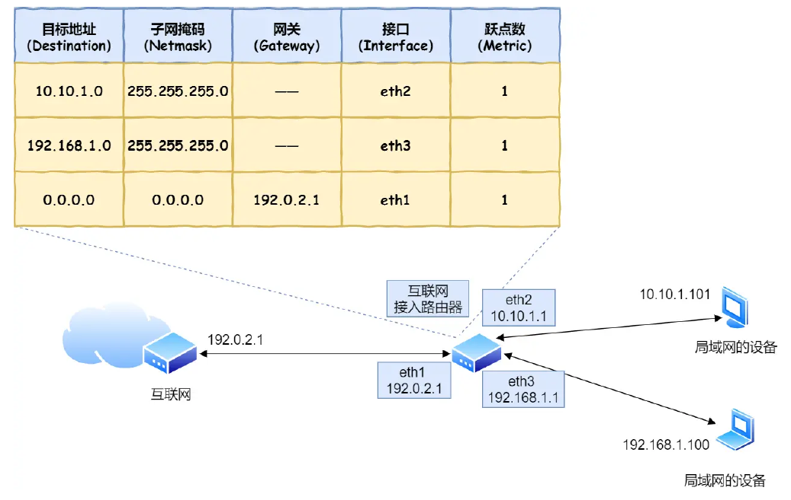

假设地址为**10.10.1.101**的计算机要向地址为**192.168.1.100**的服务器发送一个包，这个包先到达图中的路由器

判断转发目标的第一步，就是根据包的接收方IP地址查询路由表中的目标地址栏，以找到相匹配的记录

路由匹配：每个条目的子网掩码和**192.168.1.100**做**&与运算**后，得到的结果与对应条目的目标地址进行匹配，如果匹配就会作为候选转发目标，如果不匹配就继续与下个条目进行路由匹配。

例如：第二条目的子网掩码**255.255.255.0**与**192.168.1.100**做与运算后，得到的结果是192.168.1.0（这是服务器所在的整个子网，服务器属于该子网的设备），这与第二条目的目标地址192.168.1.0匹配，该第二条目记录就会被作为转发目标

实在找不到匹配路由时，就会选择**默认路由**，路由表中子网掩码为0.0.0.0的记录表示默认路由


### 4.10.5 路由器的发送操作

首先，我们需要根据**路由表的网关列**判断对方的地址

1. 如果网关是一个IP地址，则这个IP地址就是我们要转发到的目标地址，还未抵达终点，还需继续路由器转发
2. 如果网关为空，则IP头部中的接收方IP地址就是要转发到的目标地址，也就是终于找到IP包头里的目标地址了，说明已达到终点。

开始发送：

1. 知道对方的IP地址之后，接下来需要通过ARP协议根据IP地址查询MAC地址，并将查询的结果作为接收方MAC地址。

2. 路由器也有ARP缓存，因此首先会在ARP缓存中查询，如果找不到则发送ARP查询请求。

3. 接下来是发送方MAC地址字段，这里填写输出端口的MAC地址。还有一个以太类型字段，填写**0800**（16进制）表示IP协议。

4. 网络包完成后，接下来会将其转换为电信号通过端口发送出去，和计算机相同。
5. 发送出去的网络包会通过交换机达到下一个路由器。由于接收方MAC地址就是下一个路由器的地址，所以交换机会根据这一地址将包传输到下一个路由器
6. 接下来，下一个路由器会将包转发给再下一个路由器，**经过层层转发之后，网络包终于到达服务器的子网，通过交换机根据IP查询MAC地址，最终转发到目的主机**


**源IP和目标IP始终不会变，一直变化的是MAC地址**，因为需要MAC地址在以太网内进行两个设备之间的包传输

**路由基于IP，交换基于MAC**，每一跳的MAC地址都是当前段的下一跳设备，而IP地址始终是最终目标。


## 4.11 服务器与客户端—互相扒皮

数据包终于到达了服务器，服务器开始一层层去掉头部

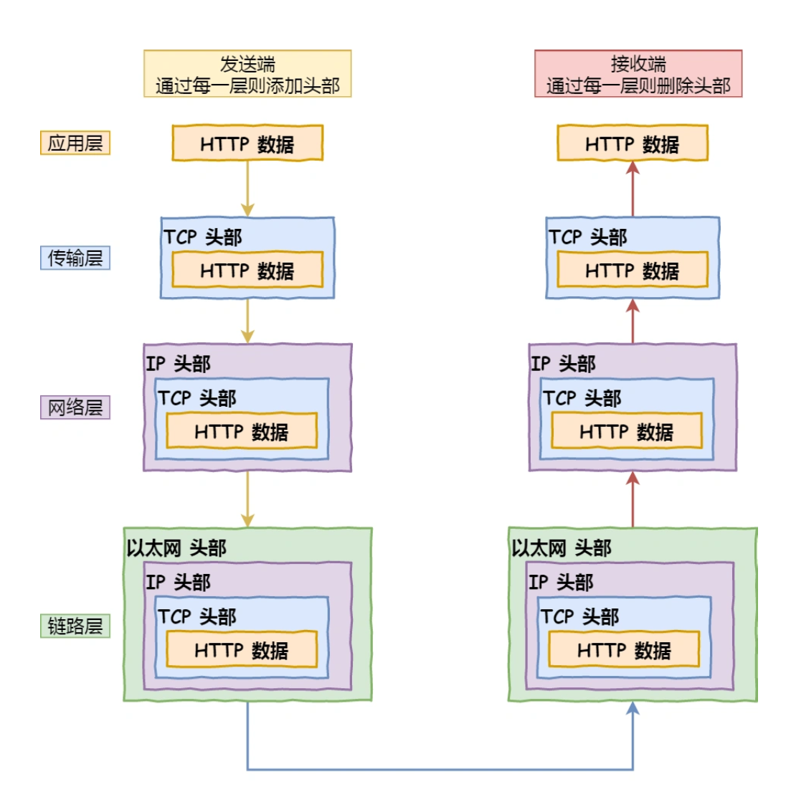

1. **数据链路层：**数据报抵达服务器后，服务器会先扒开数据报的MAC头部，查看是否和服务器自己的MAC地址符合，符合就收起来。
2. **网络层：**继续扒开数据包的IP头部，发现IP地址符合，根据IP头中的**协议项**，知道自己的上层其实是**TCP协议**
3. **传输层：**继续扒开TCP的头部，里面有序列号，需要看一看这个序列包是不是我想要的(Seq数)，如果是就放入缓存中然后返回一个ACK，如果不是就丢弃。TCP头部还有端口号，HTTP的服务器正在监听这个端口。
4. **传输层：**于是，服务器自然就知道是HTTP进程想要这个包，于是就将包发给HTTP进程。
5. **应用层：**服务器的HTTP进程看到，原来这个请求是要访问一个页面，于是就把这个网页封装在HTTP响应报文里。
6. HTTP响应报文也需要加上TCP,IP,MAC头部，不过这次源地址是服务器IP地址，目的地址是客户端IP地址。
7. 加好头部之后，从网卡出去，交由交换机转发到路由器，路由器把响应数据包发到了下一个路由器，最后发到了客户端的子网，又通过交换机找到了客户端。
8. 客户端收到了响应数据包后，拆除MAC,IP,TCP头部后，把HTTP响应报文交给浏览器去渲染页面，之后就显示出来了。
9. 最后客户端要离开了，向服务器发起了TCP四次挥手，至此双方连接断开


# 5. HTTP基本概念


## 5.1 HTTP是什么

HTTP是超文本传输协议，也就是**HyperText Transfer Protocol**

HTTP是一个用在计算机世界里的**协议**。它使用计算机能够理解的语言，确立了一种计算机之间交流通信的规范（两个以上的参与者），以及相关的各种控制和错误处理方式（行为约定和规范）

HTTP是一个**双向协议**，是一个在计算机世界里专门用来在**两点之间传输数据**的约定和规范

超文本：指**超越了普通文本的文本**，是文字、图片、视频等的混合体，最关键有超链接，能从一个超文本跳转到另一个超文本。

HTML就是最常见的超文本，本身只是纯文字文件，但内部用很多标签定义了图片、视频等的链接，再通过浏览器的解释，呈现给我们的就是一个有文字有画面的网页了

**HTTP是一个在计算机世界里专门在两点之间传输文字、图片、音频、视频等超文本数据的约定和规范**


## 5,2 HTTP常见的状态码

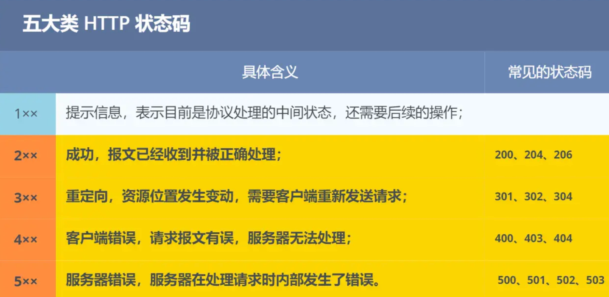

**1XX**类状态码属于提示信息，是协议处理的一种中间状态，实际用的比较少

**2XX**类状态码表示服务器**成功处理**了客户端的请求，也是我们最愿意看到的状态

1. **200OK**：是最常见的成功状态码，表示一切正常。如果是非HEAD请求，服务器返回的响应头都会有body数据。
2. **204 No Content**：也是常见的成功状态码，与200OK基本相同，但响应头没有body数据
3. **206 Partial Content**：是应用于HTTP分块下载或断点续传，表示响应返回的body数据并不是资源的全部，而是其中一部分，也是服务器成功处理的状态。

**3XX**类状态码表示客户端请求的**资源发生了变动**，需要客户端用新的URL重新发送请求获取资源，也就是**重定向**

1. **301 Moved Permanently** 表示永久重定向，说明请求的资源已经不存在了，需改用新的URL再次访问。
2. **302 Found** 表示临时重定向，说明请求的资源还在，但暂时需要用另一个URL来访问。
3. **304 Not Modified** 不具有跳转的含义，表示资源未修改，重定向已存在的缓冲文件，也称缓存重定向，也就是告诉客户端可以继续使用缓存资源，用于缓存控制

301和302都会在响应头里使用字段**Location**知名后续要跳转的URL，浏览器会自动重定向行的URL。

**4XX**类状态码表示客户端发送的**报文有误**，服务器无法处理，也就是**错误码**

1. **400 Bad Request**：表示客户端请求的报文有错误，但只是个笼统的错误。
2. **403 Forbidden** ：表示服务器禁止访问资源，并不是客户端的请求出错
3. **404 Not Found**：表示请求的资源在服务器上不存在或未找到，无法提供给客户端。

**5XX**类状态码表示客户端请求报文正确，但是**服务器处理时内部发送了错误**，属于服务器端的错误码

1. **500 Internal Server Error** ：与400类似，是个笼统通用的错误码，服务器发生了什么错误，我们并不知道。
2. **501 Not Implemented** ：表示客户端请求的功能还不支持。implement(v. 使生效)
3. **502 Bad Gateway** ：通常是服务器作为网关或代理时返回的错误码，表示服务器本身工作正常，访问后端服务器时发生了错误。
4. **503 Service Unavailable** ：表示当前服务器很忙，暂时无法响应客户端。

## 5.3 HTTP常见字段

常见字段有：Host  Content-Lenth   Connection    Content-Type    Content-Encoding     

### Host

客户端发送请求时，用来指定服务器的域名

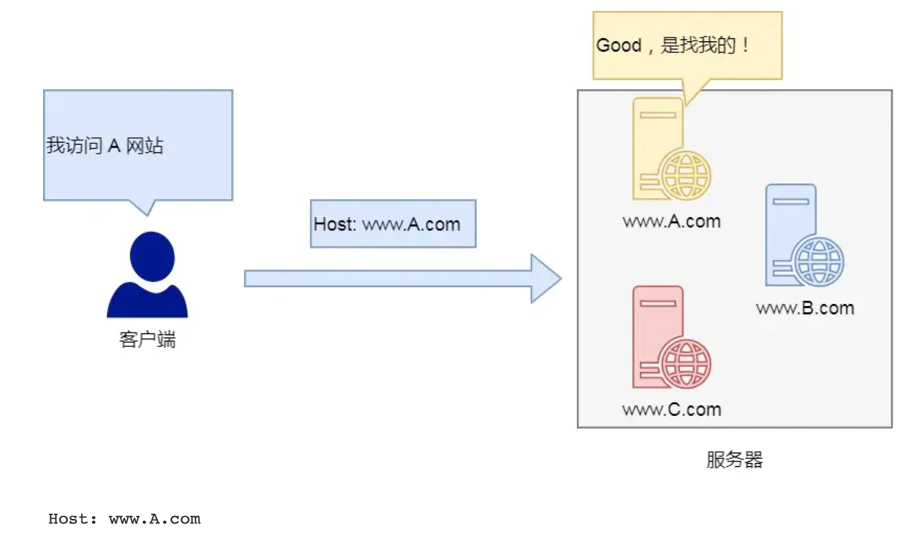

有了**Host**字段，就可以将请求发往同一台服务器上的不同网站。


### Content—Length

服务器在返回数据时，会有Content—Length字段，表明这次回应的数据长度


### Connection

Connection字段最常用于客户端要求服务器使用**HTTP长连接**机制，以便其他请求复用

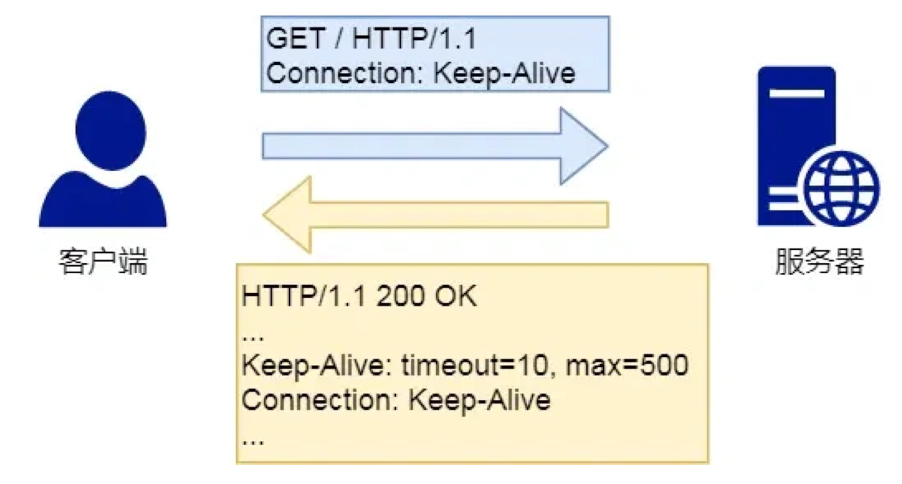

HTTP长连接的特点是，只要任意一端没有明确提出断开连接，则保持TCP连接状态。

HTTP/1.1版本的默认连接都是长连接，但为了兼容老版本的HTTP，需要指定Connection首部字段的值为**Keep-Alive**    Connection：Keep-Alive

开启了HTTP的Keep-Alive机制之后，连接就不会中断，而是保持连接。当客户端发送另一个请求时，它会使用同一个连接，一直持续到客户端或者服务器提出断开连接。


### Content-Type

Content-Type字段用于服务器回应时，告诉客户端，本次回应的数据格式。

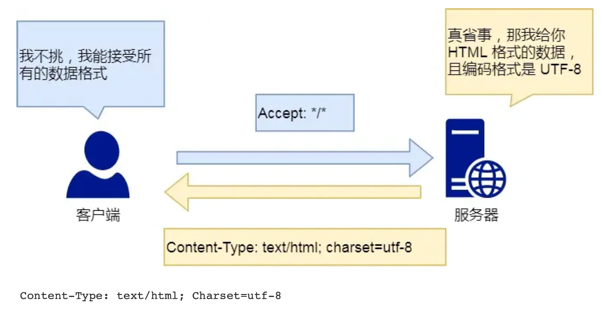

上面的类型表明，发送的是网页，而且编码是UTF-8

客户端请求的时候，可以使用Accept字段声明自己可以接受哪些数据格式。


### Content—Encoding

该字段说明数据的压缩方法，表明服务器返回的数据使用了什么压缩格式

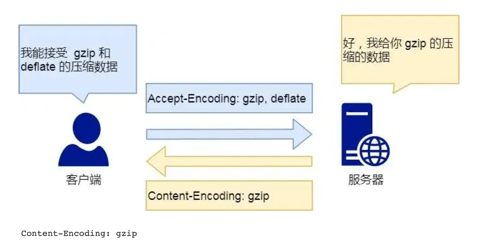

上面表示服务器返回的数据采用了gzip的方式压缩，告知客户端需要使用此方式解压

客户端在请求时，用Accept—Encoding字段说明自己可以接受哪些压缩方法。


# 6. GET与POST

## 6.1 GET和POST有什么区别

根据RFC规范，**GET的语义是从服务器获取指定的资源**，这个资源可以是静态的文本、页面、图片视频等。GET请求的参数位置一般是写在URL中，URL规定只能支持ASCII，所以GET请求的参数只允许ASCII字符，而且浏览器对URL长度有限制（HTTP协议本身对URL长度没有规定）

比如，想查看小林coding的文章，浏览器就会发送**GET请求**给服务器，服务器会返回文章的文字和图片资源

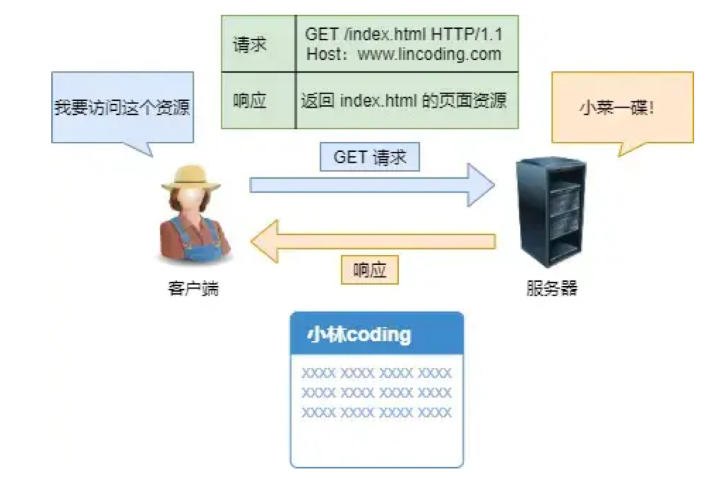

根据RFC规范，**POST的语义是根据请求负荷（报文body）对指定的资源做出处理**，具体的处理方式视资源类型而不同。POST请求携带数据的位置一般是写在**报文body**中，body中的数据可以是任意格式的数据，只要客户端与服务端协商好即可，而且浏览器不会对body大小做限制。

比如在文章底部留言后提交，浏览器就会执行**POST请求**，把留言文字放进报文body中，然后拼接好POST请求头，通过TCP发给服务器。

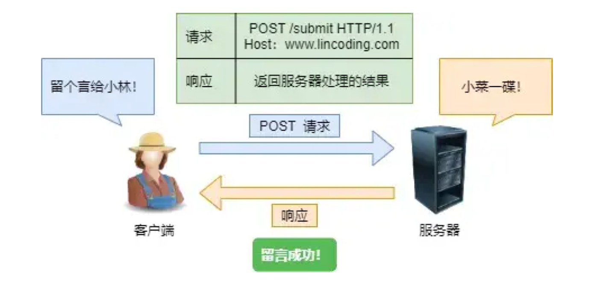


## 6.2 GET和POST的安全和幂等

安全和幂等的概念：

1. 在HTTP中，所谓的**安全**是指请求方法不会破坏服务器上的资源
2. 所谓**幂等**是指多次执行相同操作，结果是相同的

**GET方法是安全且幂等的**，因为它是**只读**操作，无论操作多少次，服务器上的数据都是安全的，且每次结果是相同的。

