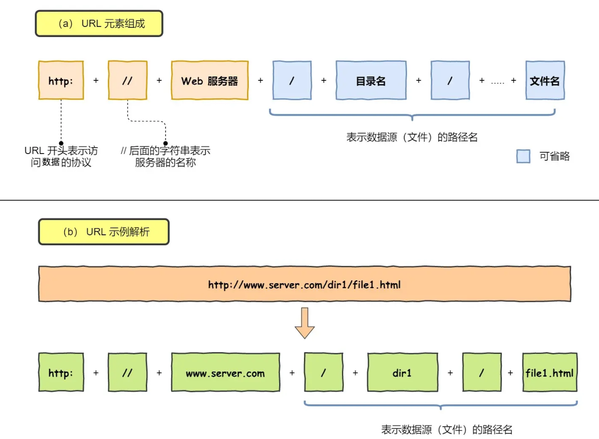
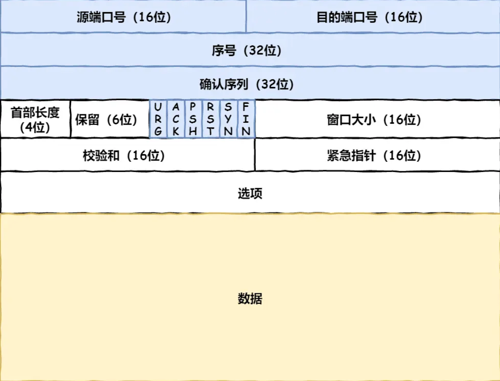
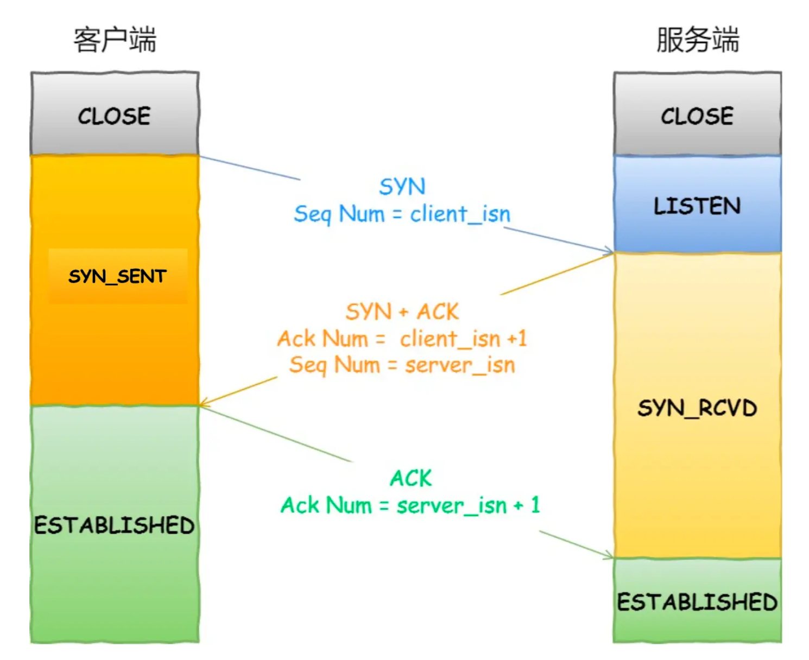
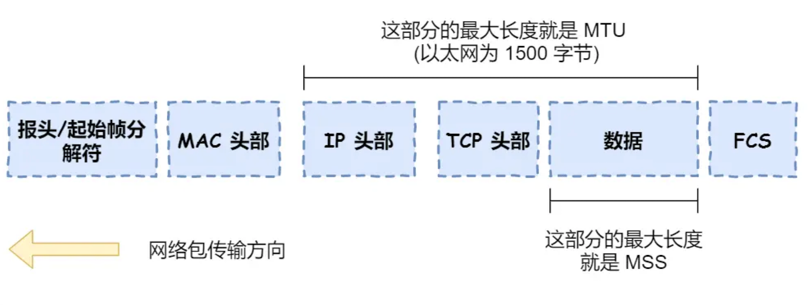
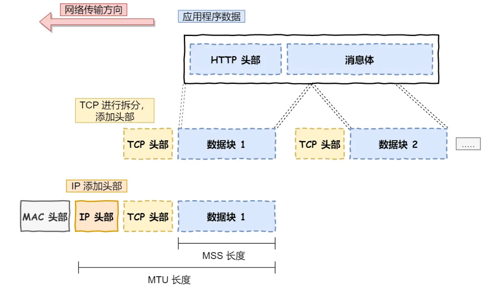
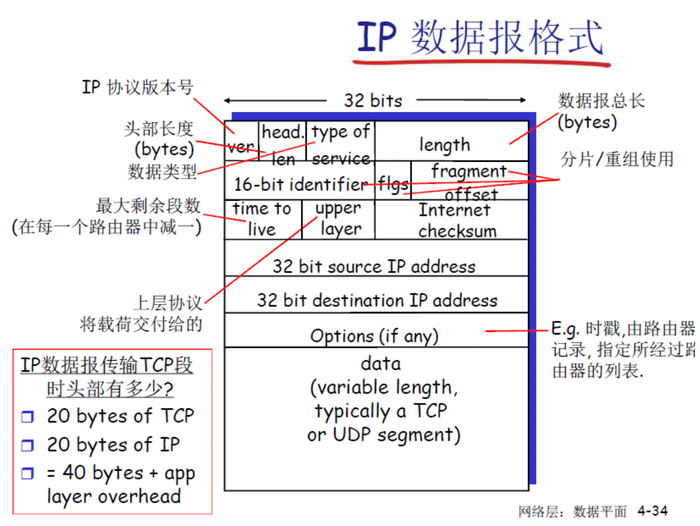

# 1. MTU与MSS

### MTU（Maximum Transmission Unit）最大传输单元

- **定义**：数据链路层一次能够传输的最大数据包大小
- **层次**：工作在数据链路层（第2层）   但在网络层将数据包封装成MTU
- **包含内容**：整个IP数据包（TCP头部+IP头部 + 应用层数据部分）
- **常见值**：以太网MTU通常为1500字节

### MSS（Maximum Segment Size）最大段大小

- **定义**：TCP层一次能够传输的最大数据段大小
- **层次**：工作在传输层（第4层）
- **包含内容**：仅指应用层数据部分，不包括TCP头部和IP头部
- **计算方式**：MSS = MTU - IP头部长度 - TCP头部长度

### 关系示例

```
MTU = 1500字节（以太网标准）
IP头部 = 20字节（无选项时）
TCP头部 = 20字节（无选项时）
MSS = 1500 - 20 - 20 = 1460字节
```

**一个简单的比喻：**

- **MTU** 就像是公路上对货车整体尺寸的限制（例如，长、宽、高都不能超过某个值）。
- **MSS** 则是货车车厢内部可以装载货物的最大体积。为了让货车能顺利上路，装载的货物（MSS）加上车头和车身等（IP 和 TCP 头部）的尺寸，不能超过公路的限制（MTU）。

### 为什么要有 MTU 和 MSS？

**为什么需要 MTU？**

 **MTU 的存在主要是为了平衡传输效率和网络延迟：**

- **避免无限大的数据包**：网络中的设备（如路由器、交换机）需要缓存和转发数据包，如果数据包无限大，对设备的内存和处理能力要求会极高，成本也会随之增加。

- 平衡效率和延迟：

  - **较大的 MTU**：可以减少头部开销的比例，因为每个数据包都需要添加头部信息，数据包越大，有效数据的占比就越高，传输效率也就越高。
  - **较小的 MTU**：可以减少网络延迟。在共享网络中，一个大的数据包会长时间占用链路，导致其他数据包等待，从而增加整体延迟。 此外，数据包越大，在传输过程中出错的概率也越高，一旦出错就需要重传整个大数据包，代价更大。
  
- **历史原因**：以太网的 MTU 设置为 1500 字节是一个历史遗留问题，与早期的 CSMA/CD (载波侦听多路访问/冲突检测) 机制有关，旨在确保网络中的冲突能够被有效检测。

**为什么在有了 MTU 之后还需要 MSS？** 既然 网络层可以根据 MTU 对过大的数据包进行分片，为什么 TCP 层还需要一个 MSS 呢？

主要原因是为了**尽可能避免在网络层进行分片**，从而提高传输效率和可靠性。

**举例：**

假设没有MSS，在应用层共有1w4字节的数据需要传输，向下经过传输层传到网络层后，网络层收到该数据包（TCP头部+IP头部+应用层数据共14040字节），发现超过了MTU的大小，就将数据包进行分片（网络层分片**效率低下**），分成10片，然后传输，如果其中任意一个分片丢失了，就会将整个数据包全部重传。

在发送端：如果有MSS，在传输层就会将1W4字节的数据，分成10个TCP段，并给这十个段都加一个TCP头部，之后将这十个段向下传给网络层，此时网络层收到数据包（MSS令其最大1500字节）之后，不需要进行分片，加上IP头部后发给数据链路层，每个包**独立传输**。

在接收端：网络层收到十个数据包之后，对每个数据包独立检查错误，解封装后变为TCP段发给传输层，传输层利用TCP头部的**序列号**将这些段**按正确的顺序重新组装**成原始的应用程序数据流。如果有段丢失，TCP会请求重传那个特定的段。组装完成后将完整的数据上传给应用层。

- **IP 分片的效率问题**：IP 层分片对网络是透明的，但它存在一个严重缺陷：如果分片后的任何一个小数据包在传输过程中丢失，整个原始数据包就必须全部重传。 这会大大增加网络开销和延迟。
- **MSS 的主动控制**：通过在 TCP 层设置 MSS，发送方在发送数据之前，就会主动将数据分割成小于 MSS 的段。 这样一来，每个 TCP 段封装成 IP 包后，其大小就不会超过 MTU，从而避免了在 IP 层进行分片。
- **TCP 的高效重传机制**：如果某个 TCP 段在传输中丢失，TCP 的可靠传输机制只需要重传丢失的那个小段即可，而不需要重传整个大数据块，这比 IP 分片丢失后的重传效率高得多。

**总结来说**，MTU 是数据链路层的一个物理限制，而 MSS 是 TCP 层为了适应这个限制而进行的一种主动优化策略。 通过 MSS 协商，TCP 协议可以主动将数据分割成合适的大小，以避免低效的 IP 层分片，从而在保证数据可靠性的同时，最大化地提升网络传输的效率。


# 2. 用户之间收发信息的过程

## CS模式下的通信机制

整个过程，发送方不需要知道接受方的端口号和IP地址，只需要知道服务器的端口号和IP地址（域名）即可

全靠服务器转发给接收方

### 发送方（同学A）的视角
```
同学A发送文件时：
- 只知道：微信服务器的地址（如 wechat.qq.com:443）
- 不知道：同学B的IP地址、端口号、甚至B在哪个网络
- 只需要：告诉服务器"我要给用户B发文件"
```

### 服务器的转发机制
```
微信服务器维护的信息：
用户A：IP=203.0.113.10, 端口=12345, 在线状态=在线
用户B：IP=198.51.100.20, 端口=54321, 在线状态=在线
用户C：IP=192.168.1.100, 端口=23456, 在线状态=离线
```

### 完整的转发过程

#### 1. A发送给服务器
```
A → 服务器的数据包：
源IP: A的IP地址
目标IP: 微信服务器IP
应用层数据: {
    from: "用户A",
    to: "用户B", 
    type: "文件",
    content: 文件数据
}
```

#### 2. 服务器处理和转发
```
服务器收到后：
1. 解析：这是A发给B的文件
2. 查表：B当前的连接信息是 198.51.100.20:54321
3. 转发：将文件数据推送给B
```

#### 3. 服务器发送给B
```
服务器 → B的数据包：
源IP: 微信服务器IP
目标IP: B的IP地址
应用层数据: {
    from: "用户A",
    to: "用户B",
    type: "文件", 
    content: 文件数据
}
```

## 关键优势

### 1. 简化客户端逻辑
```
客户端只需要：
- 连接到服务器
- 发送"给谁发什么"
- 不用管对方在哪里、怎么到达
```

### 2. 解决网络复杂性
```
服务器处理：
- NAT穿透问题
- 用户离线消息存储
- 跨网络路由
- 负载均衡
```

### 3. 实际例子对比

**微信聊天（CS模式）**：
```
你发消息 → 微信服务器 → 对方收到
你不需要知道对方的IP地址
```

**直接P2P聊天**：
```
你发消息 → 直接到对方
但你必须先知道对方的IP:端口
```

## 这就解释了为什么

1. **微信可以给离线用户发消息**：服务器存储转发
2. **不需要知道对方网络信息**：服务器负责寻址
3. **可以跨不同网络通信**：服务器作为中继
4. **群聊很容易实现**：服务器向多个用户转发

**CS模式下，客户端之间不直接通信，完全依靠服务器的"邮局"功能进行消息转发**。这大大简化了客户端的复杂度，但代价是对服务器的完全依赖。


# 3. 获取目标IP地址的方法

在网络数据发送过程中，网络层本身并不主动“发现”目标IP地址，而是从更高层（通常是应用层或传输层）接收这个地址。以下是网络通信中获取目标IP地址的几种常见方法：

### 1. 域名系统 (DNS) 解析

这是最常见的方法，尤其是在访问网站或连接到远程服务器时。整个过程通常如下：

- **用户输入域名**: 用户在浏览器中输入一个网址，例如 `www.google.com`。这个域名对人类友好，但计算机网络需要IP地址来进行通信。
- **发起DNS查询**: 用户的操作系统会将这个域名发送给一个DNS解析器（通常由互联网服务提供商ISP提供）。
- **解析过程**: DNS解析器会查询一系列的DNS服务器（根服务器、顶级域服务器和权威名称服务器），以找到与该域名对应的IP地址。
- **返回IP地址**: 权威DNS服务器最终会将IP地址（例如 `172.217.160.100`）返回给用户的计算机。
- **向下层传递**: 应用程序（如浏览器）获得IP地址后，在准备发送数据时，会将此IP地址连同数据一起传递给传输层，再由传输层传递给网络层。 网络层随后将这个IP地址放入IP数据包的目标地址字段中。

### 2. 静态配置或直接输入

在某些情况下，IP地址是预先知道的，不需要通过DNS解析：

- **直接输入IP**: 用户可以直接在应用程序中输入数字IP地址来代替域名。
- **配置文件**: 应用程序或操作系统可能有一个配置文件，其中静态地指定了要连接的目标服务器的IP地址。这在企业内部网络或特定软件中很常见。

### 3. 从应用程序和服务中获取

许多应用程序在内部处理IP地址的获取过程：

- **API调用**: 程序员在编写网络应用程序时，会使用套接字（Socket）API。在建立连接（如使用 `connect()` 函数）或发送数据包（如使用 `sendto()` 函数）时，目标IP地址会作为一个参数明确地提供给操作系统内核中的网络协议栈。
- **服务发现**: 在复杂的分布式系统中，服务可能会向一个中心目录注册自己的IP地址，其他服务在需要通信时会从该目录查询IP地址。

### 需要澄清的概念：ARP协议

地址解析协议（ARP）经常被提及，但它的作用**不是**获取目标IP地址。ARP的功能恰恰相反：当网络层已经知道了一个IP地址，并且需要将数据包发送到同一局域网内的该IP地址时，它会使用ARP来查询与该IP地址对应的物理硬件地址（MAC地址）。 如果目标IP地址不在同一局域网内，网络层则会使用ARP来查找下一跳路由器（网关）的MAC地址。

总结来说，网络层在发送数据包之前，必须从上层协议（如TCP或UDP）获得明确的目标IP地址。而这个IP地址最常见的来源是通过DNS将用户友好的域名转换而来，或是由用户或应用程序直接提供。


# 4. 键入网址到网页显示，期间发生了什么？

## 4.1 浏览器解析URL



长长的URL实际上是在请求服务器中的**文件资源**(根据路径名)

当没有路径名时，就会访问根目录下事先设置的默认文件，也就是/index.html

## 4.2 根据URL提供的Web服务器和文件名，生成HTTP请求消息

## 4.3 根据域名通过DNS查询IP地址

此时浏览器解析URL已经生成了HTTP消息，需要把消息发送给Web服务器

此时通过DNS将域名转化为IP地址

如：www.server.com.

域名中越靠右的位置，代表层级越高。**.根域**是在最顶层（**根DNS服务器**），下一层就是.com**顶级域DNS服务器**，再下面是server.com**权威DNS服务器**

根域的DNS服务器信息保存在互联网所有的DNS服务器中，客户端只需要找到任意一台DNS服务器，就可以通过它找到根域DNS服务器，再一路找到目标DNS服务器

### 4.3.1 域名解析的工作流程

1. 客户端发出一个DNS请求，问www.server.com的IP是什么，并发给本地DNS服务器（TCP/IP设置中填写的）
2. 本地域名服务器收到请求后，如果缓存里的表格能找到该域名，则直接返回IP地址给客户端。如果没有，本地DNS回去问它的根域名服务器
3. 根DNS收到来自本地NDS请求后，发现www.server.com域名后置是.com，就把.com顶级域名服务器地址发送给本地DNS
4. 本地DNS收到顶级域名服务器地址后，发起请求问www.server.com的IP地址
5. 顶级域名服务器给本地DNS发送负责www.server.com区域的权威DNS服务器的地址(如:dns1.server.com)
6. 本地DNS收到权威DNS服务器地址之后，询问www.server.com对应的IP是什么
7. 权威DNS服务器查询域名后，将对应的IP地址发送给本地DNS
8. 本地DNS将IP返回客户端，客户端和目标建立连接


当然，也不是每次域名解析都需要这么多流程

1. 如果浏览器有该域名缓存
2. 操作系统有该域名缓存
3. hosts文件有该域名缓存

会直接返回，这些条件都不满足才会去问本地DNS服务器

## 4.4 协议栈

通过DNS拿到IP地址之后，就可以把HTTP的传输工作交给操作系统中的协议栈


# 5. TCP协议

## 5.1 TCP报文头部格式



1. 源端口号16bit
2. 目标端口号16bit
3. 序号32bit，解决包乱序的问题
4. 确认序列32bit，目的是确认发出去对方是否收到，如果没有收到就应该重新发送，解决丢包问题
5. 状态位6bit，SYN（sync同步）是要发起一个连接，ACK是回复，RST是重新连接，FIN是结束连接等。TCP是面向连接的，所以要用这些去维护连接的状态
6. 窗口大小16bit，TCP要做流量控制，通信双方各声明一个窗口（缓存大小），标识自己当前的处理能力，防止对方发送过快或过慢
7. 拥塞控制，只能做的就是控制自己发送的速度

## 5.2 TCP三次握手

TCP连接的建立，称为三次握手。

所谓连接，只是双方计算机中维护一个状态机，连接建立的过程中，状态变化时序图如下



1. 一开始，客户端和服务器都处于`CLOSED`状态。先是服务器主动监听某个端口，处于`LISTEN`状态。
2. 随后客户端主动发起连接`SYN`，之后处于`SYN-SENT`状态，假设Seq Num = x，SYN bit = 1
3. 服务端收到发起的连接，返回SYN，并且ACK = x+1 回应客户端的SYN，发送自己的Seq Num=y 之后处于`SYN_RCVD`状态
4. 客户端收到服务端发送的SYN和ACK之后，发送对SYN确认的ACK=y+1，之后处于`ESTABLISHED`状态

三次握手的目的是保证双方都有发送和接收的能力


## 5.3 TCP分割数据

如果HTTP请求消息比较长，超过了MSS的长度，此时TCP就需要把HTTP的数据拆解成一块块数据发送。



MTU：一个网络包的最大长度，以太网中一般为1500字节

MSS：出去IP头部(一般20字节)和TCP头部(一般20字节)之后，一个网络包能容纳的TCP数据最大长度

数据会被以MSS的长度为单位进行拆分，拆出来的每一块数据都会被放进单独的网络包中。每个被拆分的数据都会加上TCP头部。




# 6. IP模块

## 6.1 IP报文头格式



1. Ver: 版本号 占4bit 如： IPv4 0100

2. Head.len 首部的长度，占4bit，以4B为单位（系数） 最大可表示的首部长度为60B（15*4B）。最常用的首部长度是20B（5*4B）该字段的值是0101，此时不使用任何可选字段

3. Type of service 区分服务 ： 占8个bit 代表数据报携带的载荷的类型

4. Length 数据报总长度：占16bit，指首部与数据之和的长度，单位是字节，因此IP数据报的最大长度是216-1=65535B。以太网帧的最大传送单元（MTU）为1500B，因此当一个IP数据报封装成帧时，数据报的总长度（首部+数据）不能超过链路层MTU的值

5. 16-bit identifier 标识：16bit 是一个计数器，每产生一个数据报就+1，并赋值给标识（identifier）字段。但它不是“序号”，因为IP是无连接服务。当一个数据报的长度超过网络MTU时，必须分片，此时每一个数据报片都复制一次标识号，以便能正确重装成原来的数据报

6. Flags 标志：3bit 标志（flags）字段的最低位是MF，MF=1表示后面还有分片，MF=0表示最后一个分片。标志（flags）字段中间的一位是DF，只有当DF=0时才允许分片。

7. Fragment offset 片偏移：13bit，它指出较长的数据报在分片后，某片在原数据报中的相对位置，片偏移以8B为偏移单位。除最后一个分片以外，每个分片的长度一定是8B的整数倍

8. Time to live TTL 生存时间： 占8bit，数据报在网络中可通过的路由器数的最大值，标识数据报在网络中的寿命，确保不会无限循环，路由器在转发数据报前，先将TTL-1，若TTL为0，则必须丢弃

9. Upper layer协议：8bit，指出此IP数据报携带的数据使用何种协议，即数据报的数据部分应上交给哪个协议进行处理，如TCP,UDP等。值为6代表TCP，值为17代表UDP

10. Internet checksum 首部校验和： 16bit，他只校验数据报的首部，不包括数据部分，不校验数据部分可减少计算工作量。

11. Source IP address 原地址字段：32bit 标识发送方IP地址

12. Destination IP address 目标地址字段：32bit 标识接收方的IP地址

     